# Syndicate — Roadmap

**Last updated:** 2026-08-10 (end of SESS-016)
**Where we are:** two vehicles can hurt each other, there is an arena to do it in, and the cars are
now five parts each with their own collision shapes. Nothing starts a match.

> This file is maintained by the coding assistant and updated **at the end of every session**
> (CLAUDE.md §5, step 14). It is allowed to change shape as the work demands — reorder phases, split
> them, delete ones that stopped making sense. What it must always answer is: *what just happened,
> what is next, and how far is it to a game you can play?*

---

## 1. The timeline

```mermaid
gantt
    title From blueprints to a game you can play
    dateFormat X
    axisFormat %s

    section Done
    Blueprints and build scaffolding        :done, p0, 0, 2
    Destruction toolchain                   :done, p1, 2, 3
    Simulation core - physics and breakage   :done, p2, 5, 5
    Spawning and lifetime                   :done, p3, 10, 1
    A vehicle you can drive                 :done, p4, 11, 2
    Reading real art                        :done, p6a, 13, 1
    Combat - hits, damage, weapons          :done, p5, 14, 1
    A world to fight in  (we are here)      :done, p6, 15, 1

    section Next
    Opponents - bots and match flow         :active, p8, 16, 3
    A window - client, render, HUD          :p7, 19, 3

    section Then
    Multiplayer                             :p9, 23, 4
    Production hardening                    :p10, 27, 3
```



Read the numbers as **sessions of work, roughly**, not dates. Everything before "we are here" is
done and green; everything after is an estimate that will move.

### The same thing, as a path

```
  ┌─ DONE ───────────────────────────────────────────────────────────┐
  │                                                                  │
  │  ●  Phase 0   Blueprints, Gradle build, ECS engine               │
  │  │            15 spec documents, 8 modules, guardrail checks     │
  │  ●  Phase 1   Destruction toolchain                              │
  │  │            Blender fractures a mesh; a harness re-verifies it │
  │  ●  Phase 2   Simulation core                                    │
  │  │            Bullet steps; parts fracture, detach, become scrap │
  │  ●  Phase 3   Spawning and lifetime                              │
  │  │            An assembly becomes a vehicle; debris expires      │
  │  ●  Phase 4   A vehicle you can drive                            │
  │  │            Stats aggregate, wheels turn, a server runs ticks  │
  │  ●  Phase 6a  Reading real art                                   │
  │  │            glTF loads headlessly; two cars measured and drawn │
  │  ●  Phase 5   Combat                                             │
  │  │            Contacts become damage; weapons fire; parts die    │
  │  ●  Phase 6   A world to fight in             ← THIS SESSION     │
  │  │            An arena, an asset gate, and cars cut into parts   │
  └──┼───────────────────────────────────────────────────────────────┘
     │
  ┌──┼─ NEXT ──────────────────────────────────────────────────────────┐
  │  ○  Phase 8   Opponents                          ★ PLAYABLE HERE   │
  │  │            Bots, a match that starts, scores and ends           │
  │  ○  Phase 7   A window                                             │
  │  │            Rendering, damage morphs, camera, HUD                │
  │  ○  Phase 9   Multiplayer                                          │
  │  │            Replication, prediction, reconciliation              │
  │  ○  Phase 10  Production hardening                ★ SHIPPABLE      │
  │               Perf budgets, packaging, balance sweep, CI gates     │
  └────────────────────────────────────────────────────────────────────┘
```

### The system catalogue, which is the honest progress bar

`docs/04_entity_component_model.md#D04-S4.4` fixes 27 systems in a specific order. Fourteen exist.

```
 1 InputCollection   ○   10 Physics          ●   19 NetworkReceive   ○
 2 InputReceive      ○   11 CollisionEvent   ●   20 Reconciliation   ○
 3 BotDecision       ○   12 Damage           ●   21 Transform        ○
 4 MatchFlow         ○   13 Fracture         ●   22 Interpolation    ○
 5 Spawn             ●   14 Detach           ●   23 DamageVisual     ○
 6 VehicleStats      ●   15 MassProperty     ●   24 Effect           ○
 7 VehicleControl    ●   16 Lifetime         ●   25 Audio            ○
 8 Weapon            ●   17 Score            ●   26 Render           ○
 9 Projectile        ●   18 NetworkSend      ○   27 EntityDestroy    ●

 ●●●●●●●●●●●●●●○○○○○○○○○○○○○  14 / 27
```

The thirteen that remain fall into three groups: **networking** (18–20), **the client** (1, 22–26),
and the three that stop the game being a sandbox — `MatchFlow` (4), which starts and ends a match,
`BotDecision` (3), which drives a vehicle without a human, and `InputReceive` (2), which needs a
transport first.

---

## 2. What happened this session (SESS-016)

The cars are five parts each now, and the thing that had been called a Blender job for four sessions
turned out to be a Blender job that could be done here.

### Blender was installable all along

Every plan since Phase 1 has been written around "there is no Blender in this environment". There is:
the exact version the project pins ships on PyPI as a Python module and runs headless with no window
and no graphics card. That assumption had been carried forward unexamined for four sessions and was,
in the end, the whole of the blocker.

### Cutting a car into parts

The tool that does it does not read any of the names in the file, and that is the interesting part.
The two supplied cars name their pieces `Object_170` and
`polySurface766_F:Ford_MustangGTD_2025_Callipers...`, and where one of them *does* have parts named
"wheel", the two so named are the front-left and front-**right** — the author modelled one side and
mirrored it, and the copy kept the original's name with a `.001` on the end. Anything trusting that
would put both front wheels on the same side of the car.

So it works from shape instead. A wheel is never welded to the bodywork around it, so it is a
separate connected lump of geometry; it sits outboard of the centreline; it sits low; and — the test
that actually does the work — seen from the side it is **round**. Sills, wishbones and exhausts are
all low and outboard. None of them is round.

Two of the thresholds were set by things that fooled an earlier version rather than by judgement. A
wing mirror is outboard, sits at 75 cm, and is round enough in profile to pass a loose test; it
dragged the Eclipse's front axle 30 cm backwards and reported its tyre as 1.31 m across. Both limits
now sit where that mirror fails them, and there is a unit test named after it.

### It found a bug in something that was already shipped

The Eclipse's file turns out to contain *two* copies of the car. The author modelled the right-hand
side and mirrored the whole thing, and the mirrored copy's position is stored in its skeleton rather
than in the ordinary place. The game's mesh reader does not look at skeletons — a decision taken
deliberately, and recorded at the time as safe for these models, "checked, not assumed".

It was not safe. Ten pieces of the car, the entire rear-left corner, are up to 2.65 m from where the
reader puts them. Read the way the game reads it, the Eclipse has three wheels and a fourth floating
over the front axle.

The check that had backed the "checked" *counted* how many meshes used a skeleton; it never compared
where one of them ended up against where it should be. The two automatic screenshots are three-quarter
views from front and rear, and in both of them the misplaced wheel is hidden behind or inside the
body. One number in the repository did record it — the car's measured height disagreed with itself by
9.7 cm across two documents — and nobody had put the two side by side.

Nothing shipped is broken by it today, because the parts the game now loads have no skeletons at all.
The wrong claim in the art's documentation has been replaced with the correct one.

### Checked by reading it back, not by looking at it

The measurements the tool reports are from inside Blender, and would agree with themselves whatever
the export did. So the split parts are loaded again through the game's own reader and measured there
against figures taken off the source art two sessions earlier by different code: each wheel has to be
a disc of the right diameter, centred exactly on its own axle. They match to a tenth of a millimetre.

The second car is the stronger evidence. The classifier was written against the Eclipse and never
adjusted for the Mustang — which is modelled by a different artist in a different tool at a different
scale with 1,101 pieces instead of 171 — and it reproduces that car's recorded wheelbase and track
exactly.

### What it unblocked, and what it did not

The asset gate built last session went from 18 complaints about the shipped content to 6. The
remaining six are the fracture data, which is now simply a matter of running the other tool.

What it did **not** do is move the wheels. Each chassis still declares its wheel positions where
somebody estimated them, and the art says they are 10 cm further apart along the car and 36 cm higher
than that. Correcting it changes the wheelbase and the ride height, which changes how the cars
handle, which invalidates every published figure they were calibrated against. That is a deliberate
change with a re-measurement attached, not a typo, so it is the next session's first job rather than
this one's last.

## 3. What is next

### First, half an hour of arithmetic and an afternoon of checking

Move each chassis's declared wheel positions onto the axles the art actually has, then re-run the
handling calibration and re-derive whatever moved. The numbers are already measured and written
down; what takes the time is confirming that a car with a 10 cm longer wheelbase and 36 cm more ride
height still accelerates, brakes and corners like the car it was derived from — and republishing the
figures if it does not.

### Then Phase 8 — Opponents ★ *the first thing that is actually a game*

Three systems and a bootstrap. A match that starts, keeps score and ends; bots that drive and shoot;
and something that puts vehicles on the arena's spawn points. All three are headless and testable
without a window, and together they are the difference between a simulation that contains a fight and
one that has a fight in it.

After them, the answer to "can I play it?" is yes — through a log file, which is a strange way to
play a game, but the game will be there.

### Phase 7 — A window

`game-client`: a window, a camera, rendering, and the damage morph targets nothing has yet displayed.
Placed after opponents on the argument that a renderer is much more useful pointed at a match than at
an empty arena.

### Loose content work, any time

- **One weapon part**, so the eight weapon families have something in `assets/` to fire.
- **One armour plate that covers something**, so the interception and exposure rules have content.
- **Fracture manifests** for the six parts, which is now a tool run rather than a project.
- **The JSON schemas**, so malformed content fails on its shape rather than on whichever field a
  hand-written check happens to read first.

### Phases 9–10 — Multiplayer, then hardening

Replication, client prediction, reconciliation and lag compensation, followed by the performance
budgets, packaging and balance sweeps that `docs/12_testing_validation_ci.md#D12-S5.4` requires
before anything ships.

---

## 4. Open choices — things you could ask for

None of these are decided. They are here so the options are visible when a session is being planned.

**Scope and direction**

- **Cut multiplayer from v1.** Phases 9 covers the largest and riskiest body of work in the project.
  A single-player-plus-bots game is a complete game, and the blueprints are written so that
  networking can be added later without re-architecting.
- **Bring the client forward.** Phase 7 has just been pushed *behind* opponents, on the argument
  that a renderer is more useful pointed at a match than at an empty arena. The opposite argument is
  just as good: right now the only way to see anything is a screenshot from the verification
  harness, and combat is the first thing in this project whose feel cannot be judged from numbers.
- **Go the other way and stay headless longer.** Bots, damage and match flow can all be built and
  tested without a window, and a headless-first project is one that will always run on a server.

**Gameplay**

- **How should it handle?** Half-answered. The two shipped vehicles handle like the real cars they
  were derived from, which is a defensible starting point and a much better one than invented
  numbers. What nobody has decided is whether a *combat* game wants that: real cars are fragile,
  grippy and fast, and an arena brawl might want something heavier and more forgiving. The place to
  find out is to drive them, which needs Phase 6.
- **Which vehicles next?** The two shipped are both fast, and now differ mainly in mass. A roster
  wants more contrast than that — a pickup, a van, something with six wheels. Each is an afternoon
  now that the profile machinery exists: pick a real vehicle, copy its published figures, author the
  parts. Finding *art* for it is the slower half.
- **What happens to the two car models before release?** Both are licensed CC-BY-NC-SA — free to
  use, credit required, and **not for commercial use**. As prototype and reference art that is
  ideal: real shapes, real proportions, real measurements to build the pipeline against. It is not
  something that can ship in a paid game. The options are to license replacements, commission
  original models, or decide the project is non-commercial. Nothing needs deciding now; it needs
  deciding before art budget is spent.
- **Do doors and other moving parts open?** Undecided, and worth deciding before any more art is
  made. A door is already expressible: the slot graph supports a part hanging off a part, so a door
  is a part in a `door_left` slot with its own mass, health and fracture data, and it can be shot
  off today. What does not exist is *articulation* — a door that swings on a hinge rather than being
  either attached or gone. The design has the pieces (`D06-S5.6` specifies a breakable constraint,
  and `DEV-009` records that a part only gets one once it is a body of its own), but nothing builds
  an articulated part, and the choice between "cosmetic hinge animation on the client" and "a real
  constrained body" is a fork with very different costs.
- **Arena shapes.** Open scrapyard, tight industrial corridors, a pit with a hazard in the middle.
  This changes what vehicle builds are good, so it is a design decision, not set dressing.
- **Game modes beyond deathmatch.** `docs/01_product_game_design.md` sketches several; picking one
  early would shape the match-flow work in Phase 8.
- **Do parts get repaired?** Currently damage is permanent within a match. A repair mechanic
  changes the pacing of a fight considerably.
- **How lethal should a hit be?** The degradation curves exist and nothing has tuned them. Somebody
  has to decide whether losing a wheel is an inconvenience or the end of the fight. This is now a
  *live* question rather than a hypothetical: the numbers that decide it — collision damage scale and
  threshold, the armour floors, the propagation fraction — are all implemented and all at their
  blueprint defaults, which nobody has driven against.
- **What is the first weapon?** The eight families exist in code and none of them exists as content.
  Whichever is authored first sets the tone: an autocannon makes fights about sustained accuracy, a
  cannon makes them about single decisive hits, a flamer makes them about closing distance. It is an
  afternoon's work and a real design decision.
- **What is actually in the scrapyard?** The arena is a flat box, deliberately. Cover changes what
  weapons are good, what vehicles are good, and whether ramming is a tactic or a mistake. It should
  be decided by someone who has driven in the empty one.
- **How much of a car is a part?** The split gives a chassis and four wheels because that is what the
  assemblies declare. The doors, bonnet and boot are separately modelled in both cars and could each
  be their own part — which is the difference between a car that loses wheels and a car that comes
  apart. The tool would need one more classification rule; the design question of whether a bonnet
  flying off is fun is the real cost.

**Content and tooling**

- **Author one real vehicle end to end** — Blender source, fracture, export, part manifest,
  assembly — as a vertical slice, before building any more systems. It would prove the whole content
  path works and produce the first thing that looks like a vehicle.
- **A live tuning console.** Physics constants, degradation curves and power budgets are currently
  edited and recompiled. A runtime editor pays for itself the first time somebody tunes handling.
- **Replay recording.** The simulation is deterministic by design, so a replay is a seed plus an
  input log. Cheap to build now, and it makes every future bug report reproducible.

**Technical debt worth naming**

- **`DISC-011`** — the collision-filter trap that made every suspension ray miss the ground. The
  hitscan and projectile rays added this session set their filter explicitly and are fine; the trap
  is still waiting for the next ray anyone adds without thinking about it, which will most likely be
  a bot sensor.
- **No JSON schemas.** `schemas/` is empty, so the one validation rule that catches a malformed file
  by its *shape* — rather than by whichever field a hand-written check happens to read first —
  cannot fire on either the loader or the pipeline. Both work; both are checking a list rather than
  a contract.
- **The pipeline is still not a CI gate**, but the reason has shrunk. It went from 18 complaints to
  6 when the meshes landed, and the six are fracture manifests. Generate those and it can be wired
  into `check` in the same commit.
- **The split meshes are 32 MB**, of which 19 MB is one chassis, because each `.glb` embeds its own
  copy of the textures it uses. Two cars is tolerable; a roster is not. The fix is shared texture
  files rather than embedded ones, and it should happen before a third vehicle is authored.
- **`DISC-016`** — the mesh reader places a skinned mesh by its node transform, which is wrong
  whenever the placement lives in the skeleton instead. Nothing shipped depends on it today, because
  the split parts have no skeletons; the next downloaded model with a live skin will.
- **The chassis wheel slots disagree with the art** by 10 cm along the car and 36 cm vertically. This
  is the top of §3 and is listed here too, because it is the kind of thing that gets forgotten
  precisely because everything still passes.
- **`DEC-034`** — the shipped vehicles still stop 11% and 25% longer than the cars they came from.
  That residue is the ray-cast tyre model, not the calibration, and closing it needs a tyre model
  rather than a bigger brake number.
- **`DISC-012`** — a wheel can report ground contact while carrying no load at all, so counting
  wheels in contact is not a measure of whether a vehicle is properly on its wheels. One test fixture
  had been driving on two wheels while every check said four.
- **`DISC-006`** — a latent bug in the fracture tool's point-in-mesh test. It has not produced a
  wrong result yet. It will.
- **`DEV-006`** — one test fixture does not match its own specification.
- **`DEV-008`** — Bullet has no way to remove a wheel from a vehicle, so a detached wheel is
  re-indexed on our side and left in the native controller. Harmless today; a trap later.
- **`DISC-007`** — the sandbox cannot fetch the pinned JDK 17, so every build here runs on 21 under
  an override. CI runs the real toolchain, but local results are not quite the shipping ones.

---

## 5. Where the project actually stands

Plainly: it is a game with no players in it, and that is now the only thing wrong with it.

Everything a fight is made of exists — cars that drive, armour that absorbs, parts that break off,
weapons that fire, damage that spreads, a score that counts, a floor to do it on, and as of this
session cars that are genuinely five separate breakable things rather than one lump. What does not
exist is anything that *starts*. No match state machine to move a world out of the lobby, no bot to
take a wheel, no bootstrap to put a vehicle on a spawn point. The simulation contains everything and
runs empty.

The change worth noting is not the split itself but what it says about the last four sessions. The
blocker was never the work; it was a belief about the environment that nobody had tested. One `pip
install` produced the exact tool the specification pins, and eight seconds of it produced the assets
three progress entries had been deferring. It is worth being suspicious of the next thing this
project decides it cannot do.

The second thing worth noting is how the reader bug was found, because it is the same shape as the
last two. Nothing failed. Every check agreed. The tell was one document's number disagreeing with
another's — a car measured at 1.2365 m in one place and 1.3338 m in another — and it sat there for
two sessions because nobody put the two side by side. The project has now had three placement bugs
that were invisible to tests and visible to arithmetic, and the pattern is consistent enough to plan
around: when a measurement is recorded in two places, something should compare them.

There is still a category of thing that exists in code and not in content, and it has not moved. The
coverage system — armour that intercepts hits aimed at what is behind it, and the bonus for hitting
what it used to protect — is implemented and tested against fixtures, and no shipped part covers
anything. The eight weapon families are implemented and tested, and no shipped part is a weapon. That
machinery has never met real content, which is precisely the position the mesh reader was in before
real art found two bugs in it in one afternoon.

The realistic read: something playable through a log file in two or three sessions, something you can
watch shortly after, and the first question that actually matters — is any of this fun — becomes
answerable at that point rather than before it.

---

## 6. How this file gets maintained

At the end of every session, before the session summary is written:

1. **Add what happened** to §2, replacing the previous session's entry (the memory system in
   `.agent-memory/session_summaries/` is the permanent record; this section is the current one).
2. **Move the "we are here" marker** in §1 and update the system-catalogue progress bar.
3. **Re-cut §3** — what is next changes as things land, and a "next" list that still describes work
   already done is worse than no list.
4. **Add to §4** any choice the session ran into and deliberately did not make.
5. **Rewrite §5 if the honest answer changed.** Most sessions it will not. When it does, that is the
   most valuable paragraph in the file.

Restructure freely. Delete phases that stopped making sense, split ones that turned out to be three
phases wearing a coat. The structure is a convenience, not a contract — unlike `docs/`, which is.
