# Syndicate — Roadmap

**Last updated:** 2026-08-09 (end of SESS-011)
**Where we are:** the simulation can build a vehicle and take it apart. Nothing drives it yet.

> This file is maintained by the coding assistant and updated **at the end of every session**
> (CLAUDE.md §5, step 14). It is allowed to change shape as the work demands — reorder phases, split
> them, delete ones that stopped making sense. What it must always answer is: *what just happened,
> what is next, and how far is it to a game you can play?*

---

## 1. The timeline

```mermaid
gantt
    title From blueprints to a game you can play
    dateFormat X
    axisFormat %s

    section Done
    Blueprints and build scaffolding        :done, p0, 0, 2
    Destruction toolchain                   :done, p1, 2, 3
    Simulation core - physics and breakage   :done, p2, 5, 5
    Spawning and lifetime  (we are here)    :done, p3, 10, 1

    section Next
    A vehicle you can drive                 :active, p4, 11, 2
    Combat - hits, damage, weapons          :p5, 13, 3
    A world to fight in - real content      :p6, 16, 3

    section Then
    A window - client, render, HUD          :p7, 19, 3
    Opponents - bots and match flow         :p8, 22, 3
    Multiplayer                             :p9, 25, 4
    Production hardening                    :p10, 29, 3
```



Read the numbers as **sessions of work, roughly**, not dates. Everything before "we are here" is
done and green; everything after is an estimate that will move.

### The same thing, as a path

```
  ┌─ DONE ───────────────────────────────────────────────────────────┐
  │                                                                  │
  │  ●  Phase 0   Blueprints, Gradle build, ECS engine               │
  │  │            15 spec documents, 8 modules, guardrail checks     │
  │  ●  Phase 1   Destruction toolchain                              │
  │  │            Blender fractures a mesh; a harness re-verifies it │
  │  ●  Phase 2   Simulation core                                    │
  │  │            Bullet steps; parts fracture, detach, become scrap │
  │  ●  Phase 3   Spawning and lifetime          ← THIS SESSION      │
  │  │            An assembly becomes a vehicle; debris expires      │
  └──┼───────────────────────────────────────────────────────────────┘
     │
  ┌──┼─ NEXT ──────────────────────────────────────────────────────────┐
  │  ○  Phase 4   A vehicle you can drive                              │
  │  │            Stats aggregate, wheels turn, a process runs a tick  │
  │  ○  Phase 5   Combat                                               │
  │  │            Contacts become damage; weapons fire; parts die      │
  │  ○  Phase 6   A world to fight in                                  │
  │  │            A glTF reader, real parts, an arena to drive on      │
  │  ○  Phase 7   A window                                             │
  │  │            Rendering, damage morphs, camera, HUD                │
  │  ○  Phase 8   Opponents                          ★ PLAYABLE HERE   │
  │  │            Bots, a match that starts, scores and ends           │
  │  ○  Phase 9   Multiplayer                                          │
  │  │            Replication, prediction, reconciliation              │
  │  ○  Phase 10  Production hardening                ★ SHIPPABLE      │
  │               Perf budgets, packaging, balance sweep, CI gates     │
  └────────────────────────────────────────────────────────────────────┘
```

### The system catalogue, which is the honest progress bar

`docs/04_entity_component_model.md#D04-S4.4` fixes 27 systems in a specific order. Seven exist.

```
 1 InputCollection   ○   10 Physics          ●   19 NetworkReceive   ○
 2 InputReceive      ○   11 CollisionEvent   ○   20 Reconciliation   ○
 3 BotDecision       ○   12 Damage           ○   21 Transform        ○
 4 MatchFlow         ○   13 Fracture         ●   22 Interpolation    ○
 5 Spawn             ●   14 Detach           ●   23 DamageVisual     ○
 6 VehicleStats      ○   15 MassProperty     ●   24 Effect           ○
 7 VehicleControl    ○   16 Lifetime         ●   25 Audio            ○
 8 Weapon            ○   17 Score            ○   26 Render           ○
 9 Projectile        ○   18 NetworkSend      ○   27 EntityDestroy    ●

 ●●●●●●●○○○○○○○○○○○○○○○○○○○○  7 / 27
```

---

## 2. What happened this session (SESS-011)

The session started from PROG-006's handover note, which named three things. All three are done.

- **`LifetimeSystem` (slot 16).** Everything transient now counts down and goes away — debris from a
  detached part, shards from a fractured one, the wreck of a dead chassis. It also retires a settled
  body early, three seconds after it stops moving, because a pile of sleeping scrap costs the physics
  engine work every tick and adds nothing to the game. Before this, the only thing stopping debris
  accumulating forever was a hard cap that evicted the oldest piece whenever a new one appeared.
- **The assembly loader.** A vehicle is authored as data: a chassis, a list of slots, and a part in
  each. That data now has a shape in the code (`PartType`, `SlotDefinition`, `AssemblyDef`,
  `MaterialDef`), a validator that checks thirteen ways an assembly can be wrong before it ever
  reaches the physics engine, and a reader that pulls it all off disk as JSON. One thing it cannot
  read yet is the collision geometry, which lives in binary `.glb` files — that needs a mesh reader
  the simulation module does not have, and building it badly would be worse than deferring it.
- **`SpawnSystem` (slot 5) and vehicle instantiation.** This is the piece that turns the data into a
  thing in the world: one entity for the vehicle, one for every part, a single physics body whose
  shape is all the parts' hulls welded together, a centre of mass computed from where those parts
  actually sit, and four ray-cast wheels attached to a controller. Ask for a vehicle, and next tick
  there is one.

Two smaller things came out of it that are worth naming. The test scene that every destruction test
runs on used to build its vehicles by hand; it now calls the real spawn path, so a bug in spawning
can no longer hide behind a test-only shortcut. And `MassPropertySystem` learned to move the wheels
when a vehicle's centre of mass shifts — without that, a car that loses its rear armour finds its
wheels have quietly crept backwards underneath it.

The memory system also got an audit, and it found something. Progress notes had been written as one
long chain, each session's note replacing the last regardless of what it was about — so the note
recording that the whole Blender destruction toolchain works had been superseded by a note about
physics, and from there buried. Read the memory system the way it asks to be read and you would have
concluded the toolchain didn't exist, and probably built a second one. There are now three progress
notes, one per subsystem, and a rule that a note only ever replaces one about the same thing.

---

## 3. What is next

### Phase 4 — A vehicle you can drive *(next session)*

The shortest path from here to something that feels like a game.

1. **`VehicleStatsSystem` (slot 6).** Sums the parts into vehicle-level numbers: engine force, brake
   force, steering rate, top speed. Everything it needs already exists on the spawned parts.
2. **`VehicleControlSystem` (slot 7).** Feeds throttle, brake and steering into the ray-cast
   controller the spawn path already builds. This is the one that makes the vehicle *move*.
3. **`SystemSetFactory.forMode`** (`docs/03_runtime_modes.md#D03-S5.2`) and a real tick loop in
   `game-server-headless`. Today the schedule is assembled by hand inside test scenes; this turns
   "the simulation runs in a test" into "the simulation runs as a process you can start".

At the end of Phase 4 there is no window and nothing to see, but a headless process will drive a
vehicle around under scripted input and you can watch the numbers.

### Phase 5 — Combat

`CollisionEventSystem` (11) and `DamageSystem` (12) are the pair that make damage *happen* rather
than being set by a test calling `destroyPart`. They also hand `DetachSystem` the one thing it has
been missing since it was written: the direction a part was hit from, so it flies off the right way.
Then `WeaponSystem` (8) and `ProjectileSystem` (9), and `ScoreSystem` (17) to record who did what.

### Phase 6 — A world to fight in

A headless glTF reader for the simulation module, which unblocks loading real art. Then the
`asset-pipeline` CLI that validates content and emits the index, an arena format with spawn points
and ground, and the first authored vehicle that isn't a test fixture made of boxes.

### Phase 7 — A window

`game-client`: a window, a camera, rendering, and the damage morph targets the Blender tool has been
generating since Phase 1 and nothing has yet displayed.

### Phase 8 — Opponents ★ *the first thing that is actually a game*

Bots that drive and shoot, and a match that starts, keeps score, and ends. This is the milestone
where the answer to "can I play it?" becomes yes.

### Phases 9–10 — Multiplayer, then hardening

Replication, client prediction, reconciliation and lag compensation, followed by the performance
budgets, packaging and balance sweeps that `docs/12_testing_validation_ci.md#D12-S5.4` requires
before anything ships.

---

## 4. Open choices — things you could ask for

None of these are decided. They are here so the options are visible when a session is being planned.

**Scope and direction**

- **Cut multiplayer from v1.** Phases 9 covers the largest and riskiest body of work in the project.
  A single-player-plus-bots game is a complete game, and the blueprints are written so that
  networking can be added later without re-architecting.
- **Bring the client forward.** Phase 7 is placed after content, but a rough renderer earlier would
  make every subsequent phase easier to judge — right now the only way to see anything is a
  screenshot from the verification harness.
- **Go the other way and stay headless longer.** Bots, damage and match flow can all be built and
  tested without a window, and a headless-first project is one that will always run on a server.

**Gameplay**

- **Arena shapes.** Open scrapyard, tight industrial corridors, a pit with a hazard in the middle.
  This changes what vehicle builds are good, so it is a design decision, not set dressing.
- **Game modes beyond deathmatch.** `docs/01_product_game_design.md` sketches several; picking one
  early would shape the match-flow work in Phase 8.
- **Do parts get repaired?** Currently damage is permanent within a match. A repair mechanic
  changes the pacing of a fight considerably.
- **How lethal should a hit be?** The degradation curves exist and nothing has tuned them. Somebody
  has to decide whether losing a wheel is an inconvenience or the end of the fight.

**Content and tooling**

- **Author one real vehicle end to end** — Blender source, fracture, export, part manifest,
  assembly — as a vertical slice, before building any more systems. It would prove the whole content
  path works and produce the first thing that looks like a vehicle.
- **A live tuning console.** Physics constants, degradation curves and power budgets are currently
  edited and recompiled. A runtime editor pays for itself the first time somebody tunes handling.
- **Replay recording.** The simulation is deterministic by design, so a replay is a seed plus an
  input log. Cheap to build now, and it makes every future bug report reproducible.

**Technical debt worth naming**

- **`DISC-006`** — a latent bug in the fracture tool's point-in-mesh test. It has not produced a
  wrong result yet. It will.
- **`DEV-006`** — one test fixture does not match its own specification.
- **`DEV-008`** — Bullet has no way to remove a wheel from a vehicle, so a detached wheel is
  re-indexed on our side and left in the native controller. Harmless today; a trap later.
- **`DISC-007`** — the sandbox cannot fetch the pinned JDK 17, so every build here runs on 21 under
  an override. CI runs the real toolchain, but local results are not quite the shipping ones.

---

## 5. Where the project actually stands

Plainly: there is a lot of machinery and nothing to play yet.

That sounds worse than it is. The unusual thing about this project is the order it was built in.
Most games start with something on screen and work backwards towards structure; this one started
with fifteen specification documents and has been filling in the machinery underneath from the
bottom up. So the parts that exist are unusually solid — a vehicle's mass is genuinely the sum of
its parts, and when one falls off, the mass, the balance point and the way it corners all change in
the same instant, correctly, every time. The physics is deterministic, which means the same fight
run twice produces the same result to the last decimal. That is expensive to retrofit and cheap to
have from the start, and it is the reason the multiplayer and replay work later on will be
comparatively boring.

The destruction pipeline — the actual centrepiece of the game — has worked since quite early. You
can hand it a mesh and get back a properly fractured version of it, with the shard masses adding up
to the original within a fraction of a percent, and then watch that mesh explode in a rendered
screenshot. That part is real.

What is missing is everything between the simulation and a person. There is no window. There is no
input. There is nothing to shoot at and nothing that shoots back. A vehicle spawns, sits there
correctly, and can be destroyed only by a test reaching in and telling a part it is dead. The gap
between "the simulation is right" and "the game is playable" is now almost entirely in the two
places named in Phases 4 and 5 — making a vehicle respond to input, and making a collision hurt.

Both of those are, on the evidence of the last few sessions, one or two sessions each. Whether that
holds is the interesting question. It has held so far because the specification documents keep
answering questions before they become arguments, and because every session that hit something the
documents got wrong wrote down what it did instead. There are now sixty-three of those notes. That
is what makes it possible for a session to start cold and be useful within minutes, and it is why a
project this deep into its plumbing hasn't stalled.

The realistic read: something you can drive within a session or two, something you can fight in
within a handful, something recognisably a game around Phase 8. Whether it is a *good* game is a
different question and one nobody has started on — the balance work, the feel of the handling, and
what it is actually like to lose a wheel mid-fight are all completely unexplored, because until this
session there was no vehicle to lose a wheel from.

---

## 6. How this file gets maintained

At the end of every session, before the session summary is written:

1. **Add what happened** to §2, replacing the previous session's entry (the memory system in
   `.agent-memory/session_summaries/` is the permanent record; this section is the current one).
2. **Move the "we are here" marker** in §1 and update the system-catalogue progress bar.
3. **Re-cut §3** — what is next changes as things land, and a "next" list that still describes work
   already done is worse than no list.
4. **Add to §4** any choice the session ran into and deliberately did not make.
5. **Rewrite §5 if the honest answer changed.** Most sessions it will not. When it does, that is the
   most valuable paragraph in the file.

Restructure freely. Delete phases that stopped making sense, split ones that turned out to be three
phases wearing a coat. The structure is a convenience, not a contract — unlike `docs/`, which is.
