# Syndicate — Roadmap

**Last updated:** 2026-08-10 (end of SESS-015)
**Where we are:** two vehicles can now hurt each other — collisions, weapons, projectiles, damage,
scoring — and there is an arena for them to do it in. Nothing starts a match, and the cars are still
one mesh each rather than five parts.

> This file is maintained by the coding assistant and updated **at the end of every session**
> (CLAUDE.md §5, step 14). It is allowed to change shape as the work demands — reorder phases, split
> them, delete ones that stopped making sense. What it must always answer is: *what just happened,
> what is next, and how far is it to a game you can play?*

---

## 1. The timeline

```mermaid
gantt
    title From blueprints to a game you can play
    dateFormat X
    axisFormat %s

    section Done
    Blueprints and build scaffolding        :done, p0, 0, 2
    Destruction toolchain                   :done, p1, 2, 3
    Simulation core - physics and breakage   :done, p2, 5, 5
    Spawning and lifetime                   :done, p3, 10, 1
    A vehicle you can drive                 :done, p4, 11, 2
    Reading real art                        :done, p6a, 13, 1
    Combat - hits, damage, weapons          :done, p5, 14, 1
    A world to fight in  (we are here)      :active, p6, 15, 2

    section Next
    Opponents - bots and match flow         :p8, 17, 3
    A window - client, render, HUD          :p7, 20, 3

    section Then
    Multiplayer                             :p9, 23, 4
    Production hardening                    :p10, 27, 3
```



Read the numbers as **sessions of work, roughly**, not dates. Everything before "we are here" is
done and green; everything after is an estimate that will move.

### The same thing, as a path

```
  ┌─ DONE ───────────────────────────────────────────────────────────┐
  │                                                                  │
  │  ●  Phase 0   Blueprints, Gradle build, ECS engine               │
  │  │            15 spec documents, 8 modules, guardrail checks     │
  │  ●  Phase 1   Destruction toolchain                              │
  │  │            Blender fractures a mesh; a harness re-verifies it │
  │  ●  Phase 2   Simulation core                                    │
  │  │            Bullet steps; parts fracture, detach, become scrap │
  │  ●  Phase 3   Spawning and lifetime                              │
  │  │            An assembly becomes a vehicle; debris expires      │
  │  ●  Phase 4   A vehicle you can drive                            │
  │  │            Stats aggregate, wheels turn, a server runs ticks  │
  │  ●  Phase 6a  Reading real art                                   │
  │  │            glTF loads headlessly; two cars measured and drawn │
  │  ●  Phase 5   Combat                          ← THIS SESSION     │
  │  │            Contacts become damage; weapons fire; parts die    │
  └──┼───────────────────────────────────────────────────────────────┘
     │
  ┌──┼─ NEXT ──────────────────────────────────────────────────────────┐
  │  ◐  Phase 6   A world to fight in                                  │
  │  │            Arena ships and loads; the art split is all that     │
  │  │            is left, and it is a Blender job                     │
  │  ○  Phase 8   Opponents                          ★ PLAYABLE HERE   │
  │  │            Bots, a match that starts, scores and ends           │
  │  ○  Phase 7   A window                                             │
  │  │            Rendering, damage morphs, camera, HUD                │
  │  ○  Phase 9   Multiplayer                                          │
  │  │            Replication, prediction, reconciliation              │
  │  ○  Phase 10  Production hardening                ★ SHIPPABLE      │
  │               Perf budgets, packaging, balance sweep, CI gates     │
  └────────────────────────────────────────────────────────────────────┘
```

### The system catalogue, which is the honest progress bar

`docs/04_entity_component_model.md#D04-S4.4` fixes 27 systems in a specific order. Fourteen exist.

```
 1 InputCollection   ○   10 Physics          ●   19 NetworkReceive   ○
 2 InputReceive      ○   11 CollisionEvent   ●   20 Reconciliation   ○
 3 BotDecision       ○   12 Damage           ●   21 Transform        ○
 4 MatchFlow         ○   13 Fracture         ●   22 Interpolation    ○
 5 Spawn             ●   14 Detach           ●   23 DamageVisual     ○
 6 VehicleStats      ●   15 MassProperty     ●   24 Effect           ○
 7 VehicleControl    ●   16 Lifetime         ●   25 Audio            ○
 8 Weapon            ●   17 Score            ●   26 Render           ○
 9 Projectile        ●   18 NetworkSend      ○   27 EntityDestroy    ●

 ●●●●●●●●●●●●●●○○○○○○○○○○○○○  14 / 27
```

The thirteen that remain fall into three groups: **networking** (18–20), **the client** (1, 22–26),
and the three that stop the game being a sandbox — `MatchFlow` (4), which starts and ends a match,
`BotDecision` (3), which drives a vehicle without a human, and `InputReceive` (2), which needs a
transport first.

---

## 2. What happened this session (SESS-015)

Two vehicles can hurt each other now. That was the last sentence of the previous roadmap's "what is
next", and it turned out to be five systems rather than two.

### Making a collision hurt

A vehicle is one rigid body whose collision shape is a compound of its parts' hulls, which means a
contact already knows which part it hit — Bullet hands back a child index, and the vehicle's compound
knows which slot that index is. So the chain from "these two cars touched" to "the left front wheel
lost 40 hit points" is short, and every link in it now exists.

The damage itself comes from **momentum, not speed**: the solver's applied impulse over the contact,
in newton-seconds, so a heavy car hits harder than a light one at the same speed. There is a
threshold below which nothing happens, which is what makes scraping a wall free rather than a slow
grind toward death.

Damage then does three things. It removes hit points through the struck part's armour, with a
different formula per damage type — a kinetic round subtracts armour flat, an explosive one meets
only 40% of it, an incendiary one ignores it entirely. It moves the part through intact → damaged →
critical → destroyed, one way only. And it **spreads**: a fifth of it to each neighbouring part, a
twenty-fifth to their neighbours, which is what makes a vehicle eventually die of attrition rather
than only of direct hits to the chassis.

That last part needed a fix that reads like a bug in the diff. The chassis is the *root* of a
vehicle's part tree rather than a branch of it, so a walk over the tree's branches steps straight
around it — and a vehicle whose chassis never takes splash damage cannot die of attrition at all.

### Armour that means something

An armour plate can now be authored to **cover** the slots behind it. While it is alive, a shot aimed
at what it covers hits the plate instead; once it is gone, everything behind it takes 50% more
damage. That is the payoff the whole destruction system was built for: stripping armour is rewarded,
and the reward is visible, because the exposed frame is literally showing.

Nothing in the shipped content uses it yet. The two cars are a chassis and four wheels, and neither
has a plate to lose.

### Weapons

Eight families, from the design document: autocannon, cannon, shotgun, rocket, mortar, flamer, laser
and ramming. They reach their target two ways. A **ballistic** shot becomes a real object that flies —
integrated by hand rather than as a physics body, because hundreds of tiny fast objects are expensive
and go through walls, while a swept line from where the shot was to where it will be is cheap and
cannot. A **hitscan** shot resolves in the tick it was fired.

A rocket damages every part inside its blast, each with its own falloff, so one hit between two cars
hurts both. A flamer leaves stacks that burn for five seconds each. A weapon that is shot off stops
firing, and the rounds already in the air keep going and still count — which is a rule from the design
document and the reason a shot's damage is frozen at the muzzle rather than read at impact.

Again, no shipped part is a weapon. The systems work against test fixtures; the roster has nothing to
fire.

### Scoring

Ten points for a part, a hundred for a kill, forty for an assist, minus fifty for driving off the map
and minus a hundred for killing a teammate. Assists need a memory of who hurt whom and when, which is
a new ledger kept for the whole match — total damage per player per victim, plus a rolling ten-second
window, so somebody who took a car to a quarter health and disengaged still gets credit when a
teammate finishes it.

### A place to fight

There is an arena. It is a 300 × 300 metre floor, four walls, a kill plane forty metres down and six
spawn points, and it is deliberately the least interesting thing that is still a place. Every system
since Phase 2 has been simulated against a test fixture's ground box; this is that box, promoted to
content, with the same friction the cars were calibrated against — so the numbers in `VEHICLES.md`
hold in a real process rather than only in a test.

Its collision is generated from its own bounds rather than loaded from a model, because a proper
arena mesh needs a kind of collision shape the project does not own yet. Everything the simulation
reads is exactly what the file says, so swapping in a mesh later changes the arena's shape and
nothing else.

The dedicated server loads it. It now ticks a world with ground in it.

### A gate on the content

`asset-pipeline` had been a stub that exits 70 since the first session. It now walks `assets/`,
cross-checks every part against its fracture manifest and every vehicle against its parts, checks
that vehicles in the same class have equal power budgets, and writes a single resolved catalogue.

Its first real run found something true and unwelcome: every part declares a `mesh.glb` that does not
exist. That is not a pipeline bug — it is the art split, still undone, now stated by a tool instead
of by a note in a progress file.

## 3. What is next

### Phase 6 — A world to fight in *(one thing left, and it is not code)*

The arena ships, the pipeline validates, the balance file exists. What remains is the **split**: each
supplied car model is one mesh with the wheels attached, and the game needs five separate parts,
because parts come off individually and that is the whole premise.

It is a Blender job. Nothing has to be invented for it — every measurement it needs is already
written down in each car's `SOURCE.md`, taken off the model by the reader. Cut the mesh into a
chassis and four wheels, add a simplified collision shape to each and the four damage shapes the
destruction pipeline has been generating since Phase 1, and the pipeline's twelve complaints go
quiet in the same commit.

Two smaller pieces sit beside it, both ordinary coding: the JSON schema files, so malformed content
fails on its shape rather than on the first field somebody happens to check; and **one weapon part**,
so the combat systems have something in `assets/` to fire rather than only in fixtures.

### Phase 8 — Opponents ★ *the first thing that is actually a game* — moved earlier

This has swapped places with the client, because combat landing changes what is worth building next.
Three systems: a match that starts, keeps score and ends; bots that drive and shoot; and a bootstrap
that puts vehicles on the arena's spawn points. All three are headless, all three are testable
without a window, and together they are the difference between a simulation and a match.

After them, the answer to "can I play it?" is yes — through a log file, which is a strange way to
play a game, but the game will be there.

### Phase 7 — A window

`game-client`: a window, a camera, rendering, and the damage morph targets the Blender tool has been
generating since Phase 1 and nothing has yet displayed. Now placed after opponents rather than
before, on the argument that a renderer is much more useful pointed at a match than at an empty
arena.

### Phases 9–10 — Multiplayer, then hardening

Replication, client prediction, reconciliation and lag compensation, followed by the performance
budgets, packaging and balance sweeps that `docs/12_testing_validation_ci.md#D12-S5.4` requires
before anything ships.

---

## 4. Open choices — things you could ask for

None of these are decided. They are here so the options are visible when a session is being planned.

**Scope and direction**

- **Cut multiplayer from v1.** Phases 9 covers the largest and riskiest body of work in the project.
  A single-player-plus-bots game is a complete game, and the blueprints are written so that
  networking can be added later without re-architecting.
- **Bring the client forward.** Phase 7 has just been pushed *behind* opponents, on the argument
  that a renderer is more useful pointed at a match than at an empty arena. The opposite argument is
  just as good: right now the only way to see anything is a screenshot from the verification
  harness, and combat is the first thing in this project whose feel cannot be judged from numbers.
- **Go the other way and stay headless longer.** Bots, damage and match flow can all be built and
  tested without a window, and a headless-first project is one that will always run on a server.

**Gameplay**

- **How should it handle?** Half-answered. The two shipped vehicles handle like the real cars they
  were derived from, which is a defensible starting point and a much better one than invented
  numbers. What nobody has decided is whether a *combat* game wants that: real cars are fragile,
  grippy and fast, and an arena brawl might want something heavier and more forgiving. The place to
  find out is to drive them, which needs Phase 6.
- **Which vehicles next?** The two shipped are both fast, and now differ mainly in mass. A roster
  wants more contrast than that — a pickup, a van, something with six wheels. Each is an afternoon
  now that the profile machinery exists: pick a real vehicle, copy its published figures, author the
  parts. Finding *art* for it is the slower half.
- **What happens to the two car models before release?** Both are licensed CC-BY-NC-SA — free to
  use, credit required, and **not for commercial use**. As prototype and reference art that is
  ideal: real shapes, real proportions, real measurements to build the pipeline against. It is not
  something that can ship in a paid game. The options are to license replacements, commission
  original models, or decide the project is non-commercial. Nothing needs deciding now; it needs
  deciding before art budget is spent.
- **Do doors and other moving parts open?** Undecided, and worth deciding before any more art is
  made. A door is already expressible: the slot graph supports a part hanging off a part, so a door
  is a part in a `door_left` slot with its own mass, health and fracture data, and it can be shot
  off today. What does not exist is *articulation* — a door that swings on a hinge rather than being
  either attached or gone. The design has the pieces (`D06-S5.6` specifies a breakable constraint,
  and `DEV-009` records that a part only gets one once it is a body of its own), but nothing builds
  an articulated part, and the choice between "cosmetic hinge animation on the client" and "a real
  constrained body" is a fork with very different costs.
- **Arena shapes.** Open scrapyard, tight industrial corridors, a pit with a hazard in the middle.
  This changes what vehicle builds are good, so it is a design decision, not set dressing.
- **Game modes beyond deathmatch.** `docs/01_product_game_design.md` sketches several; picking one
  early would shape the match-flow work in Phase 8.
- **Do parts get repaired?** Currently damage is permanent within a match. A repair mechanic
  changes the pacing of a fight considerably.
- **How lethal should a hit be?** The degradation curves exist and nothing has tuned them. Somebody
  has to decide whether losing a wheel is an inconvenience or the end of the fight. This is now a
  *live* question rather than a hypothetical: the numbers that decide it — collision damage scale and
  threshold, the armour floors, the propagation fraction — are all implemented and all at their
  blueprint defaults, which nobody has driven against.
- **What is the first weapon?** The eight families exist in code and none of them exists as content.
  Whichever is authored first sets the tone: an autocannon makes fights about sustained accuracy, a
  cannon makes them about single decisive hits, a flamer makes them about closing distance. It is an
  afternoon's work and a real design decision.
- **What is actually in the scrapyard?** The arena is a flat box, deliberately. Cover changes what
  weapons are good, what vehicles are good, and whether ramming is a tactic or a mistake. It should
  be decided by someone who has driven in the empty one.

**Content and tooling**

- **Author one real vehicle end to end** — Blender source, fracture, export, part manifest,
  assembly — as a vertical slice, before building any more systems. It would prove the whole content
  path works and produce the first thing that looks like a vehicle.
- **A live tuning console.** Physics constants, degradation curves and power budgets are currently
  edited and recompiled. A runtime editor pays for itself the first time somebody tunes handling.
- **Replay recording.** The simulation is deterministic by design, so a replay is a seed plus an
  input log. Cheap to build now, and it makes every future bug report reproducible.

**Technical debt worth naming**

- **`DISC-011`** — the collision-filter trap that made every suspension ray miss the ground. The
  hitscan and projectile rays added this session set their filter explicitly and are fine; the trap
  is still waiting for the next ray anyone adds without thinking about it, which will most likely be
  a bot sensor.
- **No JSON schemas.** `schemas/` is empty, so the one validation rule that catches a malformed file
  by its *shape* — rather than by whichever field a hand-written check happens to read first —
  cannot fire on either the loader or the pipeline. Both work; both are checking a list rather than
  a contract.
- **The pipeline is not a CI gate.** It exists, it is strict, and wiring it into `check` would fail
  every build until the art split lands, because the parts declare meshes that do not exist. It
  should be wired in the same commit as the split.
- **`DEC-034`** — the shipped vehicles still stop 11% and 25% longer than the cars they came from.
  That residue is the ray-cast tyre model, not the calibration, and closing it needs a tyre model
  rather than a bigger brake number.
- **`DISC-012`** — a wheel can report ground contact while carrying no load at all, so counting
  wheels in contact is not a measure of whether a vehicle is properly on its wheels. One test fixture
  had been driving on two wheels while every check said four.
- **`DISC-006`** — a latent bug in the fracture tool's point-in-mesh test. It has not produced a
  wrong result yet. It will.
- **`DEV-006`** — one test fixture does not match its own specification.
- **`DEV-008`** — Bullet has no way to remove a wheel from a vehicle, so a detached wheel is
  re-indexed on our side and left in the native controller. Harmless today; a trap later.
- **`DISC-007`** — the sandbox cannot fetch the pinned JDK 17, so every build here runs on 21 under
  an override. CI runs the real toolchain, but local results are not quite the shipping ones.

---

## 5. Where the project actually stands

Plainly: it is a game with no players in it.

That is the honest change this session. Everything a fight is made of now exists — cars that drive,
armour that absorbs, parts that break off, weapons that fire, damage that spreads, a score that
counts, and a floor to do it on. What does not exist is anything that *starts*. There is no match
state machine to move a world out of the lobby, no bot to take the wheel, and no bootstrap to put a
vehicle on a spawn point. So the simulation contains everything and runs empty.

Concretely, if you put two vehicles into that arena by hand today, they would ram each other into
scrap: the impulse becomes damage, the damage crosses armour, the plate dies, the plate comes off in
the direction it was hit, the vehicle's mass and balance change in the same tick, and whoever was
driving the other one gets a hundred points. Every link in that chain has a test. Nothing puts the
two vehicles there.

The second honest thing is that the content and the code have swapped places as the bottleneck. For
five sessions the answer to "why can't I see this?" was a missing capability. It is now a missing
afternoon in Blender: the two supplied cars are one mesh each, the game needs five parts each, and
every number that operation requires was measured and written down two sessions ago. The asset
pipeline built this session says so in twelve error messages, which is a better place for that fact
to live than a progress file.

There is also a category of thing that now exists in code and not in content, and it is worth being
precise about the difference. The coverage system — armour that intercepts hits aimed at what is
behind it, and the 50% bonus for hitting what it used to protect — is implemented and tested. No
shipped part covers anything. The eight weapon families are implemented and tested. No shipped part
is a weapon. That is not the same as unfinished, and it is not the same as finished either: the
machinery is proven against fixtures and has never met real content, which is exactly the position
the glTF reader was in before real art found two bugs in it in one afternoon.

The realistic read is unchanged in shape and shorter in distance: something you can play, in a
log file, within two or three sessions; something you can watch shortly after; and the first real
question — is any of this fun — becomes answerable at that point rather than before it.

---

## 6. How this file gets maintained

At the end of every session, before the session summary is written:

1. **Add what happened** to §2, replacing the previous session's entry (the memory system in
   `.agent-memory/session_summaries/` is the permanent record; this section is the current one).
2. **Move the "we are here" marker** in §1 and update the system-catalogue progress bar.
3. **Re-cut §3** — what is next changes as things land, and a "next" list that still describes work
   already done is worse than no list.
4. **Add to §4** any choice the session ran into and deliberately did not make.
5. **Rewrite §5 if the honest answer changed.** Most sessions it will not. When it does, that is the
   most valuable paragraph in the file.

Restructure freely. Delete phases that stopped making sense, split ones that turned out to be three
phases wearing a coat. The structure is a convenience, not a contract — unlike `docs/`, which is.
