# Syndicate — Roadmap

**Last updated:** 2026-08-12 (end of SESS-022)
**Where we are:** it has a window, and the engines are no longer recordings — they are synthesised
live from what each car is doing and what state it is in. Eight cars on an arena floor, a camera
behind one of them, a scoreboard in the corner, and a supercharged V8 that burbles, misfires when you
wreck it, and doppler-shifts as it goes past. Nobody has driven it yet.

> This file is maintained by the coding assistant and updated **at the end of every session**
> (CLAUDE.md §5, step 14). It is allowed to change shape as the work demands — reorder phases, split
> them, delete ones that stopped making sense. What it must always answer is: *what just happened,
> what is next, and how far is it to a game you can play?*

---

## 1. The timeline

```mermaid
gantt
    title From blueprints to a game you can play
    dateFormat X
    axisFormat %s

    section Done
    Blueprints and build scaffolding        :done, p0, 0, 2
    Destruction toolchain                   :done, p1, 2, 3
    Simulation core - physics and breakage   :done, p2, 5, 5
    Spawning and lifetime                   :done, p3, 10, 1
    A vehicle you can drive                 :done, p4, 11, 2
    Reading real art                        :done, p6a, 13, 1
    Combat - hits, damage, weapons          :done, p5, 14, 1
    A world to fight in                     :done, p6, 15, 1
    A car that drives                       :done, p6b, 16, 2
    Opponents - bots and match flow         :done, p8, 18, 1
    Preparation pipeline, sound, input      :done, p6c, 19, 1
    A window - client, render, HUD          :done, p7, 20, 1
    Audio - engines, induction, triggers    :done, p7b, 21, 1
    Real-time engine synthesis (here)       :done, p7c, 22, 1

    section Next
    Driving it - tuning, balance, feel      :active, p11, 23, 2
    Preparation pipeline - stages 6 to 8    :p6d, 24, 3

    section Then
    Multiplayer                             :p9, 26, 4
    Production hardening                    :p10, 30, 3
```



Read the numbers as **sessions of work, roughly**, not dates. Everything before "we are here" is
done and green; everything after is an estimate that will move.

### The same thing, as a path

```
  ┌─ DONE ───────────────────────────────────────────────────────────┐
  │                                                                  │
  │  ●  Phase 0   Blueprints, Gradle build, ECS engine               │
  │  │            15 spec documents, 8 modules, guardrail checks     │
  │  ●  Phase 1   Destruction toolchain                              │
  │  │            Blender fractures a mesh; a harness re-verifies it │
  │  ●  Phase 2   Simulation core                                    │
  │  │            Bullet steps; parts fracture, detach, become scrap │
  │  ●  Phase 3   Spawning and lifetime                              │
  │  │            An assembly becomes a vehicle; debris expires      │
  │  ●  Phase 4   A vehicle you can drive                            │
  │  │            Stats aggregate, wheels turn, a server runs ticks  │
  │  ●  Phase 6a  Reading real art                                   │
  │  │            glTF loads headlessly; two cars measured and drawn │
  │  ●  Phase 5   Combat                                             │
  │  │            Contacts become damage; weapons fire; parts die    │
  │  ●  Phase 6   A world to fight in                                │
  │  │            An arena, an asset gate, and cars cut into parts   │
  │  ●  Phase 6b  A car that drives                                  │
  │  │            Wheels on the ground, spinning, and detachable     │
  │  ●  Phase 8   Opponents                     ★ PLAYABLE           │
  │  │            Bots, a match that starts, scores and ends         │
  │  ●  Phase 6c  Parts, sound and input                             │
  │  │            A car cut up by geometry; 52 sounds; a gamepad     │
  │  ●  Phase 7   A window          ★ WATCHABLE                     │
  │  │            Rendering, camera, HUD, morphs, particles, audio   │
  │  ●  Phase 7b  Audio             ★ AUDIBLE     ← THIS SESSION     │
  │  │            Real engines, induction, every family triggered    │
  └──┼───────────────────────────────────────────────────────────────┘
     │
  ┌──┼─ NEXT ──────────────────────────────────────────────────────────┐
  │  ○  Phase 11  Driving it                          ★ IS IT ANY GOOD │
  │  │            Handling, damage numbers, bot difficulty, match len  │
  │  ○  Phase 6d  Preparation pipeline, stages 6–8                     │
  │  │            Geometry repair, hinges, per-class destruction       │
  │  ○  Phase 9   Multiplayer                                          │
  │  │            Replication, prediction, reconciliation              │
  │  ○  Phase 10  Production hardening                ★ SHIPPABLE      │
  │               Perf budgets, packaging, balance sweep, CI gates     │
  └────────────────────────────────────────────────────────────────────┘
```

### The system catalogue, which is the honest progress bar

`docs/04_entity_component_model.md#D04-S4.4` fixes 27 systems in a specific order. Twenty-three exist.

```
 1 InputCollection   ●   10 Physics          ●   19 NetworkReceive   ○
 2 InputReceive      ○   11 CollisionEvent   ●   20 Reconciliation   ○
 3 BotDecision       ●   12 Damage           ●   21 Transform        ●
 4 MatchFlow         ●   13 Fracture         ●   22 Interpolation    ●
 5 Spawn             ●   14 Detach           ●   23 DamageVisual     ●
 6 VehicleStats      ●   15 MassProperty     ●   24 Effect           ●
 7 VehicleControl    ●   16 Lifetime         ●   25 Audio            ●
 8 Weapon            ●   17 Score            ●   26 Render           ●
 9 Projectile        ●   18 NetworkSend      ○   27 EntityDestroy    ●

 ●●●●●●●●●●●●●●●●●●●●●●●○○○○  23 / 27
```

The four that remain are **all networking** (2, 18, 19, 20). There is no longer a single
unimplemented system that a single-player game needs. If multiplayer were cut tomorrow, the
catalogue would be finished.

---

## 2. What happened this session (SESS-022)

You listened to the engine loops and said they could not possibly be a V8. You were right, and the
reason turned out to be one line of DSP topology.

### What was actually wrong

Measured on the committed bytes rather than read from the code that wrote them:

| | firing frequency | loudest thing in the file | ratio |
|---|---|---|---|
| I4 | 133 Hz | 133 Hz | 1.00 |
| V6 | 200 Hz | 600 Hz | 3.00 |
| **V8** | **267 Hz** | **100 Hz** | **0.375** |
| V12 | 400 Hz | 400 Hz | 1.00 |

Four of six loops sounded at a pitch unrelated to their engine. The V8's own firing frequency was
25 dB down — effectively inaudible — and 95% of the file's energy sat in two narrow bands that did
not move when the engine revved.

The pulse train feeding it was correct. The exhaust stage was a bank of three band-pass filters
summed with nothing else, which is not a filter but a gate: everything between the formants was
thrown away, and a V8's fundamental at the reference rpm landed squarely in the gap. In the game
that meant the Stampede ran nearly an octave and a half flat across its whole rev range while the
Eclipse ran three times sharp — two cars that are a musical fourth apart in reality, nearly three
octaves apart in the build.

### What landed instead

The engine stopped being a file. It is synthesised as it runs: the crank angle integrates forward at
whatever rpm the simulation reports, cylinders fire as they come round, and the exhaust *colours*
that pulse train instead of replacing it.

That change paid for itself three times over, because a live synthesiser can do things a recording
cannot at any file count:

- **A wrecked engine sounds wrecked.** Damage drops a cylinder, adds misfire and tears the exhaust
  open. Nobody wrote the lope that results — a missing pulse breaks the symmetry that was nulling the
  even orders, and they come up 30 dB on their own.
- **Ignition and shutdown stopped being twelve files.** They were only ever separate assets because a
  loop cannot change speed. Cranking is 260 rpm with nothing catching; shutting down is the same
  engine running out of rotation. Both now happen at each car's own idle rather than a nominal 800
  rpm that neither shipped car has.
- **The reference rpm and its pitch clamp are gone.** Both cars idle below the clamp, which meant
  every engine in the game idled at the same note regardless of its rev range.

**And engines now have places.** They are mixed by our own stereo bus — 24 voices, distance
attenuation, panning against the listener's own axes, air absorption, and true propagation delay.
The doppler as a car goes past is not an effect; it is the delay line being read faster than it is
written, which is what actually happens to air.

The bank goes from 74 files to 47. Engine audio costs 24% of one core with all 24 voices sounding.

### Checked against the real cars

Not by taste — against published specifications. The Mustang GTD's Predator 5.2 is confirmed
cross-plane with a Roots blower and a 7,650 rpm limit; the MC20's Nettuno is a 90° V6 with firing
order 1-6-3-4-2-5. That order puts its two banks on alternating events, which is exactly the split
the code already had — so the V6 being smooth and the V8 burbling is right rather than lucky. The
synthesised output matches both cars' derived firing frequencies to within 0.005% at idle, in the
mid-range and at the limiter.

### The tests could not fail, again

Two tests covered the engine loops. One wanted three or more sub-firing-order lines; a gate *creates*
sub-order lines, so the defect satisfied it. The other wanted two spectral peaks; there were three
band-pass filters, so it could only fail if somebody deleted them. Neither asked whether the engine's
firing frequency was in the file.

That is the third session running where the suite was green and the artefact was obviously wrong the
moment it was measured. Both of these tests were written by asking *what does this code produce?*
rather than *what is an engine?* — and the answers to the first question were "peaks" and
"sub-orders", both of which were there.

Worth noting how the replacement went, because the obvious fix was also wrong: the first version
asserted the firing order is the *loudest* thing, and it failed honestly. At 1,200 rpm a
four-cylinder's fundamental genuinely sits below every exhaust resonance and its second harmonic
carries. Real engines do that. The test now says the firing order must never be *buried* — never more
than 12 dB down, where the old bank was 25.

### Then it was tuned against real engines

The numbers above make an engine the right *pitch*. They say nothing about whether it has the right
*texture*, and it did not. Almost every audio host is blocked from this sandbox, but GitHub's raw
file server is not — and ESC-50, an openly licensed sound dataset, has forty engine recordings in it.
Measuring those against the synthesiser turned up two things that were badly out:

| | real engines | synth before | synth after |
|---|---|---|---|
| how fast harmonics fall | −7 dB/octave | **−22** | −7 to −11 |
| how far they stand above the noise between them | +9 to +17 dB | **+37** | +19 to +23 |

It was muffled, and it was almost noiseless. The second matters more than it looks: a real engine has
turbulent gas moving through the pipe between the bangs, and one that does not sounds synthetic no
matter how correct its firing geometry is. The muffler opened up and continuous flow noise was added.

Brightening it then exposed something that had been hiding: the two exhaust banks were offset by
1.4 ms, which cancels at 357 Hz — exactly where a V8 fires at 4,500 rpm. That offset was chosen last
session to protect the burble, but part of the "burble" it was protecting was the firing order being
notched out. Halved, the V8 keeps its burble and gets its fundamental back.

The reference clips are CC BY-NC and are **never committed** — they are measured, and the constants
they produce are what ships. `game-client/tools/engine_reference.py` re-runs the whole comparison so
the next person does not have to take these numbers on trust.

### Then three things you heard that no measurement had asked about

The starter had a beep at the front of every sample: a bare 1,160 Hz sine at full amplitude from the
first sample. Fixing the obvious part — fade it in, make it noise rather than a tone — exposed the
real fault, which was that **three of the ignition's moving parts were not connected to the engine at
all**:

- the crank speed wobbled at a hardcoded 6 Hz, under a comment claiming it was the compression rate.
  The real rate is `rpm / 120 x cylinders`: 8.7 Hz for a four, 17.3 for a V8, 26 for a V12.
- the gear whine held one pitch while the crank speed swung 26% underneath it. A starter pinion is
  geared to the ring gear; its pitch has to dip and recover with the labour.
- a cranking engine made almost no exhaust noise, when in fact it is pumping air hard on every
  stroke. That chuffing is most of what a start is.

Tied to the crank, the same code now growls, and a four, a V8 and a V12 start audibly differently.
The general lesson is worth keeping: **the ear detects a free constant long before it detects a wrong
value.** 1,160 Hz was a perfectly plausible gear mesh; the problem was that it was connected to
nothing.

Two more, both asked for: powerful engines now get a low shelf that swells with the throttle and
falls away on a lift (about 5 dB of swing on the Stampede, 1 dB on a small four), and lifting off at
speed pops — armed by the throttle transition rather than the state, so a car that coasts for ten
seconds pops for the first second and then just coasts.

### Still not verified here

`game-client` does not build in this sandbox, and it is not a stale dependency: CI builds it fine on
every run. `jitpack.io`, where `gdx-gltf` lives, is blocked by this sandbox's network policy, along
with `search.maven.org`, `github.com` and `codeload`. No version bump fixes that, and gdx-gltf is not
vestigial either — it supplies the GLB loader, the entire PBR shading path, image-based lighting, and
the morph-target classes the damage deformation is built on. Removing it means reimplementing all
four.

The three new DSP classes import no libGDX at all, so their 14 tests were compiled and run standalone
and all pass. The two classes that do touch libGDX are type-checked only. CI is the first place they
run.

One thing was deliberately left undone: the deleted overrun files carried exhaust crackle, and
dropping the load reproduces the overrun but not the pops.

## 3. What is next

### Phase 11 — Driving it ★ *is any of this good?*

This is now the only question left that cannot be answered by writing more code, and for the first
time it can be answered at all: build the client, run it, drive the car.

Everything it needs is in place and nothing in it has been tuned by a person. The handling is a real
supercar's figures, which is a defensible starting point and possibly the wrong one for an arena
brawl. The damage numbers are blueprint defaults nobody has been hit by. The bots have a difficulty
scale nobody has lost to. The match is three minutes long because three minutes is a round number.
None of that is a bug and none of it is settleable by reading.

Concretely, the numbers a session here would move: collision damage scale and threshold, the armour
floors, the propagation fraction, the degradation curves, the steering rate and lock, the chase
camera's two half-lives, bot reaction delay and aim error, and the match length and frag limit.

The one piece of machinery that would pay for itself immediately is a **live tuning console** — those
numbers are compiled in today, and a handling pass that needs a rebuild per value is a handling pass
nobody finishes.

### Phase 6d — Preparation pipeline, stages 6 to 8

Stages 1–5 ship. What remains is named as pending in the tool's own report rather than quietly
skipped: **geometry repair** (non-manifold edges, flipped normals, degenerate faces), **hinge
rigging** so doors swing rather than only detach, and **per-class destruction authoring** so each
label gets the treatment `D15` specifies rather than everything being treated as a rigid part.

Hinges depend on an open choice in §4 — cosmetic animation or a real constrained body — so that
decision wants making before the session that implements them starts.

### Loose content work, any time

- **Fracture manifests** for the six parts, so a destroyed wheel breaks up rather than detaching
  whole. A tool run rather than a project, and the last thing between the asset pipeline and being
  a CI gate.
- **One weapon part**, so the eight weapon families have something in `assets/` to fire.
- **One armour plate that covers something**, so the interception and exposure rules have content.
- **The JSON schemas**, so malformed content fails on its shape rather than on whichever field a
  hand-written check happens to read first.
- **Tuning the numbers now that a match runs.** Collision damage scale and threshold, the armour
  floors, the propagation fraction, the degradation curves — all implemented, all at blueprint
  defaults, and for the first time there is a thing to run them against: eight bots fighting for
  sixty seconds and a report at the end of it.
- **Mixing, and the engine's own voicing.** Forty-seven sounds plus a live synthesiser, which is a
  different thing from them playing *well together*. Nothing has ever been balanced with a person
  listening: the gains in `AudioSystem` and `EngineMixer` are first guesses, and so is the
  synthesiser's own voicing — the blower level, the muffler corner, how far a wrecked exhaust opens
  up. Those are now numbers to turn rather than files to re-commission, which is the point, but
  somebody still has to turn them.
- **Better reference recordings.** The engines are now tuned against forty openly licensed clips of
  *generic* engines, which fixed the texture. Nothing has been matched against a Mustang GTD or an
  MC20 specifically, because no openly licensed recording of either is reachable. If you can supply
  a clean recording of each, the same harness will measure it and the constants can be moved.

### Phases 9–10 — Multiplayer, then hardening

Replication, client prediction, reconciliation and lag compensation, followed by the performance
budgets, packaging and balance sweeps that `docs/12_testing_validation_ci.md#D12-S5.4` requires
before anything ships.

## 4. Open choices — things you could ask for

None of these are decided. They are here so the options are visible when a session is being planned.

**Scope and direction**

- **Cut multiplayer from v1.** Phase 9 covers the largest and riskiest body of work in the project.
  A single-player-plus-bots game is a complete game, and the blueprints are written so that
  networking can be added later without re-architecting. This choice is now cheaper to make than it
  was: the single-player game exists and runs.
- **What the first playable build is for.** There is a build to hand somebody now, and it draws.
  Whether the next milestone is "make the thing it does good" or "make more of it" is the fork, and
  the first is cheaper and answers a question nobody has asked yet.
- **Local multiplayer.** The input layer takes the first connected pad and ignores the rest, because
  assigning pads to players needs a UI that does not exist. Split-screen is a genuinely different
  product decision and the input code is one device-list loop away from it.

**Gameplay**

- **How should it handle?** Half-answered. The two shipped vehicles handle like the real cars they
  were derived from, which is a defensible starting point and a much better one than invented
  numbers. What nobody has decided is whether a *combat* game wants that: real cars are fragile,
  grippy and fast, and an arena brawl might want something heavier and more forgiving. The place to
  find out is to drive them, and everything but the window is now in place: the cars, the controls
  the player would use, and an arena with opponents already in it.
- **Which vehicles next?** The two shipped are both fast, and now differ mainly in mass. A roster
  wants more contrast than that — a pickup, a van, something with six wheels. Each is an afternoon
  now that the profile machinery exists: pick a real vehicle, copy its published figures, author the
  parts. Finding *art* for it is the slower half.
- **What happens to the two car models before release?** Both are licensed CC-BY-NC-SA — free to
  use, credit required, and **not for commercial use**. As prototype and reference art that is
  ideal: real shapes, real proportions, real measurements to build the pipeline against. It is not
  something that can ship in a paid game. The options are to license replacements, commission
  original models, or decide the project is non-commercial. Nothing needs deciding now; it needs
  deciding before art budget is spent.
- **Do doors and other moving parts open?** Undecided, and now *blocking* — Phase 6d's hinge
  rigging cannot start until it is answered. A door is already expressible: the slot graph supports a part hanging off a part, so a door
  is a part in a `door_left` slot with its own mass, health and fracture data, and it can be shot
  off today. What does not exist is *articulation* — a door that swings on a hinge rather than being
  either attached or gone. The design has the pieces (`D06-S5.6` specifies a breakable constraint,
  and `DEV-009` records that a part only gets one once it is a body of its own), but nothing builds
  an articulated part, and the choice between "cosmetic hinge animation on the client" and "a real
  constrained body" is a fork with very different costs.
- **Which engine does each car get?** Six configurations ship, I4 through V12, and each is audibly
  a different engine rather than a pitched copy. Which one a vehicle carries is currently derived
  from its power figure; making it an explicit authoring choice per vehicle is a one-line content
  change and a real character decision — a heavy brawler with a lazy V8 reads completely differently
  from the same car with an angry I4.
- **How long is a match, and what ends it?** The runner defaults to a three-minute time limit and a
  frag count nobody has tuned. Eight bots and sixty seconds produced a match; whether it produced a
  *good* one is the first question that can now be asked by running it rather than by arguing.
- **How hard should the bots be?** Difficulty scaling exists as reaction delay and aim error and
  ships at its blueprint defaults. Nobody has played against them, so nobody knows whether the
  hardest setting is hard.
- **Arena shapes.** Open scrapyard, tight industrial corridors, a pit with a hazard in the middle.
  This changes what vehicle builds are good, so it is a design decision, not set dressing.
- **Game modes beyond deathmatch.** `docs/01_product_game_design.md` sketches several; picking one
  early would shape the match-flow work in Phase 8.
- **Do parts get repaired?** Currently damage is permanent within a match. A repair mechanic
  changes the pacing of a fight considerably.
- **How lethal should a hit be?** The degradation curves exist and nothing has tuned them. Somebody
  has to decide whether losing a wheel is an inconvenience or the end of the fight. This is now a
  *live* question rather than a hypothetical: the numbers that decide it — collision damage scale and
  threshold, the armour floors, the propagation fraction — are all implemented and all at their
  blueprint defaults, which nobody has driven against.
- **What is the first weapon?** The eight families exist in code and none of them exists as content.
  Whichever is authored first sets the tone: an autocannon makes fights about sustained accuracy, a
  cannon makes them about single decisive hits, a flamer makes them about closing distance. It is an
  afternoon's work and a real design decision.
- **What is actually in the scrapyard?** The arena is a flat box, deliberately. Cover changes what
  weapons are good, what vehicles are good, and whether ramming is a tactic or a mistake. It should
  be decided by someone who has driven in the empty one.
- **How much of a car is a part?** Now specified rather than speculative — see
  `docs/15_vehicle_preparation_pipeline.md` and §3. The taxonomy has twelve labels; the open question
  is which of them you actually want as *separable* parts. Every extra separable part is more
  physics bodies, more network state and more art to verify, so "a car that comes apart into
  fourteen pieces" is a gameplay choice with a cost, not a free upgrade.

**Content and tooling**

- **Author one real vehicle end to end** — Blender source, fracture, export, part manifest,
  assembly — as a vertical slice, before building any more systems. It would prove the whole content
  path works and produce the first thing that looks like a vehicle.
- **A live tuning console.** Physics constants, degradation curves and power budgets are currently
  edited and recompiled. A runtime editor pays for itself the first time somebody tunes handling.
- **Replay recording.** The simulation is deterministic by design, so a replay is a seed plus an
  input log. Cheap to build now, and it makes every future bug report reproducible.

**Technical debt worth naming**

- **`DISC-011`** — the collision-filter trap that made every suspension ray miss the ground. Still
  waiting for the next ray anyone adds without thinking about it, which will most likely be a bot
  sensor.
- **`DISC-017`** — the physics engine's ray test is only accurate on small shapes, and the ray-cast
  wheel is built entirely on ray tests. Ground surfaces are planes now, which are exact; the trap
  returns the moment an arena is built out of large boxes.
- **No JSON schemas.** `schemas/` is empty, so the one validation rule that catches a malformed file
  by its *shape* — rather than by whichever field a hand-written check happens to read first —
  cannot fire on either the loader or the pipeline. Both work; both are checking a list rather than
  a contract.
- **The pipeline is still not a CI gate.** Generating the real fracture manifests is the last thing
  between it and `check`.
- **Preparation pipeline stages 6–8 do not exist.** The tool reports them as pending rather than
  skipping them silently, which is the right failure mode, but a prepared car today has unrepaired
  geometry, no hinges and one destruction treatment for every part regardless of what it is made of.
- **The split meshes are 32 MB**, of which 19 MB is one chassis, because each `.glb` embeds its own
  copy of the textures it uses. Two cars is tolerable; a roster is not. The fix is shared texture
  files rather than embedded ones, and it should happen before a third vehicle is authored.
- **`DISC-016`** — the mesh reader places a skinned mesh by its node transform, which is wrong
  whenever the placement lives in the skeleton instead. Nothing shipped depends on it today, because
  the split parts have no skeletons; the next downloaded model with a live skin will.
- **Nobody has heard any of it.** Seventy-four sounds, every family triggered, and the whole of it
  verified by spectral measurement rather than by listening — because this sandbox has no audio
  device any more than it has a screen. The measurements say the V8 burbles and the turbo goes quiet
  off-throttle; whether the result is *good* is the same kind of open question as the handling.
- **`game-client` does not build here** (`DISC-024`). `jitpack.io` is blocked by the sandbox network
  policy and `gdx-gltf` is published nowhere else, so every client change since this session is
  type-checked by hand and untested until CI runs it. This will bite every future session that
  touches the client.
- **Every arena is tarmac.** The tyre loops ship for tarmac, gravel and metal, and the surface a
  wheel is on is hard-coded to the first because an arena declares none (`DEV-014`). The three files
  are correct and two of them can never play until arenas carry a surface.
- **No damage morph targets exist yet**, so slot 23 is correct code driving nothing. Deformation
  arrives with stage 7 of the preparation pipeline, and until then a damaged car looks undamaged
  until a part comes off it entirely.
- **The renderer is one draw call per part with no culling and no batching.** Forty-one instances at
  eight cars is fine; a scrapyard full of debris on an integrated GPU has never been measured, and
  D12's performance budgets have never been run against a real frame.
- **The input layer has never met a physical pad.** Every line is tested through a fake device, which
  is what makes it testable at all in a headless sandbox, and no test can tell you whether the
  steering curve feels right or whether the trigger axis indices are correct on real hardware. The
  analogue-trigger index is content precisely because it will need changing per pad and platform.
- **`DEC-034`** — the shipped vehicles still stop 11% and 25% longer than the cars they came from.
  That residue is the ray-cast tyre model, not the calibration, and closing it needs a tyre model
  rather than a bigger brake number.
- **`DISC-012`** — a wheel can report ground contact while carrying no load at all, so counting
  wheels in contact is not a measure of whether a vehicle is properly on its wheels. One test fixture
  had been driving on two wheels while every check said four.
- **`DISC-006`** — a latent bug in the fracture tool's point-in-mesh test. It has not produced a
  wrong result yet. It will.
- **`DEV-006`** — one test fixture does not match its own specification.
- **`DEV-008`** — Bullet has no way to remove a wheel from a vehicle, so a detached wheel is
  re-indexed on our side and left in the native controller. Harmless today; a trap later.
- **`DISC-007`** — the sandbox cannot fetch the pinned JDK 17, so every build here runs on 21 under
  an override. CI runs the real toolchain, but local results are not quite the shipping ones.

---

## 5. Where the project actually stands

It is a game you can watch and hear. Two sessions ago it could only be read about in a log file; last
session it could be watched; this session its engines stopped being recordings and became machines
that are simulated, so a car sounds like what it is doing and what has been done to it.

Eight cars go onto an arena floor, drawn from real art with real paint on them. They drive, crash,
take damage, throw sparks, lose parts, and one of them wins. A camera follows one, a HUD says how
fast and how broken it is, a scoreboard says who is ahead. Every sound the design calls for now
plays: engines that crank, catch, rev, misfire and die, tyres that squeal under slip, weapons that
fire and land, shards that clatter as they settle, and a fire that keeps burning until somebody
finishes the car off. Each engine is in a place, so they pan, fade with distance and doppler past.

**Nobody has driven it, and nobody has heard it.** That remains the entire question, and this session
sharpened rather than changed it. The handling is a real supercar's published figures. The damage
numbers are blueprint defaults. The bots ship at a difficulty nobody has lost to. And the mix — now
including the synthesiser's own voicing — is a set of first guesses. None of that is a bug, and none
of it can be settled by writing more code.

What is genuinely still missing is short and it is all networking: four systems, and a game that will
never need them if multiplayer is cut. Everything else on the "not done" list is content (damage
morphs, weapons, fracture manifests), Blender pipeline stages 6–8, or tuning.

The risk profile is unchanged and this session confirmed it for the third time running, with a
sharper version of the same lesson. It is not only that **the tests verify components rather than
their combination** — it is that a test written from the implementation's vocabulary tests that the
implementation *ran*, not that its output is right. Two tests covered the engine loops; both were
satisfied by the very defect that made them wrong, because both asked what the code produces rather
than what an engine is. The counter-measure has worked every single time: build the real artefact,
then measure the artefact rather than the code. This session that meant a DFT over the committed
`.wav` files, and then — the part worth keeping — replacing those two tests with ones that fail on
the old bank.

It is also worth recording that a user's ear beat the entire suite. The loops were committed,
documented, measured and green. Somebody listened to them and said no.

There is one new structural risk worth naming. `game-client` cannot be built in this environment at
all, so the largest module in the project is now the least verified — and the audio work landed
squarely in it.

## 6. How this file gets maintained

At the end of every session, before the session summary is written:

1. **Add what happened** to §2, replacing the previous session's entry (the memory system in
   `.agent-memory/session_summaries/` is the permanent record; this section is the current one).
2. **Move the "we are here" marker** in §1 and update the system-catalogue progress bar.
3. **Re-cut §3** — what is next changes as things land, and a "next" list that still describes work
   already done is worse than no list.
4. **Add to §4** any choice the session ran into and deliberately did not make.
5. **Rewrite §5 if the honest answer changed.** Most sessions it will not. When it does, that is the
   most valuable paragraph in the file.

Restructure freely. Delete phases that stopped making sense, split ones that turned out to be three
phases wearing a coat. The structure is a convenience, not a contract — unlike `docs/`, which is.
