# Syndicate — Roadmap

**Last updated:** 2026-08-10 (end of SESS-019)
**Where we are:** a whole match plays itself, start to finish, with no display — eight bots, a
scoreboard, a winner, and a noise. Nobody can watch it.

> This file is maintained by the coding assistant and updated **at the end of every session**
> (CLAUDE.md §5, step 14). It is allowed to change shape as the work demands — reorder phases, split
> them, delete ones that stopped making sense. What it must always answer is: *what just happened,
> what is next, and how far is it to a game you can play?*

---

## 1. The timeline

```mermaid
gantt
    title From blueprints to a game you can play
    dateFormat X
    axisFormat %s

    section Done
    Blueprints and build scaffolding        :done, p0, 0, 2
    Destruction toolchain                   :done, p1, 2, 3
    Simulation core - physics and breakage   :done, p2, 5, 5
    Spawning and lifetime                   :done, p3, 10, 1
    A vehicle you can drive                 :done, p4, 11, 2
    Reading real art                        :done, p6a, 13, 1
    Combat - hits, damage, weapons          :done, p5, 14, 1
    A world to fight in                     :done, p6, 15, 1
    A car that drives                       :done, p6b, 16, 2
    Opponents - bots and match flow         :done, p8, 18, 1
    Preparation pipeline, sound, input (here):done, p6c, 19, 1

    section Next
    A window - client, render, HUD          :active, p7, 20, 3
    Preparation pipeline - stages 6 to 8    :p6d, 23, 3

    section Then
    Multiplayer                             :p9, 26, 4
    Production hardening                    :p10, 30, 3
```



Read the numbers as **sessions of work, roughly**, not dates. Everything before "we are here" is
done and green; everything after is an estimate that will move.

### The same thing, as a path

```
  ┌─ DONE ───────────────────────────────────────────────────────────┐
  │                                                                  │
  │  ●  Phase 0   Blueprints, Gradle build, ECS engine               │
  │  │            15 spec documents, 8 modules, guardrail checks     │
  │  ●  Phase 1   Destruction toolchain                              │
  │  │            Blender fractures a mesh; a harness re-verifies it │
  │  ●  Phase 2   Simulation core                                    │
  │  │            Bullet steps; parts fracture, detach, become scrap │
  │  ●  Phase 3   Spawning and lifetime                              │
  │  │            An assembly becomes a vehicle; debris expires      │
  │  ●  Phase 4   A vehicle you can drive                            │
  │  │            Stats aggregate, wheels turn, a server runs ticks  │
  │  ●  Phase 6a  Reading real art                                   │
  │  │            glTF loads headlessly; two cars measured and drawn │
  │  ●  Phase 5   Combat                                             │
  │  │            Contacts become damage; weapons fire; parts die    │
  │  ●  Phase 6   A world to fight in                                │
  │  │            An arena, an asset gate, and cars cut into parts   │
  │  ●  Phase 6b  A car that drives                                  │
  │  │            Wheels on the ground, spinning, and detachable     │
  │  ●  Phase 8   Opponents                     ★ PLAYABLE           │
  │  │            Bots, a match that starts, scores and ends         │
  │  ●  Phase 6c  Parts, sound and input          ← THIS SESSION     │
  │  │            A car cut up by geometry; 52 sounds; a gamepad     │
  └──┼───────────────────────────────────────────────────────────────┘
     │
  ┌──┼─ NEXT ──────────────────────────────────────────────────────────┐
  │  ○  Phase 7   A window                           ★ WATCHABLE HERE  │
  │  │            Rendering, damage morphs, camera, HUD, audio         │
  │  ○  Phase 6d  Preparation pipeline, stages 6–8                     │
  │  │            Geometry repair, hinges, per-class destruction       │
  │  ○  Phase 9   Multiplayer                                          │
  │  │            Replication, prediction, reconciliation              │
  │  ○  Phase 10  Production hardening                ★ SHIPPABLE      │
  │               Perf budgets, packaging, balance sweep, CI gates     │
  └────────────────────────────────────────────────────────────────────┘
```

### The system catalogue, which is the honest progress bar

`docs/04_entity_component_model.md#D04-S4.4` fixes 27 systems in a specific order. Eighteen exist.

```
 1 InputCollection   ●   10 Physics          ●   19 NetworkReceive   ○
 2 InputReceive      ○   11 CollisionEvent   ●   20 Reconciliation   ○
 3 BotDecision       ●   12 Damage           ●   21 Transform        ●
 4 MatchFlow         ●   13 Fracture         ●   22 Interpolation    ○
 5 Spawn             ●   14 Detach           ●   23 DamageVisual     ○
 6 VehicleStats      ●   15 MassProperty     ●   24 Effect           ○
 7 VehicleControl    ●   16 Lifetime         ●   25 Audio            ○
 8 Weapon            ●   17 Score            ●   26 Render           ○
 9 Projectile        ●   18 NetworkSend      ○   27 EntityDestroy    ●

 ●●●●●●●●●●●●●●●●●●○○○○○○○○○  18 / 27
```

The nine that remain fall into exactly two groups now, which is the useful change: **the renderer**
(22–26, plus `Audio` which has a bank waiting for it) and **networking** (2, 18–20). Nothing left is
load-bearing for the game *working* — every one of the nine is about somebody else seeing it.

---

## 2. What happened this session (SESS-019)

The session the marker moves past ★ PLAYABLE. Four things landed: a match that plays itself, a car
cut into parts by geometry rather than by material names, a sound bank in which different cars
sound different, and a gamepad the game was built around rather than bolted onto.

### A match that plays itself

`MatchFlowSystem` and `BotDecisionSystem` were the last two systems standing between a simulation
that *contains* a fight and one that *has* one. Both exist, and the proof is not a unit test:

```
$ MatchSimulatorMain --bots 8 --time-limit 60
LOBBY → COUNTDOWN → ACTIVE → ENDING → RESULTS
8 bots, 300–410 m driven each, mean tick 0.248 ms, no native leaks
```

Two design notes worth carrying forward. Input gating happens by **erasing intent** at slot 4 —
after the two systems that write input, before the six that read it — rather than by a flag that six
systems have to remember to check; the schedule order makes the single erase equivalent and
unforgettable. And a headless runner that runs the *real* system set rather than a cut-down one is
the only kind worth having: every bug below was found because the real thing ran.

### Six bugs, all found by running rather than reading

Not one of these was visible to the test suite, and every one was obvious within a second of
something printing what it actually did.

- `World.dispose` freed every entity's Java object and leaked every native one, because it disposed
  the schedule before recycling entities — and native release belongs to slot 27.
- A free-for-all got two of six spawn points, because `ANY_TEAM` and `FREE_FOR_ALL` are both `-1`
  and the filter compared them for equality.
- Slot 4 picks spawn points and slot 5 creates the vehicles, so a starting grid saw an empty world
  and handed the same point out repeatedly.
- A bot pointing away from its destination got 0.15 throttle and never tripped a stuck detector
  watching for 0.5.
- Obstacle avoidance pushed straight back from whatever was dead ahead, which is the one direction
  that cannot steer round it. It escapes laterally now.
- The preparation tool deleted 94% of a car — 283,192 triangles down to 15,381, reporting a Mustang
  "0.734 m long" — because the load stages ran twice and one of them is not idempotent.

### A car cut up by geometry

`docs/15_vehicle_preparation_pipeline.md` stages 1–5 are implemented and run on both shipped cars.
The cue ensemble does what the blueprint measured: geometry proves what it can, material names are
read when they happen to mean something, and what is left is asked of a human **once per material**.

The practical claim in last session's roadmap — "run the tool, read its report, write six lines of
`parts.json`" — is now demonstrated end to end rather than argued. The difficult car went from 48%
labelled to fully labelled on four material overrides; the easy one needed nine and would have been
fine with fewer.

### Different cars sound different

52 sounds, all synthesised, no licence attached to any of them (`DEC-046` — the reason is the
licence, not the convenience). Impacts and shatters are modal synthesis: damped inharmonic
sinusoids per material, which is what metal, glass and rubber physically are.

Engines are the part worth reading. They are keyed on **engine configuration**, not weight class
(`DEC-047`), because that is what actually makes two cars sound unalike — an I4 fires four times
per two revolutions and a V12 fires twelve, and no amount of pitching one gets you the other. Six
configurations ship, I4 through V12, each with its own firing rate, low-end weight and harmonic
spread. A more powerful car sounds more powerful because it *is* a different engine, not a louder
copy of the same one.

The shared material table was decided along the way (`DEC-045`): the material says what a part is
made of, the part says how it fails. The first cut had `destructionClass` on the material, which
falls apart the moment a chassis rail and a door skin are both steel.

### A gamepad, and a keyboard that is not a consolation

Neither device is the "real" one. The router polls both every frame and follows whichever the player
last touched, with a threshold and a quiet period so a drifting stick cannot steal the game from
somebody typing. Unplugging the active pad hands over immediately.

The pad gets analogue triggers, a steering response curve and rate-based aim; the keyboard gets
ramped steering and throttle, which is the thing that makes a keyboard competitive rather than
merely usable — a key is on or off, and applying full lock the instant it goes down is undriveable.
All of it is content in `assets/input/bindings.json`, because input feel is the thing most worth
iterating on and least judgeable by inspection.

## 3. What is next

### Phase 7 — A window ★ *the first time anybody sees it*

This is now the only thing standing between the project and a person forming an opinion about it.
Six client slots: `Interpolation` (22), `DamageVisual` (23), `Effect` (24), `Audio` (25), `Render`
(26) — slot 1 landed this session. A camera, the damage morph targets nothing has yet displayed, and
a HUD.

Two of the six have most of their work already done elsewhere. The verification harness renders a
driving car today, so `Render` is largely a relocation rather than an invention; and `Audio` has a
52-file bank, an event enum and a per-vehicle engine voice waiting for something to call it.

After this phase the answer to "is any of this fun" becomes answerable, which it has never been.

### Phase 6d — Preparation pipeline, stages 6 to 8

Stages 1–5 ship. What remains is named as pending in the tool's own report rather than quietly
skipped: **geometry repair** (non-manifold edges, flipped normals, degenerate faces), **hinge
rigging** so doors swing rather than only detach, and **per-class destruction authoring** so each
label gets the treatment `D15` specifies rather than everything being treated as a rigid part.

Hinges depend on an open choice in §4 — cosmetic animation or a real constrained body — so that
decision wants making before the session that implements them starts.

### Loose content work, any time

- **Fracture manifests** for the six parts, so a destroyed wheel breaks up rather than detaching
  whole. A tool run rather than a project, and the last thing between the asset pipeline and being
  a CI gate.
- **One weapon part**, so the eight weapon families have something in `assets/` to fire.
- **One armour plate that covers something**, so the interception and exposure rules have content.
- **The JSON schemas**, so malformed content fails on its shape rather than on whichever field a
  hand-written check happens to read first.
- **Tuning the numbers now that a match runs.** Collision damage scale and threshold, the armour
  floors, the propagation fraction, the degradation curves — all implemented, all at blueprint
  defaults, and for the first time there is a thing to run them against: eight bots fighting for
  sixty seconds and a report at the end of it.

### Phases 9–10 — Multiplayer, then hardening

Replication, client prediction, reconciliation and lag compensation, followed by the performance
budgets, packaging and balance sweeps that `docs/12_testing_validation_ci.md#D12-S5.4` requires
before anything ships.

## 4. Open choices — things you could ask for

None of these are decided. They are here so the options are visible when a session is being planned.

**Scope and direction**

- **Cut multiplayer from v1.** Phase 9 covers the largest and riskiest body of work in the project.
  A single-player-plus-bots game is a complete game, and the blueprints are written so that
  networking can be added later without re-architecting. This choice is now cheaper to make than it
  was: the single-player game exists and runs.
- **What the first playable build is for.** There is now something to hand somebody. Whether the
  next milestone is "a window so it can be watched" or "a balance pass so the match it plays is a
  good one" is a real fork, and the second does not need the first — the runner emits a report.
- **Local multiplayer.** The input layer takes the first connected pad and ignores the rest, because
  assigning pads to players needs a UI that does not exist. Split-screen is a genuinely different
  product decision and the input code is one device-list loop away from it.

**Gameplay**

- **How should it handle?** Half-answered. The two shipped vehicles handle like the real cars they
  were derived from, which is a defensible starting point and a much better one than invented
  numbers. What nobody has decided is whether a *combat* game wants that: real cars are fragile,
  grippy and fast, and an arena brawl might want something heavier and more forgiving. The place to
  find out is to drive them, and everything but the window is now in place: the cars, the controls
  the player would use, and an arena with opponents already in it.
- **Which vehicles next?** The two shipped are both fast, and now differ mainly in mass. A roster
  wants more contrast than that — a pickup, a van, something with six wheels. Each is an afternoon
  now that the profile machinery exists: pick a real vehicle, copy its published figures, author the
  parts. Finding *art* for it is the slower half.
- **What happens to the two car models before release?** Both are licensed CC-BY-NC-SA — free to
  use, credit required, and **not for commercial use**. As prototype and reference art that is
  ideal: real shapes, real proportions, real measurements to build the pipeline against. It is not
  something that can ship in a paid game. The options are to license replacements, commission
  original models, or decide the project is non-commercial. Nothing needs deciding now; it needs
  deciding before art budget is spent.
- **Do doors and other moving parts open?** Undecided, and now *blocking* — Phase 6d's hinge
  rigging cannot start until it is answered. A door is already expressible: the slot graph supports a part hanging off a part, so a door
  is a part in a `door_left` slot with its own mass, health and fracture data, and it can be shot
  off today. What does not exist is *articulation* — a door that swings on a hinge rather than being
  either attached or gone. The design has the pieces (`D06-S5.6` specifies a breakable constraint,
  and `DEV-009` records that a part only gets one once it is a body of its own), but nothing builds
  an articulated part, and the choice between "cosmetic hinge animation on the client" and "a real
  constrained body" is a fork with very different costs.
- **Which engine does each car get?** Six configurations ship, I4 through V12, and each is audibly
  a different engine rather than a pitched copy. Which one a vehicle carries is currently derived
  from its power figure; making it an explicit authoring choice per vehicle is a one-line content
  change and a real character decision — a heavy brawler with a lazy V8 reads completely differently
  from the same car with an angry I4.
- **How long is a match, and what ends it?** The runner defaults to a three-minute time limit and a
  frag count nobody has tuned. Eight bots and sixty seconds produced a match; whether it produced a
  *good* one is the first question that can now be asked by running it rather than by arguing.
- **How hard should the bots be?** Difficulty scaling exists as reaction delay and aim error and
  ships at its blueprint defaults. Nobody has played against them, so nobody knows whether the
  hardest setting is hard.
- **Arena shapes.** Open scrapyard, tight industrial corridors, a pit with a hazard in the middle.
  This changes what vehicle builds are good, so it is a design decision, not set dressing.
- **Game modes beyond deathmatch.** `docs/01_product_game_design.md` sketches several; picking one
  early would shape the match-flow work in Phase 8.
- **Do parts get repaired?** Currently damage is permanent within a match. A repair mechanic
  changes the pacing of a fight considerably.
- **How lethal should a hit be?** The degradation curves exist and nothing has tuned them. Somebody
  has to decide whether losing a wheel is an inconvenience or the end of the fight. This is now a
  *live* question rather than a hypothetical: the numbers that decide it — collision damage scale and
  threshold, the armour floors, the propagation fraction — are all implemented and all at their
  blueprint defaults, which nobody has driven against.
- **What is the first weapon?** The eight families exist in code and none of them exists as content.
  Whichever is authored first sets the tone: an autocannon makes fights about sustained accuracy, a
  cannon makes them about single decisive hits, a flamer makes them about closing distance. It is an
  afternoon's work and a real design decision.
- **What is actually in the scrapyard?** The arena is a flat box, deliberately. Cover changes what
  weapons are good, what vehicles are good, and whether ramming is a tactic or a mistake. It should
  be decided by someone who has driven in the empty one.
- **How much of a car is a part?** Now specified rather than speculative — see
  `docs/15_vehicle_preparation_pipeline.md` and §3. The taxonomy has twelve labels; the open question
  is which of them you actually want as *separable* parts. Every extra separable part is more
  physics bodies, more network state and more art to verify, so "a car that comes apart into
  fourteen pieces" is a gameplay choice with a cost, not a free upgrade.

**Content and tooling**

- **Author one real vehicle end to end** — Blender source, fracture, export, part manifest,
  assembly — as a vertical slice, before building any more systems. It would prove the whole content
  path works and produce the first thing that looks like a vehicle.
- **A live tuning console.** Physics constants, degradation curves and power budgets are currently
  edited and recompiled. A runtime editor pays for itself the first time somebody tunes handling.
- **Replay recording.** The simulation is deterministic by design, so a replay is a seed plus an
  input log. Cheap to build now, and it makes every future bug report reproducible.

**Technical debt worth naming**

- **`DISC-011`** — the collision-filter trap that made every suspension ray miss the ground. Still
  waiting for the next ray anyone adds without thinking about it, which will most likely be a bot
  sensor.
- **`DISC-017`** — the physics engine's ray test is only accurate on small shapes, and the ray-cast
  wheel is built entirely on ray tests. Ground surfaces are planes now, which are exact; the trap
  returns the moment an arena is built out of large boxes.
- **No JSON schemas.** `schemas/` is empty, so the one validation rule that catches a malformed file
  by its *shape* — rather than by whichever field a hand-written check happens to read first —
  cannot fire on either the loader or the pipeline. Both work; both are checking a list rather than
  a contract.
- **The pipeline is still not a CI gate.** Generating the real fracture manifests is the last thing
  between it and `check`.
- **Preparation pipeline stages 6–8 do not exist.** The tool reports them as pending rather than
  skipping them silently, which is the right failure mode, but a prepared car today has unrepaired
  geometry, no hinges and one destruction treatment for every part regardless of what it is made of.
- **The split meshes are 32 MB**, of which 19 MB is one chassis, because each `.glb` embeds its own
  copy of the textures it uses. Two cars is tolerable; a roster is not. The fix is shared texture
  files rather than embedded ones, and it should happen before a third vehicle is authored.
- **`DISC-016`** — the mesh reader places a skinned mesh by its node transform, which is wrong
  whenever the placement lives in the skeleton instead. Nothing shipped depends on it today, because
  the split parts have no skeletons; the next downloaded model with a live skin will.
- **Nothing renders except the harness**, and now nothing makes a sound either. There is a 52-file
  bank, an event enum and a per-vehicle engine voice, and no `AudioSystem` to play any of it — the
  content is ahead of the slot that consumes it, deliberately, but until slot 25 exists the bank is
  verified only by its own tests.
- **The input layer has never met a physical pad.** Every line is tested through a fake device, which
  is what makes it testable at all in a headless sandbox, and no test can tell you whether the
  steering curve feels right or whether the trigger axis indices are correct on real hardware. The
  analogue-trigger index is content precisely because it will need changing per pad and platform.
- **`DEC-034`** — the shipped vehicles still stop 11% and 25% longer than the cars they came from.
  That residue is the ray-cast tyre model, not the calibration, and closing it needs a tyre model
  rather than a bigger brake number.
- **`DISC-012`** — a wheel can report ground contact while carrying no load at all, so counting
  wheels in contact is not a measure of whether a vehicle is properly on its wheels. One test fixture
  had been driving on two wheels while every check said four.
- **`DISC-006`** — a latent bug in the fracture tool's point-in-mesh test. It has not produced a
  wrong result yet. It will.
- **`DEV-006`** — one test fixture does not match its own specification.
- **`DEV-008`** — Bullet has no way to remove a wheel from a vehicle, so a detached wheel is
  re-indexed on our side and left in the native controller. Harmless today; a trap later.
- **`DISC-007`** — the sandbox cannot fetch the pinned JDK 17, so every build here runs on 21 under
  an override. CI runs the real toolchain, but local results are not quite the shipping ones.

---

## 5. Where the project actually stands

It is a game. That sentence was not true at the end of the last session and it is true now, and it
is the only genuinely new thing in this file.

Eight bots take eight cars onto an arena floor, drive them 300 to 400 metres each, shoot at each
other, lose wheels, and one of them wins. The match starts on its own, runs a countdown, keeps score,
ends, and produces a report. It does this in a quarter of a millisecond per tick with no display, no
window and no graphics driver, which means it does it on a server. The thing the previous version of
this section called "a simulation that contains everything and runs empty" now runs full.

What is missing is not machinery any more, it is *witnesses*. Nobody can see it. The only output is a
log file and a report, the 52 sounds have nothing to play them, the damage morph targets have nothing
to display them, and the input layer that would let a human take one of those eight cars has no
window to receive events in. Every one of the nine unimplemented systems is about somebody else
seeing the game, not about the game working.

That reframes the risk. For eight sessions the open question was whether the pieces would compose;
that is answered, and the answer was yes, expensively — six bugs this session, none of which any test
caught, all of which were obvious the moment something ran end to end and printed what it did. The
pattern has now repeated so consistently that it should be treated as a property of this project
rather than a run of bad luck: **the tests here verify that components are correct, and almost never
that they are correct together.** The counter-measure that has worked every time is cheap and dull —
make the real thing run, and make it say what it did.

The open question from here is different in kind, and it is the one nobody has been able to ask:
**is it any good?** The handling is real-car handling nobody has driven. The damage numbers are
blueprint defaults nobody has been hit by. The bots have a difficulty scale nobody has lost to. The
match is three minutes long because three minutes is a round number. None of that is a bug and none
of it can be settled by reading; it needs a person, a window, and an afternoon. That is Phase 7, and
after it this file stops being about whether the game exists.

## 6. How this file gets maintained

At the end of every session, before the session summary is written:

1. **Add what happened** to §2, replacing the previous session's entry (the memory system in
   `.agent-memory/session_summaries/` is the permanent record; this section is the current one).
2. **Move the "we are here" marker** in §1 and update the system-catalogue progress bar.
3. **Re-cut §3** — what is next changes as things land, and a "next" list that still describes work
   already done is worse than no list.
4. **Add to §4** any choice the session ran into and deliberately did not make.
5. **Rewrite §5 if the honest answer changed.** Most sessions it will not. When it does, that is the
   most valuable paragraph in the file.

Restructure freely. Delete phases that stopped making sense, split ones that turned out to be three
phases wearing a coat. The structure is a convenience, not a contract — unlike `docs/`, which is.
