# Syndicate — Roadmap

**Last updated:** 2026-08-10 (end of SESS-017)
**Where we are:** a car drives, its wheels turn, and one of them can be shot off while it does —
and there are pictures of it. Nothing starts a match.

> This file is maintained by the coding assistant and updated **at the end of every session**
> (CLAUDE.md §5, step 14). It is allowed to change shape as the work demands — reorder phases, split
> them, delete ones that stopped making sense. What it must always answer is: *what just happened,
> what is next, and how far is it to a game you can play?*

---

## 1. The timeline

```mermaid
gantt
    title From blueprints to a game you can play
    dateFormat X
    axisFormat %s

    section Done
    Blueprints and build scaffolding        :done, p0, 0, 2
    Destruction toolchain                   :done, p1, 2, 3
    Simulation core - physics and breakage   :done, p2, 5, 5
    Spawning and lifetime                   :done, p3, 10, 1
    A vehicle you can drive                 :done, p4, 11, 2
    Reading real art                        :done, p6a, 13, 1
    Combat - hits, damage, weapons          :done, p5, 14, 1
    A world to fight in                     :done, p6, 15, 1
    A car that drives  (we are here)        :done, p6b, 16, 1

    section Next
    Opponents - bots and match flow         :active, p8, 17, 3
    A window - client, render, HUD          :p7, 20, 3

    section Then
    Multiplayer                             :p9, 24, 4
    Production hardening                    :p10, 28, 3
```



Read the numbers as **sessions of work, roughly**, not dates. Everything before "we are here" is
done and green; everything after is an estimate that will move.

### The same thing, as a path

```
  ┌─ DONE ───────────────────────────────────────────────────────────┐
  │                                                                  │
  │  ●  Phase 0   Blueprints, Gradle build, ECS engine               │
  │  │            15 spec documents, 8 modules, guardrail checks     │
  │  ●  Phase 1   Destruction toolchain                              │
  │  │            Blender fractures a mesh; a harness re-verifies it │
  │  ●  Phase 2   Simulation core                                    │
  │  │            Bullet steps; parts fracture, detach, become scrap │
  │  ●  Phase 3   Spawning and lifetime                              │
  │  │            An assembly becomes a vehicle; debris expires      │
  │  ●  Phase 4   A vehicle you can drive                            │
  │  │            Stats aggregate, wheels turn, a server runs ticks  │
  │  ●  Phase 6a  Reading real art                                   │
  │  │            glTF loads headlessly; two cars measured and drawn │
  │  ●  Phase 5   Combat                                             │
  │  │            Contacts become damage; weapons fire; parts die    │
  │  ●  Phase 6   A world to fight in                                │
  │  │            An arena, an asset gate, and cars cut into parts   │
  │  ●  Phase 6b  A car that drives               ← THIS SESSION     │
  │  │            Wheels on the ground, spinning, and detachable     │
  └──┼───────────────────────────────────────────────────────────────┘
     │
  ┌──┼─ NEXT ──────────────────────────────────────────────────────────┐
  │  ○  Phase 8   Opponents                          ★ PLAYABLE HERE   │
  │  │            Bots, a match that starts, scores and ends           │
  │  ○  Phase 7   A window                                             │
  │  │            Rendering, damage morphs, camera, HUD                │
  │  ○  Phase 9   Multiplayer                                          │
  │  │            Replication, prediction, reconciliation              │
  │  ○  Phase 10  Production hardening                ★ SHIPPABLE      │
  │               Perf budgets, packaging, balance sweep, CI gates     │
  └────────────────────────────────────────────────────────────────────┘
```

### The system catalogue, which is the honest progress bar

`docs/04_entity_component_model.md#D04-S4.4` fixes 27 systems in a specific order. Fifteen exist.

```
 1 InputCollection   ○   10 Physics          ●   19 NetworkReceive   ○
 2 InputReceive      ○   11 CollisionEvent   ●   20 Reconciliation   ○
 3 BotDecision       ○   12 Damage           ●   21 Transform        ●
 4 MatchFlow         ○   13 Fracture         ●   22 Interpolation    ○
 5 Spawn             ●   14 Detach           ●   23 DamageVisual     ○
 6 VehicleStats      ●   15 MassProperty     ●   24 Effect           ○
 7 VehicleControl    ●   16 Lifetime         ●   25 Audio            ○
 8 Weapon            ●   17 Score            ●   26 Render           ○
 9 Projectile        ●   18 NetworkSend      ○   27 EntityDestroy    ●

 ●●●●●●●●●●●●●●●○○○○○○○○○○○○  15 / 27
```

The twelve that remain fall into three groups: **networking** (18–20), **the client** (1, 22–26),
and the three that stop the game being a sandbox — `MatchFlow` (4), which starts and ends a match,
`BotDecision` (3), which drives a vehicle without a human, and `InputReceive` (2), which needs a
transport first.

---

## 2. What happened this session (SESS-017)

Last session cut the cars into parts. This one put those parts together into something that behaves
like a car, and — for the first time in the project — looked at it.

### The car was 61 cm in the air

Each chassis declared where its wheels attach. Every one of those declarations said "at ground
level, on the centreline", which is not where a wheel is. The result was both cars floating two feet
above the road with their wheels dangling underneath like a toy held up by a child.

Nothing had caught this in four sessions of work, and the reason is worth stating plainly: how high
a car's body sits does not affect how fast it accelerates or how quickly it stops, which is what
every test measured. The suite was measuring the right things about a scene nobody had ever
rendered, and tests like that will agree with each other forever.

### Two more, underneath it

Fixing the wheel positions exposed two further problems that the first one had been hiding.

**The mass was in the wrong place.** The code put each part's weight at the point where it bolts on
rather than at the middle of the part. A car body bolts on at road level, so the whole vehicle's
centre of gravity sat six centimetres off the ground instead of about seventy — and the physics
engine spins a vehicle around its centre of gravity, so both cars were pivoting about a point under
the tarmac. The specification had said to do it the right way all along; the code had quietly done
something else.

**The road was too big to hit accurately.** The test track was a single box 800 m long, and the
physics engine finds a shape like that by an approximation whose error grows with the shape's size.
Every wheel's contact with the ground came back up to 14 cm wrong, differently every tick — the body
sat perfectly still while the wheels strobed through their arches. It reads exactly like a suspension
that will not settle, which is what it was mistaken for twice. Roads and arena floors are now
mathematical planes, which are hit exactly.

With all three fixed, a parked car puts its body within a **millimetre** of the road, each wheel
exactly its own tyre's radius up, and then does not move again.

### Wheels that turn

A wheel's position is not in the vehicle's parts list at all — the physics engine owns it, because
the wheel moves with the suspension, turns with the steering and spins as the car travels. The new
`TransformSystem` (the 15th of the 27 the design calls for) works out where everything in the world
is each tick, and for a wheel it asks the physics engine rather than the parts list. That single
distinction is the difference between wheels that turn and wheels that slide silently along the road.

There is now a test that drives a car 40 m and checks the front wheel went round the right number of
times for its size, and another that checks a parked car's wheels do not.

### A wheel that comes off at 30 m/s

The physics library has no way to remove a wheel from a vehicle. A previous session had worked
around that by renumbering the remaining wheels — which turns out to be backwards, because those
numbers are how the game addresses the library's own wheel list, and that list did not renumber. The
survivors were each steering and driving their neighbour's corner. The empty corner is now switched
off in place and the numbering left alone.

Destroy the front-left wheel of a car doing 30 m/s and it leaves as a body of its own carrying the
car's speed, bounces down the road, and the car drives on with three wheels on the ground.

### Pictures of all of it

The verification harness gained a third mode. The first two photograph a *file*; this one
photographs a *simulation* — it assembles a shipped car, drives it, takes a wheel off, and renders
each part exactly where the game says that part is. Eight frames are in `docs/captures/`, including
a pair of close-ups of the same front wheel three seconds apart with the rim at a visibly different
angle, and the tyre's own sidewall lettering readable on it.

### One piece of content debt cleared by deletion

All six parts claimed to have fracture data. None of them did, and the file has never existed — so
a destroyed wheel silently vanished instead of detaching. The claim is removed until the tool that
would produce it has been run.

## 3. What is next

### Phase 8 — Opponents ★ *the first thing that is actually a game*

Three systems and a bootstrap. A match that starts, keeps score and ends; bots that drive and shoot;
and something that puts vehicles on the arena's spawn points. All three are headless and testable
without a window, and together they are the difference between a simulation that contains a fight and
one that has a fight in it.

After them, the answer to "can I play it?" is yes — through a log file, which is a strange way to
play a game, but the game will be there.

### Phase 7 — A window

`game-client`: a window, a camera, rendering, and the damage morph targets nothing has yet displayed.
Placed after opponents on the argument that a renderer is much more useful pointed at a match than at
an empty arena — an argument that is weaker than it was, now that the verification harness can render
a driving car and the client's job is starting to look like "the same thing, interactively".

### Loose content work, any time

- **Fracture manifests** for the six parts, so a destroyed wheel breaks up rather than detaching
  whole. This is now a tool run rather than a project, and it is the last thing between the asset
  pipeline and being a CI gate.
- **One weapon part**, so the eight weapon families have something in `assets/` to fire.
- **One armour plate that covers something**, so the interception and exposure rules have content.
- **The JSON schemas**, so malformed content fails on its shape rather than on whichever field a
  hand-written check happens to read first.

### Phases 9–10 — Multiplayer, then hardening

Replication, client prediction, reconciliation and lag compensation, followed by the performance
budgets, packaging and balance sweeps that `docs/12_testing_validation_ci.md#D12-S5.4` requires
before anything ships.

---

## 4. Open choices — things you could ask for

None of these are decided. They are here so the options are visible when a session is being planned.

**Scope and direction**

- **Cut multiplayer from v1.** Phases 9 covers the largest and riskiest body of work in the project.
  A single-player-plus-bots game is a complete game, and the blueprints are written so that
  networking can be added later without re-architecting.
- **Bring the client forward.** Phase 7 has just been pushed *behind* opponents, on the argument
  that a renderer is more useful pointed at a match than at an empty arena. The opposite argument is
  just as good: right now the only way to see anything is a screenshot from the verification
  harness, and combat is the first thing in this project whose feel cannot be judged from numbers.
- **Go the other way and stay headless longer.** Bots, damage and match flow can all be built and
  tested without a window, and a headless-first project is one that will always run on a server.

**Gameplay**

- **How should it handle?** Half-answered. The two shipped vehicles handle like the real cars they
  were derived from, which is a defensible starting point and a much better one than invented
  numbers. What nobody has decided is whether a *combat* game wants that: real cars are fragile,
  grippy and fast, and an arena brawl might want something heavier and more forgiving. The place to
  find out is to drive them, which now needs only a window — the cars themselves are ready.
- **Which vehicles next?** The two shipped are both fast, and now differ mainly in mass. A roster
  wants more contrast than that — a pickup, a van, something with six wheels. Each is an afternoon
  now that the profile machinery exists: pick a real vehicle, copy its published figures, author the
  parts. Finding *art* for it is the slower half.
- **What happens to the two car models before release?** Both are licensed CC-BY-NC-SA — free to
  use, credit required, and **not for commercial use**. As prototype and reference art that is
  ideal: real shapes, real proportions, real measurements to build the pipeline against. It is not
  something that can ship in a paid game. The options are to license replacements, commission
  original models, or decide the project is non-commercial. Nothing needs deciding now; it needs
  deciding before art budget is spent.
- **Do doors and other moving parts open?** Undecided, and worth deciding before any more art is
  made. A door is already expressible: the slot graph supports a part hanging off a part, so a door
  is a part in a `door_left` slot with its own mass, health and fracture data, and it can be shot
  off today. What does not exist is *articulation* — a door that swings on a hinge rather than being
  either attached or gone. The design has the pieces (`D06-S5.6` specifies a breakable constraint,
  and `DEV-009` records that a part only gets one once it is a body of its own), but nothing builds
  an articulated part, and the choice between "cosmetic hinge animation on the client" and "a real
  constrained body" is a fork with very different costs.
- **Arena shapes.** Open scrapyard, tight industrial corridors, a pit with a hazard in the middle.
  This changes what vehicle builds are good, so it is a design decision, not set dressing.
- **Game modes beyond deathmatch.** `docs/01_product_game_design.md` sketches several; picking one
  early would shape the match-flow work in Phase 8.
- **Do parts get repaired?** Currently damage is permanent within a match. A repair mechanic
  changes the pacing of a fight considerably.
- **How lethal should a hit be?** The degradation curves exist and nothing has tuned them. Somebody
  has to decide whether losing a wheel is an inconvenience or the end of the fight. This is now a
  *live* question rather than a hypothetical: the numbers that decide it — collision damage scale and
  threshold, the armour floors, the propagation fraction — are all implemented and all at their
  blueprint defaults, which nobody has driven against.
- **What is the first weapon?** The eight families exist in code and none of them exists as content.
  Whichever is authored first sets the tone: an autocannon makes fights about sustained accuracy, a
  cannon makes them about single decisive hits, a flamer makes them about closing distance. It is an
  afternoon's work and a real design decision.
- **What is actually in the scrapyard?** The arena is a flat box, deliberately. Cover changes what
  weapons are good, what vehicles are good, and whether ramming is a tactic or a mistake. It should
  be decided by someone who has driven in the empty one.
- **How much of a car is a part?** The split gives a chassis and four wheels because that is what the
  assemblies declare. The doors, bonnet and boot are separately modelled in both cars and could each
  be their own part — which is the difference between a car that loses wheels and a car that comes
  apart. The tool would need one more classification rule; the design question of whether a bonnet
  flying off is fun is the real cost.

**Content and tooling**

- **Author one real vehicle end to end** — Blender source, fracture, export, part manifest,
  assembly — as a vertical slice, before building any more systems. It would prove the whole content
  path works and produce the first thing that looks like a vehicle.
- **A live tuning console.** Physics constants, degradation curves and power budgets are currently
  edited and recompiled. A runtime editor pays for itself the first time somebody tunes handling.
- **Replay recording.** The simulation is deterministic by design, so a replay is a seed plus an
  input log. Cheap to build now, and it makes every future bug report reproducible.

**Technical debt worth naming**

- **`DISC-011`** — the collision-filter trap that made every suspension ray miss the ground. Still
  waiting for the next ray anyone adds without thinking about it, which will most likely be a bot
  sensor.
- **`DISC-017`** — the physics engine's ray test is only accurate on small shapes, and the ray-cast
  wheel is built entirely on ray tests. Ground surfaces are planes now, which are exact; the trap
  returns the moment an arena is built out of large boxes.
- **No JSON schemas.** `schemas/` is empty, so the one validation rule that catches a malformed file
  by its *shape* — rather than by whichever field a hand-written check happens to read first —
  cannot fire on either the loader or the pipeline. Both work; both are checking a list rather than
  a contract.
- **The pipeline is still not a CI gate**, but the reason has shrunk again. It went from 18
  complaints to 6 when the meshes landed, and this session removed the six false claims of fracture
  data that caused them. Generating the real manifests is what remains before it can be wired into
  `check`.
- **The split meshes are 32 MB**, of which 19 MB is one chassis, because each `.glb` embeds its own
  copy of the textures it uses. Two cars is tolerable; a roster is not. The fix is shared texture
  files rather than embedded ones, and it should happen before a third vehicle is authored.
- **`DISC-016`** — the mesh reader places a skinned mesh by its node transform, which is wrong
  whenever the placement lives in the skeleton instead. Nothing shipped depends on it today, because
  the split parts have no skeletons; the next downloaded model with a live skin will.
- **Nothing renders except the harness.** This session's captures come from the verification tool,
  not from a game client, and the one thing they cannot show is what driving feels like. Until Phase
  7 the only way to judge the handling is a number.
- **`DEC-034`** — the shipped vehicles still stop 11% and 25% longer than the cars they came from.
  That residue is the ray-cast tyre model, not the calibration, and closing it needs a tyre model
  rather than a bigger brake number.
- **`DISC-012`** — a wheel can report ground contact while carrying no load at all, so counting
  wheels in contact is not a measure of whether a vehicle is properly on its wheels. One test fixture
  had been driving on two wheels while every check said four.
- **`DISC-006`** — a latent bug in the fracture tool's point-in-mesh test. It has not produced a
  wrong result yet. It will.
- **`DEV-006`** — one test fixture does not match its own specification.
- **`DEV-008`** — Bullet has no way to remove a wheel from a vehicle, so a detached wheel is
  re-indexed on our side and left in the native controller. Harmless today; a trap later.
- **`DISC-007`** — the sandbox cannot fetch the pinned JDK 17, so every build here runs on 21 under
  an override. CI runs the real toolchain, but local results are not quite the shipping ones.

---

## 5. Where the project actually stands

Plainly: it is a game with no players in it, and that is now the only thing wrong with it.

Everything a fight is made of exists — cars that drive on wheels that turn, armour that absorbs,
parts that break off, weapons that fire, damage that spreads, a score that counts, and a floor to do
it on. As of this session a car is not merely five breakable objects on paper; it sits on its
suspension, rolls its tyres through the distance it travels, and keeps going when one of them is
destroyed. What does not exist is anything that *starts*. No match state machine to move a world out
of the lobby, no bot to take a wheel, no bootstrap to put a vehicle on a spawn point. The simulation
contains everything and runs empty.

What this session actually demonstrated is narrower than the fixes and more useful than them. Three
sessions of handling calibration ran against a car floating 61 cm in the air, on wheels whose contact
with the road moved 14 cm at random every tick, and every published figure came out inside tolerance.
Nothing was wrong with the tests; they measured acceleration and braking accurately, and neither
depends on ride height. The gap was that nobody had drawn the thing being measured.

That is the third distinct bug this project has had which was invisible to its tests, and the
previous two were found by comparing two recorded numbers rather than by a failure. The pattern is
now consistent enough to plan around, and it has two halves: when a quantity is written down twice,
something should compare the copies — and when a system's output can be looked at, something should
look at it. The `--vehicle` capture mode exists to make the second half cheap.

There is still a category of thing that exists in code and not in content, and it has not moved. The
coverage system — armour that intercepts hits aimed at what is behind it, and the bonus for hitting
what it used to protect — is implemented and tested against fixtures, and no shipped part covers
anything. The eight weapon families are implemented and tested, and no shipped part is a weapon. That
machinery has never met real content, which is precisely the position the mesh reader was in before
real art found two bugs in it in one afternoon.

The realistic read: something playable through a log file in two or three sessions, something you can
watch shortly after, and the first question that actually matters — is any of this fun — becomes
answerable at that point rather than before it.

---

## 6. How this file gets maintained

At the end of every session, before the session summary is written:

1. **Add what happened** to §2, replacing the previous session's entry (the memory system in
   `.agent-memory/session_summaries/` is the permanent record; this section is the current one).
2. **Move the "we are here" marker** in §1 and update the system-catalogue progress bar.
3. **Re-cut §3** — what is next changes as things land, and a "next" list that still describes work
   already done is worse than no list.
4. **Add to §4** any choice the session ran into and deliberately did not make.
5. **Rewrite §5 if the honest answer changed.** Most sessions it will not. When it does, that is the
   most valuable paragraph in the file.

Restructure freely. Delete phases that stopped making sense, split ones that turned out to be three
phases wearing a coat. The structure is a convenience, not a contract — unlike `docs/`, which is.
