# Syndicate — Roadmap

**Last updated:** 2026-08-14 (end of SESS-029)
**Where we are:** there is ground. A 600 m desert of real dunes generates from a seed in under a
fifth of a second, collides, and knows what every square metre of itself is made of and whether you
can drive on it — the first arena in this project that is a place rather than a plane. Nobody can see
it yet: the renderer still draws the flat box, which is the next of four stages. Behind it: the
content pipeline is finished, has been run on both shipped cars, and the
last two things it could not do it now does. Drop a downloaded car model into
`art-source/vehicles/`, run one command, and about a hundred seconds later there are twenty-five
named parts — chassis, wheels, hubs, doors, windscreen, headlamps — each with its own mesh,
collision hull, mass, health and manifest, plus an assembly the game loads and drives. The doors
open and dent on both cars; every window shatters into twenty-four shards weighing exactly what
the pane weighed. Verified against the hand-authored content: the axles land on the same
millimetre, the wheels weigh what the authored ones weigh, and the Eclipse comes out in the same
class with the same power budget. All twenty-seven systems exist and two peers replicate to each
other in one process. It prepares *cars* — a tank runs through it and comes out as one immobile
lump, for reasons that are now understood rather than guessed. Nobody has driven any of it yet.

> This file is maintained by the coding assistant and updated **at the end of every session**
> (CLAUDE.md §5, step 14). It is allowed to change shape as the work demands — reorder phases, split
> them, delete ones that stopped making sense. What it must always answer is: *what just happened,
> what is next, and how far is it to a game you can play?*

---

## 1. The timeline

```mermaid
gantt
    title From blueprints to a game you can play
    dateFormat X
    axisFormat %s

    section Done
    Blueprints and build scaffolding        :done, p0, 0, 2
    Destruction toolchain                   :done, p1, 2, 3
    Simulation core - physics and breakage   :done, p2, 5, 5
    Spawning and lifetime                   :done, p3, 10, 1
    A vehicle you can drive                 :done, p4, 11, 2
    Reading real art                        :done, p6a, 13, 1
    Combat - hits, damage, weapons          :done, p5, 14, 1
    A world to fight in                     :done, p6, 15, 1
    A car that drives                       :done, p6b, 16, 2
    Opponents - bots and match flow         :done, p8, 18, 1
    Preparation pipeline, sound, input      :done, p6c, 19, 1
    A window - client, render, HUD          :done, p7, 20, 1
    Audio - engines, induction, triggers    :done, p7b, 21, 1
    Real-time engine synthesis              :done, p7c, 22, 1
    The rumble - pulse fusion               :done, p7d, 23, 1
    Lope, startup, overrun                  :done, p7e, 24, 1
    Replication - the last four systems     :done, p9a, 25, 1
    Preparation pipeline - a model in, a car out :done, p6d, 26, 1
    Run on both shipped cars                :done, p6e, 27, 1
    Glass, doors, and a tank                :done, p6f, 28, 1
    Ground and sky - the spec               :done, p12a, 29, 1
    Terrain - generator and collision (here) :done, p12b, 30, 1

    section Next
    Terrain - drawing it                    :active, p12c, 31, 2
    Roads and surfaces                      :p12d, 33, 1
    Structures                              :p12e, 34, 1
    Driving it - tuning, balance, feel      :p11, 35, 2
    Re-cut the shipped cars                 :p6g, 37, 1
    Sockets - two machines                  :p9b, 38, 2

    section Then
    Production hardening                    :p10, 40, 3
```



Read the numbers as **sessions of work, roughly**, not dates. Everything before "we are here" is
done and green; everything after is an estimate that will move.

### The same thing, as a path

```
  ┌─ DONE ───────────────────────────────────────────────────────────┐
  │                                                                  │
  │  ●  Phase 0   Blueprints, Gradle build, ECS engine               │
  │  │            15 spec documents, 8 modules, guardrail checks     │
  │  ●  Phase 1   Destruction toolchain                              │
  │  │            Blender fractures a mesh; a harness re-verifies it │
  │  ●  Phase 2   Simulation core                                    │
  │  │            Bullet steps; parts fracture, detach, become scrap │
  │  ●  Phase 3   Spawning and lifetime                              │
  │  │            An assembly becomes a vehicle; debris expires      │
  │  ●  Phase 4   A vehicle you can drive                            │
  │  │            Stats aggregate, wheels turn, a server runs ticks  │
  │  ●  Phase 6a  Reading real art                                   │
  │  │            glTF loads headlessly; two cars measured and drawn │
  │  ●  Phase 5   Combat                                             │
  │  │            Contacts become damage; weapons fire; parts die    │
  │  ●  Phase 6   A world to fight in                                │
  │  │            An arena, an asset gate, and cars cut into parts   │
  │  ●  Phase 6b  A car that drives                                  │
  │  │            Wheels on the ground, spinning, and detachable     │
  │  ●  Phase 8   Opponents                     ★ PLAYABLE           │
  │  │            Bots, a match that starts, scores and ends         │
  │  ●  Phase 6c  Parts, sound and input                             │
  │  │            A car cut up by geometry; 52 sounds; a gamepad     │
  │  ●  Phase 7   A window          ★ WATCHABLE                     │
  │  │            Rendering, camera, HUD, morphs, particles, audio   │
  │  ●  Phase 7b  Audio             ★ AUDIBLE                        │
  │  │            Real engines, induction, every family triggered    │
  │  ●  Phase 7c  The rumble                                         │
  │  │            Pulses fuse; a tool that measures against real cars│
  │  ●  Phase 7d  Feel                                              │
  │  │            A flywheel, a rocking couple, a start you can hear │
  │  ●  Phase 9a  Replication         ★ 27/27                       │
  │  │            Snapshots, deltas, prediction, reconciliation      │
  │  ●  Phase 6d  Preparation         ★ A MODEL IN, A CAR OUT       │
  │  │            Repair, roles, hinges, destruction, export         │
  │  ●  Phase 6e  Run on real cars                                   │
  │  │            Blender 4.2; both cars prepared and verified       │
  │  ●  Phase 6f  Glass, doors, and a tank              ★ IT SHATTERS│
  │  │            Every pane breaks; both cars shed doors             │
  │  ●  Phase 12a Ground and sky - the spec                           │
  │  │            D16: terrain, dunes, roads, surfaces                │
  │  ●  Phase 12b Terrain - generator and collision   ★ THERE IS GROUND│
  │  │            Dunes, passes, a rim, one height field   ← HERE     │
  └──┼───────────────────────────────────────────────────────────────┘
     │
  ┌──┼─ NEXT ──────────────────────────────────────────────────────────┐
  │  ○  Phase 12c Drawing it                          ★ SOMEWHERE TO BE│
  │  │            Chunked mesh, LOD, generated textures, sky, fog      │
  │  ○  Phase 12d Roads and surfaces                                   │
  │  │            The highway carve; sand slow, tarmac fast            │
  │  ○  Phase 12e Structures                                           │
  │  │            A factory, a placement pass, five things to break    │
  │  ○  Phase 11  Driving it                          ★ IS IT ANY GOOD │
  │  │            Handling, damage numbers, bot difficulty, match len  │
  │  ○  Phase 9b  Sockets                             ★ TWO MACHINES   │
  │  │            A KryoNet transport, and the runtimes wired to it    │
  │  ○  Phase 10  Production hardening                ★ SHIPPABLE      │
  │               Perf budgets, packaging, balance sweep, CI gates     │
  └────────────────────────────────────────────────────────────────────┘
```

### The system catalogue, which is the honest progress bar

`docs/04_entity_component_model.md#D04-S4.4` fixes 27 systems in a specific order. All 27 exist.

```
 1 InputCollection   ●   10 Physics          ●   19 NetworkReceive   ●
 2 InputReceive      ●   11 CollisionEvent   ●   20 Reconciliation   ●
 3 BotDecision       ●   12 Damage           ●   21 Transform        ●
 4 MatchFlow         ●   13 Fracture         ●   22 Interpolation    ●
 5 Spawn             ●   14 Detach           ●   23 DamageVisual     ●
 6 VehicleStats      ●   15 MassProperty     ●   24 Effect           ●
 7 VehicleControl    ●   16 Lifetime         ●   25 Audio            ●
 8 Weapon            ●   17 Score            ●   26 Render           ●
 9 Projectile        ●   18 NetworkSend      ●   27 EntityDestroy    ●

 ●●●●●●●●●●●●●●●●●●●●●●●●●●●  27 / 27
```

This progress bar has now done its job and stops being the interesting number. What is left is not
"systems that do not exist" but "things the existing systems have not been pointed at": one socket
transport, the runtime wiring for it, and a great deal of tuning.

---

## 2. What happened this session (SESS-029)

Stage 1 of the four the last session laid out: **the generator, the collision, and the queries**.
There is now a real desert to drive on. Nobody can see it — the renderer still draws the flat box,
which is stage 2 — but a car put on it settles on a dune's windward face and cannot climb back over
the crest behind it.

The shipped arena, `arena_desert_01`, is 600 m square at one height sample per metre. It generates in
**187 ms** from a seed and thirteen numbers:

| | |
|---|---|
| Relief | −4.7 m to +50.6 m, the top of it being the border rim |
| Drivable | 73.5%, and 94% of that is one connected region |
| Surfaces | 69% sand, 23% rock, 8% gravel |
| Dune slip faces | mean **32.5°**, 90th percentile 34.6°, against a 33.0° target |
| Ray accuracy | worst error **6.8 µm** over 130 casts |

That last row is worth pausing on. The suspension of every vehicle in this game rides on downward
rays, and against the old flat arena's alternative — a 600 m convex box — the same cast came back
**up to 0.14 m off, differently every tick**, which is why the current floor is an infinite plane and
why `DISC-017` has sat on the debt list since. A height field is ray-tested per triangle. Six point
eight micrometres. That trap is closed for the ground, and closed by construction rather than by
avoiding large shapes.

### The two things the specification got wrong

Both were caught by assertions written before the code existed, which is the whole argument for
having written the document first.

**Every dune was a ramp.** The design fixed the shape of a dune's windward side and let the steep
face fall out of it — and at the numbers the document shipped, that face came out at **19.6°**, which
a car climbs comfortably. The entire desert biome rests on a dune being a ramp from one side and a
wall from the other, and it was a ramp from both. Worse, the correction the document specified could
only ever make a face *shallower*, so it pointed the wrong way and had nowhere to converge.

Turning it around — solving for how wide the steep face has to be, given how tall the dune is here
and how crowded the crests are here — makes the angle correct by construction rather than by
iteration. Measured across 2,229 face cells: 32.5°.

**Then every dune was a wall, and that was worse.** Dunes run in parallel lines. Make every face
impassable and you have not built a desert, you have built **42 parallel corridors** — 73% of the
arena drivable and the largest connected piece of it under a quarter. The load-time connectivity
check refused to load the arena, which is the only reason this was a build failure at 4pm instead of
a confused play session later.

The first fix for it looked like a triumph and was a disaster: letting the dunes fade out where the
noise is low connected the arena beautifully — because it had **deleted the dunes**. Peak height fell
from 9 m to 3.6 m and nearly two thirds of the desert went dead flat. Only measuring the dune layer
on its own, separately from the connectivity number it was supposed to fix, showed that.

What works is a sharp gate rather than a gentle fade: dunes are either there at full height or not
there at all, with passes between them. That is also what a real barchan field looks like — discrete
crescents with gaps, not corduroy — and it is better level design than the corduroy would have been,
because a pass is a chokepoint. Dunes back to 7.2 m, 29% of the field standing over 4 m, and 94% of
drivable ground in one piece.

### And one thing that is fragile, now checked rather than tuned

The arena's boundary is dunes rising at the edge instead of invisible walls. How impassable that rim
is depends on what the landform underneath it happened to be doing: at the shipped height it holds
with 33 m to spare, and at three quarters of that height there is a gully a car drives straight out
through. Which is which is a property of the seed.

So it is not a tuned constant. Loading an arena now floods the drivable ground from a spawn point and
**refuses the arena if that region touches the edge**. Tuning the rim until one desert is sealed says
nothing about the next one.

### Also landed

Both Bullet traps the document predicted are real and are now verified rather than asserted: the
height field shape borrows the caller's data buffer instead of copying it, and it centres itself on
the middle of its own height range — placing the body at the ground datum would have put the
collision 17 m from the visible surface on this arena.

Every spawn point levels a pad with a ramp out of it wide enough to drive, so a spawn on a dune face
is impossible rather than unlikely.

**387 tests in `game-core`, 0 failures.** Nineteen of them are new and five run against real Bullet.

## 3. What is next

### Phase 12c — Drawing it ★ *somewhere to be*

**The next thing, and the biggest risk on this list.** There is a desert and nobody can look at it.
Chunked mesh built from the same two grids the collision came from, frustum culling, two levels of
detail with skirts, tiling textures generated at load, an analytic sky driving the skybox and the
image-based lighting and the fog from one sun.

The risk is not the algorithm, it is the environment. Terrain rendering is the largest piece of
client work this project has attempted, `game-client` is the one module that **cannot be built in the
development sandbox** (`DISC-024`), and "it draws" and "it draws at a frame rate" are separated by
culling and LOD work nobody has measured. This wants a session on a machine that can run the client.

A cheap intermediate exists and is probably worth taking first: a **top-down debug render** of the
height, slope and surface grids, written to a PNG by the verification harness. No GL context, no
client build, and it would have made both of this session's failures visible in one glance instead of
in a connected-component count.

### Phase 12d — Roads and surfaces

The spline carve, cut and fill, and per-surface grip at the wheel. This is the piece that turns a
landscape into an *arena*: a raised tarmac ribbon with sand either side, cuttings you can be pushed
into, and — finally — sand that is slower than tarmac and sounds different under the tyres. The
surface grid it needs already exists and is already populated; what is missing is the carve that puts
tarmac in it and the four lines in the wheel code that read it.

### Phase 12e — Structures

A factory, a placement pass, and four or five things to place. Everything that breaks them already
exists (`DEC-071`), so the work is the two new pieces plus a Blender fracture run per object.

### Phase 11 — Driving it ★ *is any of this good?*

This is now the only question left that cannot be answered by writing more code, and for the first
time it can be answered at all: build the client, run it, drive the car.

Everything it needs is in place and nothing in it has been tuned by a person. The handling is a real
supercar's figures, which is a defensible starting point and possibly the wrong one for an arena
brawl. The damage numbers are blueprint defaults nobody has been hit by. The bots have a difficulty
scale nobody has lost to. The match is three minutes long because three minutes is a round number.
None of that is a bug and none of it is settleable by reading.

Concretely, the numbers a session here would move: collision damage scale and threshold, the armour
floors, the propagation fraction, the degradation curves, the steering rate and lock, the chase
camera's two half-lives, bot reaction delay and aim error, and the match length and frag limit.

The one piece of machinery that would pay for itself immediately is a **live tuning console** — those
numbers are compiled in today, and a handling pass that needs a rebuild per value is a handling pass
nobody finishes.

### Phase 9b — Sockets ★ *two machines*

What stands between this and real multiplayer is now short and specific, which it has never been
before:

1. **A socket transport.** One class implementing an interface that already exists — TCP for the
   reliable channel, UDP for state — behind which every other piece of replication already works.
2. **Wiring the two runtime shells to build one.** Today the dedicated server and the client each
   construct a world with no network endpoints, so the four networking systems are absent from every
   shipping schedule. Single-player should go through the in-process pair, which is what makes the
   design's "there is no separate single-player code path" true in practice rather than on paper.
3. **Lag compensation.** Rewinding a target to where the shooter saw it. The rules are fully
   specified and nothing of it is written; without it, hitting a moving car at 150 ms of latency
   means leading it by a car length.
4. **The messages nobody needed yet** — scoreboard, match phase, chat, ping. Their slots on the wire
   are reserved so adding them cannot renumber what already ships.

### Phase 6g — Re-cut the shipped cars ★ *the new output becomes the game*

The pipeline now produces, for both cars, twenty-five parts with doors that open and dent and
glass that shatters. The game still loads the old output: a chassis and two wheel types per car,
cut by the previous tool. Everything needed to replace it exists and has been verified — the
step that has not been taken is overwriting committed content the game currently loads, which is
a decision to make with somebody watching rather than a side effect of testing.

This is the single highest-value item on this list per hour spent. It is what turns "25 parts per
car" from a number in a report into a car on the arena floor that sheds a door when you hit it.

### Phase 6h — Vehicles that are not cars

The pipeline prepares **cars**, and now knows exactly where that stops. A tank runs through it
cleanly and comes out as one immobile lump, not because the classifier fails — it labels every
road wheel correctly — but because what is built on top assumes four wheels at four corners, a
sill at flank height, and a bootlid at the back.

Three things would change that, in the order they matter:

1. **A road-wheel set.** The wheel model admits one wheel per corner. A tracked vehicle has six a
   side in a line, and they currently merge into a single 7 m "wheel" that gets correctly thrown
   away. This is the one that turns an immobile hull into something that drives.
2. **A `turret` label with a yaw articulation.** Hinges are rigged (D15-S5.6); nothing rotates
   about a vertical axis. A turret is also the first part that is *aimed* rather than opened, so
   it touches the weapon system rather than only the asset pipeline.
3. **A `track` label** whose destruction behaves like neither sheet metal nor rubber.

Worth doing when a second vehicle *class* is actually wanted — it is a design decision as much as
a tooling one, and nothing about it is urgent while there is one car body style in the game.

### Loose content work, any time

- **Fracture manifests** for the six parts, so a destroyed wheel breaks up rather than detaching
  whole. A tool run rather than a project, and the last thing between the asset pipeline and being
  a CI gate.
- **One weapon part**, so the eight weapon families have something in `assets/` to fire.
- **One armour plate that covers something**, so the interception and exposure rules have content.
- **The JSON schemas**, so malformed content fails on its shape rather than on whichever field a
  hand-written check happens to read first.
- **Tuning the numbers now that a match runs.** Collision damage scale and threshold, the armour
  floors, the propagation fraction, the degradation curves — all implemented, all at blueprint
  defaults, and for the first time there is a thing to run them against: eight bots fighting for
  sixty seconds and a report at the end of it.
- **Mixing, and the engine's own voicing.** Forty-seven sounds plus a live synthesiser, which is a
  different thing from them playing *well together*. Nothing has ever been balanced with a person
  listening: the gains in `AudioSystem` and `EngineMixer` are first guesses, and so is the
  synthesiser's own voicing — the blower level, the muffler corner, how far a wrecked exhaust opens
  up. Those are now numbers to turn rather than files to re-commission, which is the point, but
  somebody still has to turn them.
- **More reference recordings.** One real V8 moved the model further than forty generic clips did.
  There is still nothing to check the V6, V10, V12 or four against, so their sub-order content is
  inference rather than measurement. A clean recording of each would settle them the same way — and
  an MC20 in particular, since the Eclipse is the one shipped car with no reference at all.
- **Body resonance.** The synthesiser models an exhaust, not a car. Part of the Mustang's low-order
  energy is almost certainly panels and cabin, which nothing here reproduces.

### Phase 10 — Production hardening

The performance budgets, packaging and balance sweeps that
`docs/12_testing_validation_ci.md#D12-S5.4` requires before anything ships. Bandwidth is now one of
them and can be measured for the first time: the budget is 128 kbit/s down and 32 kbit/s up per
client in a twelve-player match, and nothing has yet counted what a real match sends.

## 4. Open choices — things you could ask for

None of these are decided. They are here so the options are visible when a session is being planned.

**Scope and direction**

- **Cut multiplayer from v1.** Phase 9 covers the largest and riskiest body of work in the project.
  A single-player-plus-bots game is a complete game, and the blueprints are written so that
  networking can be added later without re-architecting. This choice is now cheaper to make than it
  was: the single-player game exists and runs.
- **What the first playable build is for.** There is a build to hand somebody now, and it draws.
  Whether the next milestone is "make the thing it does good" or "make more of it" is the fork, and
  the first is cheaper and answers a question nobody has asked yet.
- **Local multiplayer.** The input layer takes the first connected pad and ignores the rest, because
  assigning pads to players needs a UI that does not exist. Split-screen is a genuinely different
  product decision and the input code is one device-list loop away from it.

**Gameplay**

- **How big is an arena, really?** D16's worked example is 600 m across at one sample per metre. That
  is a size chosen so the numbers were concrete, not because anybody decided it. A tighter 300 m makes
  every fight close-quarters and the dunes dominant; a 1 km arena makes the highway the map and the
  dunes its scenery. It costs nothing to change now and a great deal once bots, spawns and match
  length have been tuned around one of them.
- **Is the highway one road or a network?** The carve supports several roads and lets later ones win
  at crossings, so a junction is free. Whether a desert arena wants one ribbon with everything
  happening on it, or a crossroads with a reason to leave, is a level-design decision the generator
  does not make for you.
- **What are the first five structures?** They set what cover means. Jersey barriers make the road
  fightable; a sign gantry gives you something to drop on somebody; fuel bowsers make a cluster worth
  approaching and worth shooting. Each is a Blender fracture run and a JSON file.
- **How hard should a dune be?** Now a live question rather than a hypothetical, and it is two
  numbers: 25° of drivable slope against 33° of repose. Widen the gap and dunes become absolute
  walls that channel every fight; narrow it and the desert becomes rolling ground you can go anywhere
  on. The current setting makes 73% of the arena drivable in one connected piece with real barriers
  in it, which is a defensible starting point that nobody has driven.
- **How should it handle?** Half-answered. The two shipped vehicles handle like the real cars they
  were derived from, which is a defensible starting point and a much better one than invented
  numbers. What nobody has decided is whether a *combat* game wants that: real cars are fragile,
  grippy and fast, and an arena brawl might want something heavier and more forgiving. The place to
  find out is to drive them, and everything but the window is now in place: the cars, the controls
  the player would use, and an arena with opponents already in it.
- **Which vehicles next?** The two shipped are both fast, and now differ mainly in mass. A roster
  wants more contrast than that — a pickup, a van, something with six wheels. Each is an afternoon
  now that the profile machinery exists: pick a real vehicle, copy its published figures, author the
  parts. Finding *art* for it is the slower half. One constraint is now measured rather than
  assumed: anything with **four wheels at four corners** is an afternoon, and anything else is not.
  A tank was run through the pipeline this session and came out as one immobile lump; a six-wheeler
  would hit the same wall for the same reason, and Phase 6h is what it would cost to fix. Choose the
  next two or three vehicles knowing that, rather than discovering it with the art already bought.
- **What happens to the two car models before release?** Both are licensed CC-BY-NC-SA — free to
  use, credit required, and **not for commercial use**. As prototype and reference art that is
  ideal: real shapes, real proportions, real measurements to build the pipeline against. It is not
  something that can ship in a paid game. The options are to license replacements, commission
  original models, or decide the project is non-commercial. Nothing needs deciding now; it needs
  deciding before art budget is spent.
- **Do doors and other moving parts open?** Half-answered, and no longer blocking. The pipeline now
  finds a door's hinge — axis, pivot and the angle it opens to, with the direction derived per side
  so a left and a right door swing outwards rather than one of them through the cabin — and writes
  it onto the part as data. What does not exist is anything that *animates* it: the runtime reads a
  part's slot rotation and nothing ever changes it. So the remaining question is narrower and
  cheaper than it was: should a door swing as a cosmetic animation on the client, or as a real
  constrained physics body that a hit can bend? The data supports either, and the first is a small
  addition to an existing system while the second is a new kind of body.
- **Which engine does each car get?** Six configurations ship, I4 through V12, and each is audibly
  a different engine rather than a pitched copy. Which one a vehicle carries is currently derived
  from its power figure; making it an explicit authoring choice per vehicle is a one-line content
  change and a real character decision — a heavy brawler with a lazy V8 reads completely differently
  from the same car with an angry I4.
- **How long is a match, and what ends it?** The runner defaults to a three-minute time limit and a
  frag count nobody has tuned. Eight bots and sixty seconds produced a match; whether it produced a
  *good* one is the first question that can now be asked by running it rather than by arguing.
- **How hard should the bots be?** Difficulty scaling exists as reaction delay and aim error and
  ships at its blueprint defaults. Nobody has played against them, so nobody knows whether the
  hardest setting is hard.
- **Arena shapes.** Open scrapyard, tight industrial corridors, a pit with a hazard in the middle.
  This changes what vehicle builds are good, so it is a design decision, not set dressing.
- **Game modes beyond deathmatch.** `docs/01_product_game_design.md` sketches several; picking one
  early would shape the match-flow work in Phase 8.
- **Do parts get repaired?** Currently damage is permanent within a match. A repair mechanic
  changes the pacing of a fight considerably.
- **How lethal should a hit be?** The degradation curves exist and nothing has tuned them. Somebody
  has to decide whether losing a wheel is an inconvenience or the end of the fight. This is now a
  *live* question rather than a hypothetical: the numbers that decide it — collision damage scale and
  threshold, the armour floors, the propagation fraction — are all implemented and all at their
  blueprint defaults, which nobody has driven against.
- **What is the first weapon?** The eight families exist in code and none of them exists as content.
  Whichever is authored first sets the tone: an autocannon makes fights about sustained accuracy, a
  cannon makes them about single decisive hits, a flamer makes them about closing distance. It is an
  afternoon's work and a real design decision.
- **What is actually in the scrapyard?** The arena is a flat box, deliberately. Cover changes what
  weapons are good, what vehicles are good, and whether ramming is a tactic or a mistake. It should
  be decided by someone who has driven in the empty one. Half-answered as of this session: D16 says
  *how* cover gets there — generated terrain, carved cuttings and placed destructible structures —
  and leaves entirely open what it should be.
- **How much of a car is a part?** Now specified rather than speculative — see
  `docs/15_vehicle_preparation_pipeline.md` and §3. The taxonomy has twelve labels; the open question
  is which of them you actually want as *separable* parts. Every extra separable part is more
  physics bodies, more network state and more art to verify, so "a car that comes apart into
  fourteen pieces" is a gameplay choice with a cost, not a free upgrade.

**Content and tooling**

- **Author one real vehicle end to end** — Blender source, fracture, export, part manifest,
  assembly — as a vertical slice, before building any more systems. It would prove the whole content
  path works and produce the first thing that looks like a vehicle.
- **A live tuning console.** Physics constants, degradation curves and power budgets are currently
  edited and recompiled. A runtime editor pays for itself the first time somebody tunes handling.
- **Replay recording.** The simulation is deterministic by design, so a replay is a seed plus an
  input log. Cheap to build now, and it makes every future bug report reproducible.

**Technical debt worth naming**

- **`DISC-011`** — the collision-filter trap that made every suspension ray miss the ground. Still
  waiting for the next ray anyone adds without thinking about it, which will most likely be a bot
  sensor.
- **`DISC-017`** — **closed for the ground.** The physics engine's ray test is only accurate on small
  shapes and the ray-cast wheel is built entirely on ray tests, so the flat arena's floor had to be
  an infinite plane. A height field is ray-tested per triangle instead: measured this session at a
  worst error of 6.8 µm over 130 casts, against 0.14 m for the convex box. The trap still applies to
  any *other* large convex shape somebody adds.
- **No JSON schemas.** `schemas/` is empty, so the one validation rule that catches a malformed file
  by its *shape* — rather than by whichever field a hand-written check happens to read first —
  cannot fire on either the loader or the pipeline. Both work; both are checking a list rather than
  a contract.
- **The pipeline is still not a CI gate.** Generating the real fracture manifests is the last thing
  between it and `check`.
- **The pipeline prepares cars, and only cars** (`DISC-042`). A tank runs through it cleanly and
  comes out as a single immobile 5.2 t chassis: its road wheels are labelled correctly and then
  dissolved by a wheel model that admits four corners, and nothing in the vocabulary is a turret
  or a track.
- **The footprint mass estimate runs 8-9% under a real kerb weight**, which put the Stampede in
  the `medium` class where the hand-authored one is `heavy`. `--mass` overrides it and the report
  says which number it used, but a car prepared without one is a class light.
- **A prepared part's material is decided by its label alone.** A carbon bonnet weighs what a steel
  one does. The fix is a `materialOverrides` block in `parts.json`; the report already says what
  material each part was given, so the gap is visible rather than silent.
- **The split meshes are 32 MB**, of which 19 MB is one chassis, because each `.glb` embeds its own
  copy of the textures it uses. Two cars is tolerable; a roster is not. The fix is shared texture
  files rather than embedded ones, and it should happen before a third vehicle is authored.
- **`DISC-016`** — the mesh reader places a skinned mesh by its node transform, which is wrong
  whenever the placement lives in the skeleton instead. Nothing shipped depends on it today, because
  the split parts have no skeletons; the next downloaded model with a live skin will.
- **Nobody has heard any of it.** Seventy-four sounds, every family triggered, and the whole of it
  verified by spectral measurement rather than by listening — because this sandbox has no audio
  device any more than it has a screen. The measurements say the V8 burbles and the turbo goes quiet
  off-throttle; whether the result is *good* is the same kind of open question as the handling.
- **`game-client` does not build here** (`DISC-024`). `jitpack.io` is blocked by the sandbox network
  policy and `gdx-gltf` is published nowhere else, so every client change since this session is
  type-checked by hand and untested until CI runs it. This will bite every future session that
  touches the client.
- **Every arena is tarmac** — half closed. Every square metre of the desert now *has* a surface with
  its own grip, rolling resistance and sound, and 69% of it is sand. Nothing reads it yet: the wheel
  code and the audio system are stage 3 (Phase 12d), and until then the gravel loop still cannot
  play.
- **No damage morph targets exist in shipped content yet**, so slot 23 is still correct code driving
  nothing. The pipeline generates them now, but `assets/parts` has not been re-cut through it, so a
  damaged car still looks undamaged until a part comes off it entirely.
- **The renderer is one draw call per part with no culling and no batching.** Forty-one instances at
  eight cars is fine; a scrapyard full of debris on an integrated GPU has never been measured, and
  D12's performance budgets have never been run against a real frame.
- **The input layer has never met a physical pad.** Every line is tested through a fake device, which
  is what makes it testable at all in a headless sandbox, and no test can tell you whether the
  steering curve feels right or whether the trigger axis indices are correct on real hardware. The
  analogue-trigger index is content precisely because it will need changing per pad and platform.
- **`DEC-034`** — the shipped vehicles still stop 11% and 25% longer than the cars they came from.
  That residue is the ray-cast tyre model, not the calibration, and closing it needs a tyre model
  rather than a bigger brake number.
- **`DISC-012`** — a wheel can report ground contact while carrying no load at all, so counting
  wheels in contact is not a measure of whether a vehicle is properly on its wheels. One test fixture
  had been driving on two wheels while every check said four.
- **`DISC-006`** — a latent bug in the fracture tool's point-in-mesh test. It has not produced a
  wrong result yet. It will.
- **`DEV-006`** — one test fixture does not match its own specification.
- **`DEV-008`** — Bullet has no way to remove a wheel from a vehicle, so a detached wheel is
  re-indexed on our side and left in the native controller. Harmless today; a trap later.
- **`DISC-007`** — the sandbox cannot fetch the pinned JDK 17, so every build here runs on 21 under
  an override. CI runs the real toolchain, but local results are not quite the shipping ones.
- **`DEV-017`** — a client's prediction replay steps the whole physics world rather than one body,
  because the physics engine offers no way to do the latter. Other cars are put back afterwards, but
  a correction that happens mid-collision is resolved against slightly stale opponents.
- **`DEV-018`** — seven of the wire protocol's twenty-one messages are declared and not yet encoded.
  Each needs a subsystem nothing yet drives (scoreboard feed, chat, admin auth, ping). Their ids are
  reserved so adding them cannot renumber what ships.
- **Nothing has ever crossed a network.** The replication layer is exercised end to end through an
  in-process transport, which is the design's intent for single-player and is not a substitute for
  real packet loss, reordering and latency. Every timing constant in it — the jitter buffer's delay,
  the interpolation delay, the reconciliation thresholds — is a blueprint default nobody has watched
  behave badly.

---

## 5. Where the project actually stands

It is a game you can watch and hear, and it is a game that is *complete in outline* — with one
qualifier added this session that is new in kind. There is now a part of it that is **real and
invisible**: a 600 m desert with dunes you cannot climb, passes between them, surfaces underfoot and
a rim you cannot escape, verified by 19 tests and never once looked at by a human being. Everything
this project has learned about measurement says that is the moment to be most careful, and the
cheapest insurance is a top-down debug image before the renderer is written. Every system the design specifies exists. There is no longer a list of things that have
not been built — only a list of things that have not been pointed at each other, tuned, or heard by
a person.

Eight cars go onto an arena floor — still the *flat* one, four invisible walls, a grid painted on it
so you can tell you are moving, because that is the only arena the renderer knows how to draw. The
desert exists underneath the game rather than in it. On that flat floor: the cars are drawn from real
art with real paint on them. They drive, crash,
take damage, throw sparks, lose parts, and one of them wins. A camera follows one, a HUD says how
fast and how broken it is, a scoreboard says who is ahead. Every sound the design calls for plays.
And now, underneath all of it, the machinery for two machines to agree on one match: compressed
state, per-client baselines, validated input, prediction and correction — running, tested, and so
far only ever talking to itself.

**Nobody has driven it, and nobody has heard it.** That is still the entire question. The handling
is a real supercar's published figures. The damage numbers are blueprint defaults. The bots ship at
a difficulty nobody has lost to. The mix is a set of first guesses. None of that is a bug, and none
of it can be settled by writing more code — which is now true of the project as a whole rather than
of one corner of it.

The honest remaining engineering, as opposed to tuning: a socket transport, the wiring that hands it
to the two runtime shells, lag compensation, and three quarters of the ground — the drawing, the
roads, the structures. Everything else on the "not done" list is content or numbers somebody has to
turn, and making content is a command rather than a project. A downloaded model goes in one end and a driveable, breakable,
named-in-parts vehicle comes out the other, with doors that open and dent and windows that shatter,
which is what stops "a roster" being expensive.

One honest qualifier on that, learned this session by trying it: it makes **cars**. Drop a tank in
and it runs, reports cleanly, and hands back one immobile lump — because a road-wheel set, a
rotating turret and a track are three things the pipeline has no vocabulary for. That is a real
piece of work, it is now scoped, and nothing about it is urgent while the game has one body style.

The risk profile has one addition this session, and it is a different kind from the audio lessons
that preceded it. Those were all about measurement — measure both halves of a ratio; a total can be
right while its distribution is wrong; a test written in the implementation's vocabulary proves only
that the implementation ran. This one is about **specifications having holes that only implementing
them reveals**: the networking document requires a client to send two things its own message list
does not contain, and neither the document review nor the blueprint validator could see it, because
both messages are perfectly consistent with everything around them — they are simply absent. The
counter-measure is the one already in use: build the real artefact, and let it disagree.

This session added a sharper version of the same lesson, and it is worth stating plainly because it
will recur. The tank was built to answer a question about tanks. What it actually found was that any
model exported without a common parent — an ordinary thing — had thirty of its thirty-one objects
deleted before the first measurement, silently, with a clean exit and a well-formed report. Both
shipped cars survived only by accident of how they were exported. **Two examples are not a test
set**: every threshold in this pipeline was measured against the same two cars, and the only way to
find out what it assumes is to feed it something it was not built for.

There is also a standing structural risk worth repeating. `game-client` cannot be built in this
environment (`DISC-024`), so the largest module in the project remains the least verified. This
session's work landed in `game-core` and `shared-models`, both of which build and test here, which
is partly why it was chosen.

## 6. How this file gets maintained

At the end of every session, before the session summary is written:

1. **Add what happened** to §2, replacing the previous session's entry (the memory system in
   `.agent-memory/session_summaries/` is the permanent record; this section is the current one).
2. **Move the "we are here" marker** in §1 and update the system-catalogue progress bar.
3. **Re-cut §3** — what is next changes as things land, and a "next" list that still describes work
   already done is worse than no list.
4. **Add to §4** any choice the session ran into and deliberately did not make.
5. **Rewrite §5 if the honest answer changed.** Most sessions it will not. When it does, that is the
   most valuable paragraph in the file.

Restructure freely. Delete phases that stopped making sense, split ones that turned out to be three
phases wearing a coat. The structure is a convenience, not a contract — unlike `docs/`, which is.
