# Syndicate — Roadmap

**Last updated:** 2026-08-13 (end of SESS-026)
**Where we are:** the content pipeline is finished **and it has been run on both shipped cars**.
Drop a downloaded car model into `art-source/vehicles/`, run one command, and about a hundred
seconds later there are twenty-five named parts — chassis, wheels, hubs, doors, windscreen,
headlamps — each with its own mesh, collision hull, mass, health and manifest, plus an assembly
the game loads and drives. Verified against the hand-authored content: the axles land on the
same millimetre, the wheels weigh what the authored ones weigh, and the Eclipse comes out in
the same class with the same power budget. All twenty-seven systems exist and two peers
replicate to each other in one process. Nobody has driven it yet.

> This file is maintained by the coding assistant and updated **at the end of every session**
> (CLAUDE.md §5, step 14). It is allowed to change shape as the work demands — reorder phases, split
> them, delete ones that stopped making sense. What it must always answer is: *what just happened,
> what is next, and how far is it to a game you can play?*

---

## 1. The timeline

```mermaid
gantt
    title From blueprints to a game you can play
    dateFormat X
    axisFormat %s

    section Done
    Blueprints and build scaffolding        :done, p0, 0, 2
    Destruction toolchain                   :done, p1, 2, 3
    Simulation core - physics and breakage   :done, p2, 5, 5
    Spawning and lifetime                   :done, p3, 10, 1
    A vehicle you can drive                 :done, p4, 11, 2
    Reading real art                        :done, p6a, 13, 1
    Combat - hits, damage, weapons          :done, p5, 14, 1
    A world to fight in                     :done, p6, 15, 1
    A car that drives                       :done, p6b, 16, 2
    Opponents - bots and match flow         :done, p8, 18, 1
    Preparation pipeline, sound, input      :done, p6c, 19, 1
    A window - client, render, HUD          :done, p7, 20, 1
    Audio - engines, induction, triggers    :done, p7b, 21, 1
    Real-time engine synthesis              :done, p7c, 22, 1
    The rumble - pulse fusion               :done, p7d, 23, 1
    Lope, startup, overrun                  :done, p7e, 24, 1
    Replication - the last four systems     :done, p9a, 25, 1
    Preparation pipeline - a model in, a car out :done, p6d, 26, 1
    Run on both shipped cars (here)         :done, p6e, 27, 1

    section Next
    Driving it - tuning, balance, feel      :active, p11, 28, 2
    Glass, and doors on the second car      :p6f, 30, 1
    Sockets - two machines                  :p9b, 31, 2

    section Then
    Production hardening                    :p10, 32, 3
```



Read the numbers as **sessions of work, roughly**, not dates. Everything before "we are here" is
done and green; everything after is an estimate that will move.

### The same thing, as a path

```
  ┌─ DONE ───────────────────────────────────────────────────────────┐
  │                                                                  │
  │  ●  Phase 0   Blueprints, Gradle build, ECS engine               │
  │  │            15 spec documents, 8 modules, guardrail checks     │
  │  ●  Phase 1   Destruction toolchain                              │
  │  │            Blender fractures a mesh; a harness re-verifies it │
  │  ●  Phase 2   Simulation core                                    │
  │  │            Bullet steps; parts fracture, detach, become scrap │
  │  ●  Phase 3   Spawning and lifetime                              │
  │  │            An assembly becomes a vehicle; debris expires      │
  │  ●  Phase 4   A vehicle you can drive                            │
  │  │            Stats aggregate, wheels turn, a server runs ticks  │
  │  ●  Phase 6a  Reading real art                                   │
  │  │            glTF loads headlessly; two cars measured and drawn │
  │  ●  Phase 5   Combat                                             │
  │  │            Contacts become damage; weapons fire; parts die    │
  │  ●  Phase 6   A world to fight in                                │
  │  │            An arena, an asset gate, and cars cut into parts   │
  │  ●  Phase 6b  A car that drives                                  │
  │  │            Wheels on the ground, spinning, and detachable     │
  │  ●  Phase 8   Opponents                     ★ PLAYABLE           │
  │  │            Bots, a match that starts, scores and ends         │
  │  ●  Phase 6c  Parts, sound and input                             │
  │  │            A car cut up by geometry; 52 sounds; a gamepad     │
  │  ●  Phase 7   A window          ★ WATCHABLE                     │
  │  │            Rendering, camera, HUD, morphs, particles, audio   │
  │  ●  Phase 7b  Audio             ★ AUDIBLE                        │
  │  │            Real engines, induction, every family triggered    │
  │  ●  Phase 7c  The rumble                                         │
  │  │            Pulses fuse; a tool that measures against real cars│
  │  ●  Phase 7d  Feel                                              │
  │  │            A flywheel, a rocking couple, a start you can hear │
  │  ●  Phase 9a  Replication         ★ 27/27                       │
  │  │            Snapshots, deltas, prediction, reconciliation      │
  │  ●  Phase 6d  Preparation         ★ A MODEL IN, A CAR OUT       │
  │  │            Repair, roles, hinges, destruction, export         │
  │  ●  Phase 6e  Run on real cars                            ← HERE│
  │  │            Blender 4.2; both cars prepared and verified       │
  └──┼───────────────────────────────────────────────────────────────┘
     │
  ┌──┼─ NEXT ──────────────────────────────────────────────────────────┐
  │  ○  Phase 11  Driving it                          ★ IS IT ANY GOOD │
  │  │            Handling, damage numbers, bot difficulty, match len  │
  │  ○  Phase 6f  Glass that shatters, and doors on the second car     │
  │  │            The one treatment that does not work on real art     │
  │  ○  Phase 9b  Sockets                             ★ TWO MACHINES   │
  │  │            A KryoNet transport, and the runtimes wired to it    │
  │  ○  Phase 10  Production hardening                ★ SHIPPABLE      │
  │               Perf budgets, packaging, balance sweep, CI gates     │
  └────────────────────────────────────────────────────────────────────┘
```

### The system catalogue, which is the honest progress bar

`docs/04_entity_component_model.md#D04-S4.4` fixes 27 systems in a specific order. All 27 exist.

```
 1 InputCollection   ●   10 Physics          ●   19 NetworkReceive   ●
 2 InputReceive      ●   11 CollisionEvent   ●   20 Reconciliation   ●
 3 BotDecision       ●   12 Damage           ●   21 Transform        ●
 4 MatchFlow         ●   13 Fracture         ●   22 Interpolation    ●
 5 Spawn             ●   14 Detach           ●   23 DamageVisual     ●
 6 VehicleStats      ●   15 MassProperty     ●   24 Effect           ●
 7 VehicleControl    ●   16 Lifetime         ●   25 Audio            ●
 8 Weapon            ●   17 Score            ●   26 Render           ●
 9 Projectile        ●   18 NetworkSend      ●   27 EntityDestroy    ●

 ●●●●●●●●●●●●●●●●●●●●●●●●●●●  27 / 27
```

This progress bar has now done its job and stops being the interesting number. What is left is not
"systems that do not exist" but "things the existing systems have not been pointed at": one socket
transport, the runtime wiring for it, and a great deal of tuning.

---

## 2. What happened this session (SESS-026)

**The content pipeline is finished.** Before this session, turning a downloaded car model into
something the game could load meant a person deciding, by hand, which triangles were a door, what
that door weighed, where it hung from, how it broke, and what its manifest said. The tool did the
first half — it could tell you a model was 6,830 shells and which of them were wheels — and then
stopped, and reported honestly that it had stopped.

Now one command does the whole thing:

```
./gradlew :blender-tool:prepareVehicles
```

Drop a model in `art-source/vehicles/pickup/`, run that, and the other end is
`assets/parts/panel_pickup_door_l_01/` with a mesh, a collision hull, damage shape keys and a
manifest — and thirteen siblings, and an assembly that drives.

### What it actually does now

**It fixes the model before it measures it.** A model in centimetres gets scaled; one facing
backwards gets turned round; one floating above the ground gets dropped onto it; doubled vertices
get welded so the thing separates into parts rather than into confetti. The correction is written
into the model's own `import.json`, so it is recorded once and checkable — and it is written as the
*composition* with whatever was already there, which is what makes running the pipeline twice safe.
A model lying on its side is reported and **not** fixed, because guessing which way up it goes turns
a visible fault into an invisible one.

**It names things the way a person would.** The specification's twelve labels are deliberately
coarse — a bonnet and a door are both "panel" — so the pipeline adds a *role*, decided by which
plane a panel lies in and where on the body it sits. A bonnet is thin vertically, a door is thin
laterally, a bumper is thin longitudinally: that one measurement separates the three families on
every vehicle ever built, and position picks the member. The result is
`panel_pickup_door_l_01`, not `panel_04`.

**It knows what turns with a wheel.** A brake caliper sits inside the wheel and does not rotate with
it; a lug nut is fifteen degrees of metal and does. The old rule measured how much of the circle a
piece covered, which gets the caliper right and the lug nuts wrong the moment an artist gives the
fasteners their own material. It now also asks whether a group *repeats* around the axle — four nuts
at ninety degrees do — and a piece rides the wheel if either test passes.

**It rigs the doors.** A door hinges about its forward vertical edge, a bonnet about its rear
transverse one, a boot about its forward one. The interesting part is the *sign*: a left and a right
door turn opposite ways about the same axis, so it is derived per part rather than authored, and
then checked by swinging the panel and requiring it to finish outside the car. A hinge that would
open through the sill is discarded and the part ships rigid, which is the specification's own rule.

**It authors the destruction.** A panel gets subdivided and dented — four damage shape keys, which
is the thing slot 23 has been correctly driving nothing with since it was written. Glass gets no
dents at all and is pre-shattered into shards instead, through the fracture tool that already
self-verifies. A wheel gets neither and comes off whole.

**It gives every part a number that means something.** This turned out to be the subtle part. The
fracture tool computes mass as volume × density, which is exactly right for a shard of a solid and
badly wrong for car bodywork: a door modelled as a hollow skin either encloses a tenth of a cubic
metre of air — 785 kg of "steel" — or encloses nothing and weighs zero. Panels are *sheets*, so the
mass is area × wall thickness × density, and a door lands at 29 kg. The chassis then takes whatever
is left of the vehicle's target weight, exactly as the two hand-authored cars are written.

### Then it met real art, which found four things 201 tests had not

Blender was installed into the sandbox and the pipeline was run on both shipped cars. Every one of
the defects it found had the same shape: **nothing failed.** The run exited cleanly, the report was
well-formed, every part validated, and the car would have loaded — wrong.

- **A material name defined an axle.** The Eclipse carries a flat bracket whose material is called
  `…_WHEEL`. That was enough to label it a wheel, and as the seed of a wheel corner it produced a
  1.44 m "wheel" that swallowed 891 shells — 37% of the car — and exported them as brake parts.
  Seeding a corner and belonging to one are different questions, and only the first one needs to be
  proved geometrically.
- **A brake hub weighed 214 kg.** 20 mm of wall is right for a rubber tyre and seven times wrong for
  a steel casting, and one class covers both. The constant is now a mass per square metre — which is
  what vehicle construction actually holds constant — and the car went from 1,977 kg to 1,619.
- **The chassis could not be dented.** One sliver face in 181,000 triangles collapses under a 4 cm
  dent, and the destruction tool correctly refuses the whole morph rather than ship a broken one.
  Dissolving slivers before exporting, and retrying at a smaller dent, fixed it.
- **The hull builder crashed** on geometry the old dissector had never fed it.

### What it produces now

| | Eclipse | Stampede |
|---|---|---|
| Part types | 25 | 25 |
| Front axle | ±0.8563, 1.4565 — the hand-authored slot to four decimals | ±0.854, 1.354 |
| Wheel mass | 36.1 / 39.5 kg against the authored 37.5 | 32.7 / 35.8 kg |
| Total mass | 1,619 kg (real 1,500) | 1,784 kg (real 1,969) |
| Class and budget | medium / 74.0 — same as the authored car | medium / 74.0 |
| Doors that open | 2 | 0 (no panels found) |
| Chassis damage morphs | 4 | 4 |

A new checker opens every exported mesh and holds it against its own manifest — nodes, morph
targets, slot types, masses, power budget. **50 parts, 2 vehicles, 0 findings.**

### What is honestly not done

**Glass does not shatter.** Every pane on both cars ships whole. The destruction tool's Voronoi
path was built for solids and a 5 mm curved windscreen defeats its convex decomposition; it
reports precisely why, per pane, and the pipeline ships the pane unfractured rather than
promising shards that do not exist.

**The Stampede has no doors.** Its bodywork is one material group, so nothing was found to hinge.
That needs a region override — a box drawn round each door by somebody with the model open.

**The shipped cars have not been re-cut.** `assets/parts` is still the old dissector's output: a
chassis and two wheel types per car. The new output lives in a scratch directory. Overwriting
committed content the game currently loads is a decision to make deliberately, not a side effect
of testing the tool.

## 3. What is next

### Phase 11 — Driving it ★ *is any of this good?*

This is now the only question left that cannot be answered by writing more code, and for the first
time it can be answered at all: build the client, run it, drive the car.

Everything it needs is in place and nothing in it has been tuned by a person. The handling is a real
supercar's figures, which is a defensible starting point and possibly the wrong one for an arena
brawl. The damage numbers are blueprint defaults nobody has been hit by. The bots have a difficulty
scale nobody has lost to. The match is three minutes long because three minutes is a round number.
None of that is a bug and none of it is settleable by reading.

Concretely, the numbers a session here would move: collision damage scale and threshold, the armour
floors, the propagation fraction, the degradation curves, the steering rate and lock, the chase
camera's two half-lives, bot reaction delay and aim error, and the match length and frag limit.

The one piece of machinery that would pay for itself immediately is a **live tuning console** — those
numbers are compiled in today, and a handling pass that needs a rebuild per value is a handling pass
nobody finishes.

### Phase 9b — Sockets ★ *two machines*

What stands between this and real multiplayer is now short and specific, which it has never been
before:

1. **A socket transport.** One class implementing an interface that already exists — TCP for the
   reliable channel, UDP for state — behind which every other piece of replication already works.
2. **Wiring the two runtime shells to build one.** Today the dedicated server and the client each
   construct a world with no network endpoints, so the four networking systems are absent from every
   shipping schedule. Single-player should go through the in-process pair, which is what makes the
   design's "there is no separate single-player code path" true in practice rather than on paper.
3. **Lag compensation.** Rewinding a target to where the shooter saw it. The rules are fully
   specified and nothing of it is written; without it, hitting a moving car at 150 ms of latency
   means leading it by a car length.
4. **The messages nobody needed yet** — scoreboard, match phase, chat, ping. Their slots on the wire
   are reserved so adding them cannot renumber what already ships.

### Phase 6f — Glass that shatters, and doors on the second car

Two specific gaps, both found by running the pipeline on real cars rather than by reasoning.

**Glass.** Pre-authored shattering is the one treatment in the specification that does not work
on real art. The fracture tool splits a *solid* by cutting it on its own face planes, and a
windscreen is hundreds of nearly-parallel faces wrapped round a curve, so the partition goes
ninety-six levels deep and gives up. The likely answer is to stop treating a pane as a solid:
cut the cells across its surface first and give each shard its thickness afterwards, rather than
thickening the pane and cutting the result. Until then every window on both cars detaches whole,
which the game already handles.

**Doors on the Stampede.** The Eclipse gives up two doors and they hinge correctly. The Stampede
gives up none, because its entire bodywork is one material and nothing in the geometry says where
a door ends. The remedy already exists and is unused: a `regionLabels` box in `parts.json`,
drawn by somebody with the model open. Half an hour of work, and it is the difference between a
car that sheds doors and one that does not.

**And then, if the results look right, re-cut the shipped cars.** That replaces content the game
loads today, so it wants doing when somebody can look at the result — but it is what turns 25
parts per car from a report into the thing that spawns on the arena floor.

### Loose content work, any time

- **Fracture manifests** for the six parts, so a destroyed wheel breaks up rather than detaching
  whole. A tool run rather than a project, and the last thing between the asset pipeline and being
  a CI gate.
- **One weapon part**, so the eight weapon families have something in `assets/` to fire.
- **One armour plate that covers something**, so the interception and exposure rules have content.
- **The JSON schemas**, so malformed content fails on its shape rather than on whichever field a
  hand-written check happens to read first.
- **Tuning the numbers now that a match runs.** Collision damage scale and threshold, the armour
  floors, the propagation fraction, the degradation curves — all implemented, all at blueprint
  defaults, and for the first time there is a thing to run them against: eight bots fighting for
  sixty seconds and a report at the end of it.
- **Mixing, and the engine's own voicing.** Forty-seven sounds plus a live synthesiser, which is a
  different thing from them playing *well together*. Nothing has ever been balanced with a person
  listening: the gains in `AudioSystem` and `EngineMixer` are first guesses, and so is the
  synthesiser's own voicing — the blower level, the muffler corner, how far a wrecked exhaust opens
  up. Those are now numbers to turn rather than files to re-commission, which is the point, but
  somebody still has to turn them.
- **More reference recordings.** One real V8 moved the model further than forty generic clips did.
  There is still nothing to check the V6, V10, V12 or four against, so their sub-order content is
  inference rather than measurement. A clean recording of each would settle them the same way — and
  an MC20 in particular, since the Eclipse is the one shipped car with no reference at all.
- **Body resonance.** The synthesiser models an exhaust, not a car. Part of the Mustang's low-order
  energy is almost certainly panels and cabin, which nothing here reproduces.

### Phase 10 — Production hardening

The performance budgets, packaging and balance sweeps that
`docs/12_testing_validation_ci.md#D12-S5.4` requires before anything ships. Bandwidth is now one of
them and can be measured for the first time: the budget is 128 kbit/s down and 32 kbit/s up per
client in a twelve-player match, and nothing has yet counted what a real match sends.

## 4. Open choices — things you could ask for

None of these are decided. They are here so the options are visible when a session is being planned.

**Scope and direction**

- **Cut multiplayer from v1.** Phase 9 covers the largest and riskiest body of work in the project.
  A single-player-plus-bots game is a complete game, and the blueprints are written so that
  networking can be added later without re-architecting. This choice is now cheaper to make than it
  was: the single-player game exists and runs.
- **What the first playable build is for.** There is a build to hand somebody now, and it draws.
  Whether the next milestone is "make the thing it does good" or "make more of it" is the fork, and
  the first is cheaper and answers a question nobody has asked yet.
- **Local multiplayer.** The input layer takes the first connected pad and ignores the rest, because
  assigning pads to players needs a UI that does not exist. Split-screen is a genuinely different
  product decision and the input code is one device-list loop away from it.

**Gameplay**

- **How should it handle?** Half-answered. The two shipped vehicles handle like the real cars they
  were derived from, which is a defensible starting point and a much better one than invented
  numbers. What nobody has decided is whether a *combat* game wants that: real cars are fragile,
  grippy and fast, and an arena brawl might want something heavier and more forgiving. The place to
  find out is to drive them, and everything but the window is now in place: the cars, the controls
  the player would use, and an arena with opponents already in it.
- **Which vehicles next?** The two shipped are both fast, and now differ mainly in mass. A roster
  wants more contrast than that — a pickup, a van, something with six wheels. Each is an afternoon
  now that the profile machinery exists: pick a real vehicle, copy its published figures, author the
  parts. Finding *art* for it is the slower half.
- **What happens to the two car models before release?** Both are licensed CC-BY-NC-SA — free to
  use, credit required, and **not for commercial use**. As prototype and reference art that is
  ideal: real shapes, real proportions, real measurements to build the pipeline against. It is not
  something that can ship in a paid game. The options are to license replacements, commission
  original models, or decide the project is non-commercial. Nothing needs deciding now; it needs
  deciding before art budget is spent.
- **Do doors and other moving parts open?** Half-answered, and no longer blocking. The pipeline now
  finds a door's hinge — axis, pivot and the angle it opens to, with the direction derived per side
  so a left and a right door swing outwards rather than one of them through the cabin — and writes
  it onto the part as data. What does not exist is anything that *animates* it: the runtime reads a
  part's slot rotation and nothing ever changes it. So the remaining question is narrower and
  cheaper than it was: should a door swing as a cosmetic animation on the client, or as a real
  constrained physics body that a hit can bend? The data supports either, and the first is a small
  addition to an existing system while the second is a new kind of body.
- **Which engine does each car get?** Six configurations ship, I4 through V12, and each is audibly
  a different engine rather than a pitched copy. Which one a vehicle carries is currently derived
  from its power figure; making it an explicit authoring choice per vehicle is a one-line content
  change and a real character decision — a heavy brawler with a lazy V8 reads completely differently
  from the same car with an angry I4.
- **How long is a match, and what ends it?** The runner defaults to a three-minute time limit and a
  frag count nobody has tuned. Eight bots and sixty seconds produced a match; whether it produced a
  *good* one is the first question that can now be asked by running it rather than by arguing.
- **How hard should the bots be?** Difficulty scaling exists as reaction delay and aim error and
  ships at its blueprint defaults. Nobody has played against them, so nobody knows whether the
  hardest setting is hard.
- **Arena shapes.** Open scrapyard, tight industrial corridors, a pit with a hazard in the middle.
  This changes what vehicle builds are good, so it is a design decision, not set dressing.
- **Game modes beyond deathmatch.** `docs/01_product_game_design.md` sketches several; picking one
  early would shape the match-flow work in Phase 8.
- **Do parts get repaired?** Currently damage is permanent within a match. A repair mechanic
  changes the pacing of a fight considerably.
- **How lethal should a hit be?** The degradation curves exist and nothing has tuned them. Somebody
  has to decide whether losing a wheel is an inconvenience or the end of the fight. This is now a
  *live* question rather than a hypothetical: the numbers that decide it — collision damage scale and
  threshold, the armour floors, the propagation fraction — are all implemented and all at their
  blueprint defaults, which nobody has driven against.
- **What is the first weapon?** The eight families exist in code and none of them exists as content.
  Whichever is authored first sets the tone: an autocannon makes fights about sustained accuracy, a
  cannon makes them about single decisive hits, a flamer makes them about closing distance. It is an
  afternoon's work and a real design decision.
- **What is actually in the scrapyard?** The arena is a flat box, deliberately. Cover changes what
  weapons are good, what vehicles are good, and whether ramming is a tactic or a mistake. It should
  be decided by someone who has driven in the empty one.
- **How much of a car is a part?** Now specified rather than speculative — see
  `docs/15_vehicle_preparation_pipeline.md` and §3. The taxonomy has twelve labels; the open question
  is which of them you actually want as *separable* parts. Every extra separable part is more
  physics bodies, more network state and more art to verify, so "a car that comes apart into
  fourteen pieces" is a gameplay choice with a cost, not a free upgrade.

**Content and tooling**

- **Author one real vehicle end to end** — Blender source, fracture, export, part manifest,
  assembly — as a vertical slice, before building any more systems. It would prove the whole content
  path works and produce the first thing that looks like a vehicle.
- **A live tuning console.** Physics constants, degradation curves and power budgets are currently
  edited and recompiled. A runtime editor pays for itself the first time somebody tunes handling.
- **Replay recording.** The simulation is deterministic by design, so a replay is a seed plus an
  input log. Cheap to build now, and it makes every future bug report reproducible.

**Technical debt worth naming**

- **`DISC-011`** — the collision-filter trap that made every suspension ray miss the ground. Still
  waiting for the next ray anyone adds without thinking about it, which will most likely be a bot
  sensor.
- **`DISC-017`** — the physics engine's ray test is only accurate on small shapes, and the ray-cast
  wheel is built entirely on ray tests. Ground surfaces are planes now, which are exact; the trap
  returns the moment an arena is built out of large boxes.
- **No JSON schemas.** `schemas/` is empty, so the one validation rule that catches a malformed file
  by its *shape* — rather than by whichever field a hand-written check happens to read first —
  cannot fire on either the loader or the pipeline. Both work; both are checking a list rather than
  a contract.
- **The pipeline is still not a CI gate.** Generating the real fracture manifests is the last thing
  between it and `check`.
- **Glass does not fracture on real art** (`DISC-039`). Every pane on both shipped cars ships
  whole, with a per-pane note saying which guard refused it.
- **The footprint mass estimate runs 8-9% under a real kerb weight**, which put the Stampede in
  the `medium` class where the hand-authored one is `heavy`. `--mass` overrides it and the report
  says which number it used, but a car prepared without one is a class light.
- **A prepared part's material is decided by its label alone.** A carbon bonnet weighs what a steel
  one does. The fix is a `materialOverrides` block in `parts.json`; the report already says what
  material each part was given, so the gap is visible rather than silent.
- **The split meshes are 32 MB**, of which 19 MB is one chassis, because each `.glb` embeds its own
  copy of the textures it uses. Two cars is tolerable; a roster is not. The fix is shared texture
  files rather than embedded ones, and it should happen before a third vehicle is authored.
- **`DISC-016`** — the mesh reader places a skinned mesh by its node transform, which is wrong
  whenever the placement lives in the skeleton instead. Nothing shipped depends on it today, because
  the split parts have no skeletons; the next downloaded model with a live skin will.
- **Nobody has heard any of it.** Seventy-four sounds, every family triggered, and the whole of it
  verified by spectral measurement rather than by listening — because this sandbox has no audio
  device any more than it has a screen. The measurements say the V8 burbles and the turbo goes quiet
  off-throttle; whether the result is *good* is the same kind of open question as the handling.
- **`game-client` does not build here** (`DISC-024`). `jitpack.io` is blocked by the sandbox network
  policy and `gdx-gltf` is published nowhere else, so every client change since this session is
  type-checked by hand and untested until CI runs it. This will bite every future session that
  touches the client.
- **Every arena is tarmac.** The tyre loops ship for tarmac, gravel and metal, and the surface a
  wheel is on is hard-coded to the first because an arena declares none (`DEV-014`). The three files
  are correct and two of them can never play until arenas carry a surface.
- **No damage morph targets exist in shipped content yet**, so slot 23 is still correct code driving
  nothing. The pipeline generates them now, but `assets/parts` has not been re-cut through it, so a
  damaged car still looks undamaged until a part comes off it entirely.
- **The renderer is one draw call per part with no culling and no batching.** Forty-one instances at
  eight cars is fine; a scrapyard full of debris on an integrated GPU has never been measured, and
  D12's performance budgets have never been run against a real frame.
- **The input layer has never met a physical pad.** Every line is tested through a fake device, which
  is what makes it testable at all in a headless sandbox, and no test can tell you whether the
  steering curve feels right or whether the trigger axis indices are correct on real hardware. The
  analogue-trigger index is content precisely because it will need changing per pad and platform.
- **`DEC-034`** — the shipped vehicles still stop 11% and 25% longer than the cars they came from.
  That residue is the ray-cast tyre model, not the calibration, and closing it needs a tyre model
  rather than a bigger brake number.
- **`DISC-012`** — a wheel can report ground contact while carrying no load at all, so counting
  wheels in contact is not a measure of whether a vehicle is properly on its wheels. One test fixture
  had been driving on two wheels while every check said four.
- **`DISC-006`** — a latent bug in the fracture tool's point-in-mesh test. It has not produced a
  wrong result yet. It will.
- **`DEV-006`** — one test fixture does not match its own specification.
- **`DEV-008`** — Bullet has no way to remove a wheel from a vehicle, so a detached wheel is
  re-indexed on our side and left in the native controller. Harmless today; a trap later.
- **`DISC-007`** — the sandbox cannot fetch the pinned JDK 17, so every build here runs on 21 under
  an override. CI runs the real toolchain, but local results are not quite the shipping ones.
- **`DEV-017`** — a client's prediction replay steps the whole physics world rather than one body,
  because the physics engine offers no way to do the latter. Other cars are put back afterwards, but
  a correction that happens mid-collision is resolved against slightly stale opponents.
- **`DEV-018`** — seven of the wire protocol's twenty-one messages are declared and not yet encoded.
  Each needs a subsystem nothing yet drives (scoreboard feed, chat, admin auth, ping). Their ids are
  reserved so adding them cannot renumber what ships.
- **Nothing has ever crossed a network.** The replication layer is exercised end to end through an
  in-process transport, which is the design's intent for single-player and is not a substitute for
  real packet loss, reordering and latency. Every timing constant in it — the jitter buffer's delay,
  the interpolation delay, the reconciliation thresholds — is a blueprint default nobody has watched
  behave badly.

---

## 5. Where the project actually stands

It is a game you can watch and hear, and as of this session it is a game that is *complete in
outline*. Every system the design specifies exists. There is no longer a list of things that have
not been built — only a list of things that have not been pointed at each other, tuned, or heard by
a person.

Eight cars go onto an arena floor, drawn from real art with real paint on them. They drive, crash,
take damage, throw sparks, lose parts, and one of them wins. A camera follows one, a HUD says how
fast and how broken it is, a scoreboard says who is ahead. Every sound the design calls for plays.
And now, underneath all of it, the machinery for two machines to agree on one match: compressed
state, per-client baselines, validated input, prediction and correction — running, tested, and so
far only ever talking to itself.

**Nobody has driven it, and nobody has heard it.** That is still the entire question. The handling
is a real supercar's published figures. The damage numbers are blueprint defaults. The bots ship at
a difficulty nobody has lost to. The mix is a set of first guesses. None of that is a bug, and none
of it can be settled by writing more code — which is now true of the project as a whole rather than
of one corner of it.

The honest remaining engineering, as opposed to tuning, is three items: a socket transport, the
wiring that hands it to the two runtime shells, and lag compensation. Everything else on the "not
done" list is content or numbers somebody has to turn — and as of this session, making content is a
command rather than a project. A downloaded model goes in one end and a driveable, breakable,
named-in-parts vehicle comes out the other, which is what "a roster" stops being expensive.

The risk profile has one addition this session, and it is a different kind from the audio lessons
that preceded it. Those were all about measurement — measure both halves of a ratio; a total can be
right while its distribution is wrong; a test written in the implementation's vocabulary proves only
that the implementation ran. This one is about **specifications having holes that only implementing
them reveals**: the networking document requires a client to send two things its own message list
does not contain, and neither the document review nor the blueprint validator could see it, because
both messages are perfectly consistent with everything around them — they are simply absent. The
counter-measure is the one already in use: build the real artefact, and let it disagree.

There is also a standing structural risk worth repeating. `game-client` cannot be built in this
environment (`DISC-024`), so the largest module in the project remains the least verified. This
session's work landed in `game-core` and `shared-models`, both of which build and test here, which
is partly why it was chosen.

## 6. How this file gets maintained

At the end of every session, before the session summary is written:

1. **Add what happened** to §2, replacing the previous session's entry (the memory system in
   `.agent-memory/session_summaries/` is the permanent record; this section is the current one).
2. **Move the "we are here" marker** in §1 and update the system-catalogue progress bar.
3. **Re-cut §3** — what is next changes as things land, and a "next" list that still describes work
   already done is worse than no list.
4. **Add to §4** any choice the session ran into and deliberately did not make.
5. **Rewrite §5 if the honest answer changed.** Most sessions it will not. When it does, that is the
   most valuable paragraph in the file.

Restructure freely. Delete phases that stopped making sense, split ones that turned out to be three
phases wearing a coat. The structure is a convenience, not a contract — unlike `docs/`, which is.
