# Syndicate — Roadmap

**Last updated:** 2026-08-09 (end of SESS-014)
**Where we are:** the game can read a car model, and there are two of them on disk that it measures
correctly and renders. Nothing shoots yet, and the cars are still one mesh each rather than five
parts.

> This file is maintained by the coding assistant and updated **at the end of every session**
> (CLAUDE.md §5, step 14). It is allowed to change shape as the work demands — reorder phases, split
> them, delete ones that stopped making sense. What it must always answer is: *what just happened,
> what is next, and how far is it to a game you can play?*

---

## 1. The timeline

```mermaid
gantt
    title From blueprints to a game you can play
    dateFormat X
    axisFormat %s

    section Done
    Blueprints and build scaffolding        :done, p0, 0, 2
    Destruction toolchain                   :done, p1, 2, 3
    Simulation core - physics and breakage   :done, p2, 5, 5
    Spawning and lifetime                   :done, p3, 10, 1
    A vehicle you can drive                 :done, p4, 11, 2
    Reading real art  (we are here)         :done, p6a, 13, 1

    section Next
    Combat - hits, damage, weapons          :active, p5, 14, 3
    A world to fight in - real content      :p6, 17, 3

    section Then
    A window - client, render, HUD          :p7, 19, 3
    Opponents - bots and match flow         :p8, 22, 3
    Multiplayer                             :p9, 25, 4
    Production hardening                    :p10, 29, 3
```



Read the numbers as **sessions of work, roughly**, not dates. Everything before "we are here" is
done and green; everything after is an estimate that will move.

### The same thing, as a path

```
  ┌─ DONE ───────────────────────────────────────────────────────────┐
  │                                                                  │
  │  ●  Phase 0   Blueprints, Gradle build, ECS engine               │
  │  │            15 spec documents, 8 modules, guardrail checks     │
  │  ●  Phase 1   Destruction toolchain                              │
  │  │            Blender fractures a mesh; a harness re-verifies it │
  │  ●  Phase 2   Simulation core                                    │
  │  │            Bullet steps; parts fracture, detach, become scrap │
  │  ●  Phase 3   Spawning and lifetime                              │
  │  │            An assembly becomes a vehicle; debris expires      │
  │  ●  Phase 4   A vehicle you can drive                            │
  │  │            Stats aggregate, wheels turn, a server runs ticks  │
  │  ◐  Phase 6a  Reading real art               ← THIS SESSION      │
  │  │            glTF loads headlessly; two cars measured and drawn │
  └──┼───────────────────────────────────────────────────────────────┘
     │
  ┌──┼─ NEXT ──────────────────────────────────────────────────────────┐
  │  ○  Phase 5   Combat                                               │
  │  │            Contacts become damage; weapons fire; parts die      │
  │  ◐  Phase 6   A world to fight in                                  │
  │  │            Reader done; parts must be cut from the car models   │
  │  ○  Phase 7   A window                                             │
  │  │            Rendering, damage morphs, camera, HUD                │
  │  ○  Phase 8   Opponents                          ★ PLAYABLE HERE   │
  │  │            Bots, a match that starts, scores and ends           │
  │  ○  Phase 9   Multiplayer                                          │
  │  │            Replication, prediction, reconciliation              │
  │  ○  Phase 10  Production hardening                ★ SHIPPABLE      │
  │               Perf budgets, packaging, balance sweep, CI gates     │
  └────────────────────────────────────────────────────────────────────┘
```

### The system catalogue, which is the honest progress bar

`docs/04_entity_component_model.md#D04-S4.4` fixes 27 systems in a specific order. Nine exist.

```
 1 InputCollection   ○   10 Physics          ●   19 NetworkReceive   ○
 2 InputReceive      ○   11 CollisionEvent   ○   20 Reconciliation   ○
 3 BotDecision       ○   12 Damage           ○   21 Transform        ○
 4 MatchFlow         ○   13 Fracture         ●   22 Interpolation    ○
 5 Spawn             ●   14 Detach           ●   23 DamageVisual     ○
 6 VehicleStats      ●   15 MassProperty     ●   24 Effect           ○
 7 VehicleControl    ●   16 Lifetime         ●   25 Audio            ○
 8 Weapon            ○   17 Score            ○   26 Render           ○
 9 Projectile        ○   18 NetworkSend      ○   27 EntityDestroy    ●

 ●●●●●●●●●○○○○○○○○○○○○○○○○○○  9 / 27
```

There is also now a **schedule** rather than a list of systems assembled by hand in a test: one
table holds all 27 slots and which runtime modes each belongs to, and a process asks it what to run.
The eighteen that do not exist are named in a log line at startup rather than silently absent.

---

## 2. What happened this session (SESS-014)

The game can read a car now. That sentence has been the blocker in this file for three sessions, and
it turned out to have three parts rather than one.

### The reader

`game-core` had no way to open a mesh file. The specification names a library — gdx-gltf — and that
library cannot be used, because it builds meshes as GPU buffers and the dedicated server has no
graphics card, no window, and by design no ability to create one. So the module every runtime mode
shares now has its own reader: about eight hundred lines that turn a glTF file into plain arrays of
numbers, with no graphics anywhere near it.

It handles what real files contain rather than what our own exporter happens to write. The most
important of those is the **node hierarchy**. A model file does not just contain triangles; it
contains a tree of transforms — rotate this, scale that — and the conversions between one tool's
conventions and another's live in that tree rather than in the geometry. Both supplied cars carry
theirs there:

- the Maserati has a 0.9625 scale and a Z-up-to-Y-up rotation on its top node;
- the Mustang has a centimetre-to-metre conversion applied to data that was already in metres, which
  leaves the car **4.9 centimetres long**.

The harness's older reader ignored all of that, which was harmless only because every file the
Blender tool writes has an identity transform. Ignoring it on real art gives you a car lying on its
side at a hundredth of its size — and, crucially, *nothing complains*. Every measurement taken from
it agrees with every other. That is the kind of bug that ships.

### The art, organised and checked

Both models are unpacked into `art-source/vehicles/eclipse/` and `.../stampede/`, each with its
provenance, its licence, its required credit line, and every measurement taken off it written down.

Beside each one is an `import.json`: three numbers that convert the file into the game's units and
orientation. The point of putting them there is that they are then **checked rather than believed**.
A new harness mode, `syndicate-verify --model`, applies the correction and then measures the result
against ten questions — is it in metres, is Y up, is the long axis the length, does the origin sit on
the road, are the textures actually present, is anything degenerate. Both cars pass. Corrected, they
reproduce their real counterparts' wheelbases to within three millimetres, which is the strongest
evidence available that the conversions are right.

One thing the checks cannot answer is which end is the front — geometry alone cannot tell a nose from
a tail. So the mode also renders the car from a front and a rear three-quarter view. That is how the
Maserati was found to be facing backwards, and both images are now in `docs/captures/`.

### The rename, and a different Mustang

The vehicles are now the **Eclipse** and the **Stampede**, dropping the class suffixes. That is a
rename of file paths and identifiers as much as of display names, and it is much cheaper now than
after save files and network messages start carrying them.

The Stampede was derived from a Ford Mustang **GT3** — a 1289 kg race car. The model supplied is a
Mustang **GTD**, a 1969 kg road car with 815 horsepower. Every derived figure moved with it: mass,
power, torque, tyres, springs, brakes and aerodynamics. Its drag is now solved backwards out of the
published 202 mph top speed instead of estimated, and the simulation reproduces that top speed to
within a tenth of a percent.

That changes what the two cars *are* to each other. It used to be a road car against a race car. It
is now light against heavy: the Eclipse is 470 kg lighter and still wins a standing start, while the
Stampede has a third more power, six times the downforce, more grip and more brake. Two tests had
quietly encoded the old relationship and were rewritten to assert the new one — including one that
was simply no longer true, because a car with 31% more mass and 25% more grip stops *longer*, not
shorter, in a model whose braking is limited by tyre grip. That is a real limitation and it is now
written down rather than papered over with a larger friction number.

## 3. What is next

### Phase 5 — Combat *(next session)*

The shortest path from a vehicle that drives to a vehicle that can be beaten.

1. **`CollisionEventSystem` (slot 11).** Turns Bullet's contact manifolds into damage events. Today
   the only way a part takes damage is a test reaching in and declaring it destroyed.
2. **`DamageSystem` (slot 12).** Applies that damage through armour, drives each part through the
   intact → damaged → critical → destroyed states, and propagates a share of it to neighbouring
   parts. It also hands `DetachSystem` the one thing it has been missing since it was written: the
   direction a part was hit from, so it flies off the right way.
3. **`WeaponSystem` (8) and `ProjectileSystem` (9)**, then `ScoreSystem` (17) to record who did what.

At the end of Phase 5 two vehicles can hurt each other, and everything the destruction pipeline has
been able to do since Phase 1 finally gets triggered by the game rather than by a test.

### Phase 6 — A world to fight in *(half done)*

The reader that used to be the blocker exists and works on real files. The blocker moved one step
along, and it is a **Blender job rather than a coding one**.

A car in this game is five parts — a chassis and four wheels — because parts come off individually;
that is the whole premise. Both supplied models are *one* mesh with the wheels attached. Splitting
one into five, adding a simplified collision shape to each and the four damage shapes the destruction
pipeline has been generating since Phase 1, is what stands between the art and a car in the game.
Nothing has to be invented for it: every measurement it needs — wheel centres, tyre diameters, track,
wheelbase, ride height — is already recorded in each car's `SOURCE.md`, taken off the model by the
reader.

After the split: the pipeline that validates content into an index, and an arena format with spawn
points, ground and bounds. Then there is a world.

### Phase 7 — A window

`game-client`: a window, a camera, rendering, and the damage morph targets the Blender tool has been
generating since Phase 1 and nothing has yet displayed. The seam they plug into now exists — the
schedule knows about the six client-side systems and simply reports them as unimplemented.

### Phase 8 — Opponents ★ *the first thing that is actually a game*

Bots that drive and shoot, and a match that starts, keeps score, and ends. This is the milestone
where the answer to "can I play it?" becomes yes.

### Phases 9–10 — Multiplayer, then hardening

Replication, client prediction, reconciliation and lag compensation, followed by the performance
budgets, packaging and balance sweeps that `docs/12_testing_validation_ci.md#D12-S5.4` requires
before anything ships.

---

## 4. Open choices — things you could ask for

None of these are decided. They are here so the options are visible when a session is being planned.

**Scope and direction**

- **Cut multiplayer from v1.** Phases 9 covers the largest and riskiest body of work in the project.
  A single-player-plus-bots game is a complete game, and the blueprints are written so that
  networking can be added later without re-architecting.
- **Bring the client forward.** Phase 7 is placed after content, but a rough renderer earlier would
  make every subsequent phase easier to judge — right now the only way to see anything is a
  screenshot from the verification harness.
- **Go the other way and stay headless longer.** Bots, damage and match flow can all be built and
  tested without a window, and a headless-first project is one that will always run on a server.

**Gameplay**

- **How should it handle?** Half-answered. The two shipped vehicles handle like the real cars they
  were derived from, which is a defensible starting point and a much better one than invented
  numbers. What nobody has decided is whether a *combat* game wants that: real cars are fragile,
  grippy and fast, and an arena brawl might want something heavier and more forgiving. The place to
  find out is to drive them, which needs Phase 6.
- **Which vehicles next?** The two shipped are both fast, and now differ mainly in mass. A roster
  wants more contrast than that — a pickup, a van, something with six wheels. Each is an afternoon
  now that the profile machinery exists: pick a real vehicle, copy its published figures, author the
  parts. Finding *art* for it is the slower half.
- **What happens to the two car models before release?** Both are licensed CC-BY-NC-SA — free to
  use, credit required, and **not for commercial use**. As prototype and reference art that is
  ideal: real shapes, real proportions, real measurements to build the pipeline against. It is not
  something that can ship in a paid game. The options are to license replacements, commission
  original models, or decide the project is non-commercial. Nothing needs deciding now; it needs
  deciding before art budget is spent.
- **Do doors and other moving parts open?** Undecided, and worth deciding before any more art is
  made. A door is already expressible: the slot graph supports a part hanging off a part, so a door
  is a part in a `door_left` slot with its own mass, health and fracture data, and it can be shot
  off today. What does not exist is *articulation* — a door that swings on a hinge rather than being
  either attached or gone. The design has the pieces (`D06-S5.6` specifies a breakable constraint,
  and `DEV-009` records that a part only gets one once it is a body of its own), but nothing builds
  an articulated part, and the choice between "cosmetic hinge animation on the client" and "a real
  constrained body" is a fork with very different costs.
- **Arena shapes.** Open scrapyard, tight industrial corridors, a pit with a hazard in the middle.
  This changes what vehicle builds are good, so it is a design decision, not set dressing.
- **Game modes beyond deathmatch.** `docs/01_product_game_design.md` sketches several; picking one
  early would shape the match-flow work in Phase 8.
- **Do parts get repaired?** Currently damage is permanent within a match. A repair mechanic
  changes the pacing of a fight considerably.
- **How lethal should a hit be?** The degradation curves exist and nothing has tuned them. Somebody
  has to decide whether losing a wheel is an inconvenience or the end of the fight.

**Content and tooling**

- **Author one real vehicle end to end** — Blender source, fracture, export, part manifest,
  assembly — as a vertical slice, before building any more systems. It would prove the whole content
  path works and produce the first thing that looks like a vehicle.
- **A live tuning console.** Physics constants, degradation curves and power budgets are currently
  edited and recompiled. A runtime editor pays for itself the first time somebody tunes handling.
- **Replay recording.** The simulation is deterministic by design, so a replay is a seed plus an
  input log. Cheap to build now, and it makes every future bug report reproducible.

**Technical debt worth naming**

- **`DISC-011`** — the collision-filter trap that made every suspension ray miss the ground is fixed
  for bodies, but the same trap is waiting for the next ray anyone adds: bot sensors, hitscan
  weapons, a ground check.
- **`DEC-034`** — the shipped vehicles still stop 11% and 25% longer than the cars they came from.
  That residue is the ray-cast tyre model, not the calibration, and closing it needs a tyre model
  rather than a bigger brake number.
- **`DISC-012`** — a wheel can report ground contact while carrying no load at all, so counting
  wheels in contact is not a measure of whether a vehicle is properly on its wheels. One test fixture
  had been driving on two wheels while every check said four.
- **`DISC-006`** — a latent bug in the fracture tool's point-in-mesh test. It has not produced a
  wrong result yet. It will.
- **`DEV-006`** — one test fixture does not match its own specification.
- **`DEV-008`** — Bullet has no way to remove a wheel from a vehicle, so a detached wheel is
  re-indexed on our side and left in the native controller. Harmless today; a trap later.
- **`DISC-007`** — the sandbox cannot fetch the pinned JDK 17, so every build here runs on 21 under
  an override. CI runs the real toolchain, but local results are not quite the shipping ones.

---

## 5. Where the project actually stands

Plainly: there is a working simulation, a process that runs it, and still nothing to look at.

That is a real change from last session, and a smaller one than it sounds. A vehicle now drives — it
sits on its suspension, accelerates, brakes, corners, and does all of that worse as it takes damage,
in ways that follow from which specific parts were hurt rather than from a global health bar. Lose
a wheel and the car pulls; lose the ammo feed and the guns slow down; lose armour and the mass, the
balance point and the handling all change in the same instant. That last part has been true since
Phase 2, but until this session there was no way to feel it, because nothing moved.

The other change is that `syndicate-server` is now a program rather than a placeholder. It starts,
loads what content exists, builds the right set of systems for its mode, and ticks a world at 60 Hz
until you stop it. It has nothing to put in that world — no arena, no authored vehicle, and no
network port for anyone to connect to — so what it does is tick an empty universe very reliably. But
the shape is right, and the gap between it and a real server is a list of named, ordinary pieces
rather than an unknown.

What is missing is still everything between the simulation and a person. There is no window, no
input from a device, nothing to shoot at and nothing that shoots back. Damage happens only when a
test declares it.

The second of those two blockers is now half gone. The game can read a mesh — a real one, from a real
model file, with all the awkwardness real files have — and there are two cars in the repository that
it measures to within millimetres of the vehicles they were built from, and draws. What it cannot yet
do is treat one of them as five separate breakable parts, and that is a Blender operation rather than
a missing capability. So: making a collision hurt (Phase 5), and cutting a car into parts (Phase 6).

Worth noting how this session's problems were found, because none of them would have been found by a
test. A car a hundred times too small parses cleanly. A car facing backwards passes every geometric
check that can be written. Both were caught by rendering the thing and looking at it — which is why
the new mode captures two views rather than reporting a number, and why those images are committed
next to the code. There is a category of asset bug that is only visible to an eye, and the cheapest
way to have an eye on it is to make looking automatic.

One caveat that is not technical. Both car models are free to use but **not commercially** — they are
prototype art, and everything derived from them inherits that. They are exactly right for building a
pipeline against and wrong for shipping. That is a decision for later, but not for much later, and
`art-source/README.md` states it wherever somebody will trip over it.

The realistic read: something you can fight in within a handful of sessions, something you can look
at shortly after, and something recognisably a game around Phase 8. Whether it is a *good* game is
still unexplored — but for the first time the question "how does it feel to drive?" has an answer
rather than being premature, and the answer is "heavy, and a bit slow to turn". Someone should
decide whether that is what the game wants.

---

## 6. How this file gets maintained

At the end of every session, before the session summary is written:

1. **Add what happened** to §2, replacing the previous session's entry (the memory system in
   `.agent-memory/session_summaries/` is the permanent record; this section is the current one).
2. **Move the "we are here" marker** in §1 and update the system-catalogue progress bar.
3. **Re-cut §3** — what is next changes as things land, and a "next" list that still describes work
   already done is worse than no list.
4. **Add to §4** any choice the session ran into and deliberately did not make.
5. **Rewrite §5 if the honest answer changed.** Most sessions it will not. When it does, that is the
   most valuable paragraph in the file.

Restructure freely. Delete phases that stopped making sense, split ones that turned out to be three
phases wearing a coat. The structure is a convenience, not a contract — unlike `docs/`, which is.
